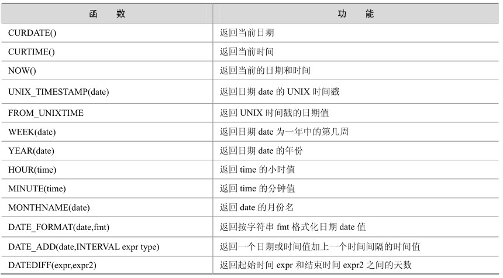
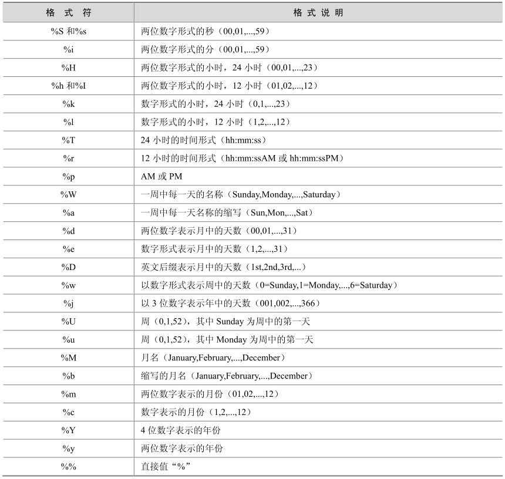
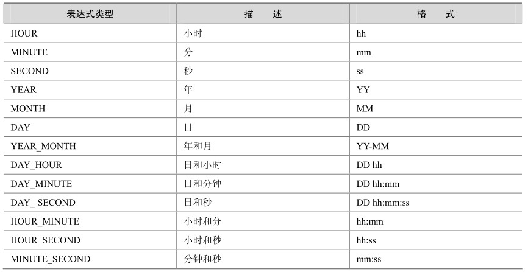

有时我们可能会遇到这样的需求：当前时间是多少，下个月的今天是星期几，统计截止到当前日期前3天的收入总和，等等。这些需求就需要日期和时间函数来实现，表5-3列出了MySQL中支持的一些常用日期和时间函数。

表5-3 MySQL中的常用日期和时间函数

下面结合一些实例来逐个讲解每个函数的使用方法。

CURDATE()函数：返回当前日期，只包含年月日。

mysql> select CURDATE();

+------------+

| CURDATE() |

+------------+

| 2007-07-11 |

+------------+

1 row in set (0.03 sec)

CURTIME()函数：返回当前时间，只包含时分秒。

mysql> select CURTIME();

+-----------+

| CURTIME() |

+-----------+

| 14:13:46 |

+-----------+

1 row in set (0.00 sec)

NOW()函数：返回当前的日期和时间，年月日时分秒全都包含。

mysql> select NOW();

+---------------------+

| NOW()|

+---------------------+

| 2007-07-11 14:14:06 |

+---------------------+

1 row in set (0.00 sec)

UNIX_TIMESTAMP(date)函数：返回日期date的UNIX时间戳。

mysql> select UNIX_TIMESTAMP(now());

+-----------------------+

| UNIX_TIMESTAMP(now()) |

+-----------------------+

| 1184134516 |

+-----------------------+

1 row in set (0.02 sec)

FROM_UNIXTIME(unixtime)函数：返回 UNIXTIME 时间戳的日期值，和 UNIX_TIMESTAMP(date)互为逆操作。

mysql> select FROM_UNIXTIME(1184134516) ;

+---------------------------+

| FROM_UNIXTIME(1184134516) |

+---------------------------+

| 2007-07-11 14:15:16 |

+---------------------------+

1 row in set (0.00 sec)

WEEK(DATE)和 YEAR(DATE)函数：前者返回所给的日期是一年中的第几周，后者返回所给的日期是哪一年。

mysql> select WEEK(now()),YEAR(now());

+-------------+-------------+

| WEEK(now()) | YEAR(now()) |

+-------------+-------------+

| 27 | 2007 |

+-------------+-------------+

1 row in set (0.02 sec)

HOUR(time)和MINUTE(time)函数：前者返回所给时间的小时，后者返回所给时间的分钟。

mysql> select HOUR(CURTIME()),MINUTE(CURTIME());

+-----------------+-------------------+

| HOUR(CURTIME()) | MINUTE(CURTIME()) |

+-----------------+-------------------+

| 14 | 18 |

+-----------------+-------------------+

1 row in set (0.00 sec)

MONTHNAME(date)函数：返回date的英文月份名称。

mysql> select MONTHNAME(now());

+------------------+

| MONTHNAME(now()) |

+------------------+

| July|

+------------------+

1 row in set (0.00 sec)

DATE_FORMAT(date,fmt)函数：按字符串 fmt 格式化日期 date 值，此函数能够按指定的格式显示日期，可以用到的格式符如表5-4所示。

表5-4 MySQL中的日期和时间格式

下面的例子将当前时间显示为“月，日，年”格式：

mysql> select DATE_FORMAT(now(),'%M,%D,%Y');

+-------------------------------+

| DATE_FORMAT(now(),'%M,%D,%Y') |

+-------------------------------+

| July,11th,2007 |

+-------------------------------+

1 row in set (0.00 sec)

DATE_ADD(date,INTERVAL expr type)函数：返回与所给日期date相差 INTERVAL时间段的日期。

其中INTERVAL是间隔类型关键字，expr是一个表达式，这个表达式对应后面的类型， type是间隔类型，MySQL提供了13种间隔类型，如表5-5所示。

表5-5 MySQL中的日期间隔类型

来看一个具体的例子，在这个例子中第1列返回了当前日期时间，第2列返回距离当前日期31天后的日期时间，第3列返回距离当前日期一年两个月后的日期时间。

mysql> select now() current,date_add(now(),INTERVAL 31 day) after31days,

date_add(now(),INTERVAL '1_2' year_month) after_oneyear_twomonth;

+---------------------+---------------------+------------------------+

| current | after31days | after_oneyear_twomonth |

+---------------------+---------------------+------------------------+

| 2007-09-03 11:30:48 | 2007-10-04 11:30:48 | 2008-11-03 11:30:48 |

+---------------------+---------------------+------------------------+

1 row in set (0.01 sec)

同样也可以用负数让它返回之前的某个日期时间，如下第1列返回了当前日期时间，第2列返回距离当前日期31天前的日期时间，第3列返回距离当前日期一年两个月前的日期时间。

mysql> select now() current,date_add(now(),INTERVAL -31 day) after31days, date_a

dd(now(),INTERVAL '-1_-2' year_month) after_oneyear_twomonth;

+---------------------+---------------------+------------------------+

| current| after31days| after_oneyear_twomonth |

+---------------------+---------------------+------------------------+

| 2007-09-03 11:36:35 | 2007-08-03 11:36:35 | 2006-07-03 11:36:35 |

+---------------------+---------------------+------------------------+

1 row in set (0.00 sec)

DATEDIFF（date1，date2）函数：用来计算两个日期之间相差的天数。

下面的例子计算出当前距离2008年8月8日的奥运会开幕式还有多少天：

mysql> select DATEDIFF('2008-08-08',now());

+------------------------------+

| DATEDIFF('2008-08-08',now()) |

+------------------------------+

|328|

+------------------------------+

1 row in set (0.01 sec)

