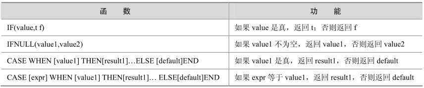

流程函数也是很常用的一类函数，用户可以使用这类函数在一个 SQL 语句中实现条件选择，这样做能够提高语句的效率。表5-6列出了MySQL中跟条件选择有关的流程函数，下面将通过具体的实例来讲解每个函数的用法。

表5-6 MySQL中的流程函数

下面的例子中模拟了对职员薪水进行分类，这里首先创建并初始化一个职员薪水表：

mysql> create table salary (userid int,salary decimal(9,2));

Query OK, 0 rows affected (0.06 sec)

插入一些测试数据：

mysql> insert into salary values(1,1000),(2,2000), (3,3000),(4,4000),(5,5000), (1,null);

Query OK, 6 rows affected (0.00 sec)

mysql> select * from salary;

+--------+---------+

| userid | salary |

+--------+---------+

| 1 | 1000.00 |

| 2 | 2000.00 |

| 3 | 3000.00 |

| 4 | 4000.00 |

| 5 | 5000.00 |

| 1 | NULL |

+--------+---------+

6 rows in set (0.00 sec)

接下来，通过这个表来介绍各个函数的应用。

IF(value,t,f)函数：这里认为月薪在2000元以上的职员属于高薪，用“high”表示；而2000元以下的职员属于低薪，用“low”表示。

mysql> select if(salary>2000, 'high', 'low') from salary;

+------------------------------+

| if(salary>2000,'high','low') |

+------------------------------+

| low |

| low |

| high |

| high |

| high |

| low |

+------------------------------+

6 rows in set (0.01 sec)

IFNULL(value1,value2)函数：这个函数一般用来替换 NULL 值，我们知道 NULL 值是不能参与数值运算的，下面这个语句就是把NULL值用0来替换。

mysql> select ifnull(salary,0) from salary;

+------------------+

| ifnull(salary,0) |

+------------------+

| 1000.00 |

| 2000.00 |

| 3000.00 |

| 4000.00 |

| 5000.00 |

| 0.00|

+------------------+

6 rows in set (0.00 sec)

CASE WHEN [value1] THEN[result1]…ELSE[default]END函数：这里也可以用 case when…then函数实现上面例子中高薪低薪的问题。

mysql> select case when salary<=2000 then 'low' else 'high' end from salary;

+---------------------------------------------------+

| case when salary<=2000 then 'low' else 'high' end |

+---------------------------------------------------+

| low |

| low |

| high|

| high|

| high|

| high|

+---------------------------------------------------+

6 rows in set (0.00 sec)

CASE [expr] WHEN [value1] THEN[result1]…ELSE[default]END函数：这里还可以分多种情况把职员的薪水分多个档次，比如下面的例子分成高、中、低3种情况。同样还可以分成更多种情况，这里就不再举例了，有兴趣的读者可以自己测试一下。

mysql> select case salary when 1000 then 'low' when 2000 then 'mid' else 'high' end from salary;

+-----------------------------------------------------------------------+

| case salary when 1000 then 'low' when 2000 then 'mid' else 'high' end |

+-----------------------------------------------------------------------+

| low |

| mid |

| high |

| high |

| high |

| high |

+-----------------------------------------------------------------------+

6 rows in set (0.00 sec)

