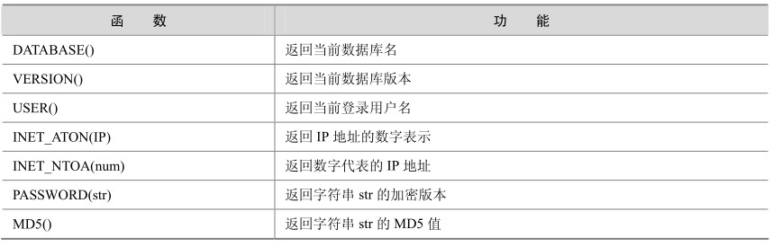

MySQL 提供的函数很丰富，除了前面介绍的字符串函数、数字函数、日期函数、流程函数以外还有很多其他函数，在此不再一一列举，有兴趣的读者可以参考MySQL官方手册。表5-7列举了一些其他常用的函数。

表5-7 MySQL中的其他常用函数

下面结合实例简单介绍一下这些函数的用法。

DATABASE()函数：返回当前数据库名。

mysql> select DATABASE();

+------------+

| DATABASE() |

+------------+

| test |

+------------+

1 row in set (0.00 sec)

VERSION()函数：返回当前数据库版本。

mysql> select VERSION();

+-----------+

| VERSION() |

+-----------+

| 5.0.18-nt |

+-----------+

1 row in set (0.00 sec)

USER()函数：返回当前登录用户名。

mysql> select USER();

+----------------+

| USER() |

+----------------+

| root@localhost |

+----------------+

1 row in set (0.03 sec)

INET_ATON(IP)函数：返回IP地址的网络字节序表示。

mysql> select INET_ATON('192.168.1.1');

+--------------------------+

| INET_ATON('192.168.1.1') |

+--------------------------+

| 3232235777 |

+--------------------------+

1 row in set (0.00 sec)

INET_NTOA(num)函数：返回网络字节序代表的IP地址。

mysql> select INET_NTOA(3232235777);

+-----------------------+

| INET_NTOA(3232235777) |

+-----------------------+

| 192.168.1.1|

+-----------------------+

1 row in set (0.00 sec)

INET_ATON(IP)和INET_NTOA(num)函数主要的用途是将字符串的IP地址转换为数字表示的网络字节序，这样可以更方便地进行IP或者网段的比较。比如在下面的表t中，想要知道在“192.168.1.3”和“192.168.1.20”之间一共有多少IP地址，可以这么做：

mysql> select * from t;

+--------------+

| ip |

+--------------+

| 192.168.1.1 |

| 192.168.1.3 |

| 192.168.1.6 |

| 192.168.1.10 |

| 192.168.1.20 |

| 192.168.1.30 |

+--------------+

6 rows in set (0.00 sec)

按照正常的思维，应该用字符串来进行比较，下面是字符串的比较结果：

mysql> select * from t where ip>='192.168.1.3' and ip<='192.168.1.20';

Empty set (0.01 sec)

结果没有如我们所愿，竟然是个空集。其实原因就在于字符串的比较是一个字符一个字符的比较，当对应字符相同时，就比较下一个，直到遇到能区分出大小的字符才停止比较，后面的字符也将忽略。显然，在此例中，“192.168.1.3”其实比“192.168.1.20”要“大”，因为“3”比“2”大，而不能用我们日常的思维 3<20，所以“ip>='192.168.1.3' and ip<='192.168.1.20'”必然是个空集。

在这里，如果要想实现上面的功能，就可用函数INET_ATON来实现，将IP地址转换为字节序后再比较，如下所示：

mysql> select * from t where inet_aton(ip)>=inet_aton('192.168.1.3') and inet_aton(ip)<=inet_aton('192.168.1.20');

+--------------+

| ip|

+--------------+

| 192.168.1.3 |

| 192.168.1.6 |

| 192.168.1.10 |

| 192.168.1.20 |

+--------------+

4 rows in set (0.00 sec)

结果完全符合我们的要求。

PASSWORD(str)函数：返回字符串str的加密版本，一个41位长的字符串。

此函数只用来设置系统用户的密码，但是不能用来对应用的数据加密。如果应用方面有加密的需求，可以使用MD5等加密函数来实现。

下例中显示了字符串“123456”的PASSWORD加密后的值：

mysql> select PASSWORD('123456');

+-------------------------------------------+

| PASSWORD('123456') |

+-------------------------------------------+

| *6BB4837EB74329105EE4568DDA7DC67ED2CA2AD9 |

+-------------------------------------------+

1 row in set (0.08 sec)

MD5(str)函数：返回字符串str的MD5值，常用来对应用中的数据进行加密。

下例中显示了字符串“123456”的MD5值：

mysql> select MD5('123456');

+----------------------------------+

| MD5('123456') |

+----------------------------------+

| e10adc3949ba59abbe56e057f20f883e |

+----------------------------------+

1 row in set (0.06 sec)

