SQL开发（SQL Development）位于主界面中心的左侧，如图 6-1中的圆圈所示。

SQL开发主要提供了与SQL相关的各种图形化开发和管理功能，开发人员和DBA在日常工作中会经常使用。SQL开发主界面显示了4个功能，下面依次介绍。

**1．新建连接（New Connection）**

对数据库进行任何操作之前，必须要首先创建一个连接。单击“New Connection”按钮，显示如图6-2所示的界面。

图6-1 Workbench主界面──SQL开发

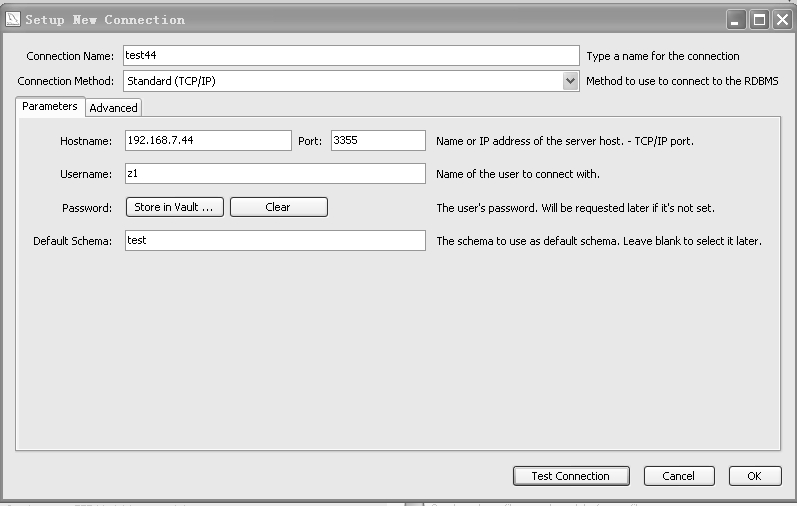
图6-2 SQL开发──新建连接

由上而下分别填入自定义连接名、连接协议（从下拉列表框中进行选择）、主机名、端口、用户名、默认数据库名，单击“Test Connection”按钮，如果提示连接正确，则单击“OK”按钮完成连接的创建。需要注意的是并没有显示密码输入框，而是在“Password”提示符后显示了两个按钮“Store in Vault”和“Clear”，单击“Store in Vault”按钮会弹出一个对话框提示输入密码，确认后密码将进行保存，以后通过此连接就不用再输入密码；而单击“Clear”按钮则相反，会将保存的密码进行清除，下次登录需要手工输入密码。

对于一些特殊的连接选项，比如采用 SSL 连接、非默认的 SQL_MODE 等，可以在“Advanced”选项卡中进行选择。

单击“OK”按钮后，新创建的连接test44会显示在连接列表中，如图6-3所示。

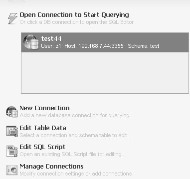
图6-3 SQL开发──显示连接列表

**2．编辑表数据（Edit Table Data）**

单击“Edit Table Data”按钮或者双击连接列表中的连接名，都可以打开SQL编辑器（SQL Editor），区别在于前者在打开前需要选择数据库和表，打开编辑器后直接进行数据的编辑状态；后者则只是进入编辑器，不做任何操作。SQL编辑器中可以编辑和执行任何有权限的SQL语句，打开的SQL编辑器如图6-4所示。

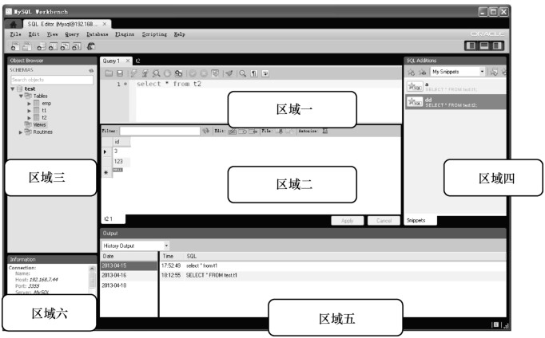
图6-4 SQL开发──SQL编辑器

编辑器界面的各区域功能如下。

区域一：SQL编辑区。可以编写以分号结尾的多个SQL语句，上面的一排面板可以用来完成与SQL相关的一些功能，比如执行语句、显示执行计划、美化SQL格式等，鼠标放在不同的按钮上会显示相应的功能。

区域二：SQL记录显示区。区域一的SQL执行结果在此区域显示，如果有多个SQL，则本区域会有多个标签页来进行显示。此区域上面的功能面板用来完成对记录的一些功能，比如记录编辑、记录导出等。

区域三：对象树显示区。列出当前用户拥有读取权限的所有对象，并以树的形式进行显示。树的最外层为数据库名；第二层为数据库下的各种对象列表，比如表、视图等；第三层为具体的对象名，即具体的表名、视图名。在树的各个节点上单击右键，就会显示相关功能的选项，我们可以根据实际需求进行相关的功能操作。

区域四：SQL附件区。此区域可以用来保存正在编辑的SQL文本，以便以后使用；还有一个功能就是保存了MySQL中的一些常用语法，并按照DB Mgmt、SQL DDL、SQL DML进行分类，当进行 SQL 编辑时可以很方便地进行语法查找。图 6-5 显示了 DDL 中 CREATE TABLE的语法。

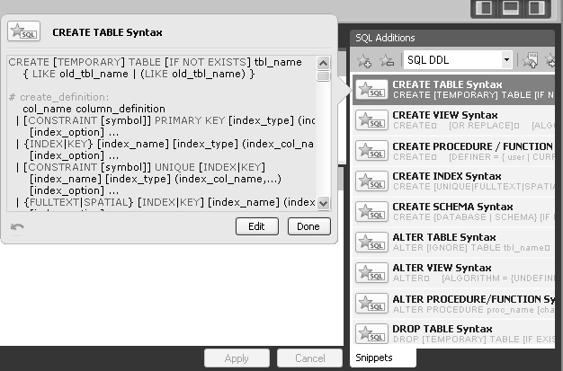
图6-5 SQL开发──SQL附件区

区域五：日志输出区。用来显示SQL执行结果日志，如果执行成功，则显示SQL语句、返回的记录数、执行花费的时间；如果执行失败，则显示失败原因。对于以前执行过的SQL，还可以在下拉列表框中选择“history output”后按日期进行显示。

区域六：Session和当前操作对象显示区。Session显示了当前连接的数据库、用户名、端口、版本等信息；对象信息则显示了当前正在操作的对象数上节点的信息。如果节点是表，还会列出表的字段信息。

如果要对记录进行编辑，可以直接在SQL编辑器中编写相应SQL，然后再单击执行按钮
，或者在SQL记录显示区中对指定记录手工编辑，对于结构复杂的表，为了方便SQL的编写，Workbench还提供了一个简捷的语句模板功能，比如要对t1编写insert语句，可以用鼠标右键单击表 t1，然后在弹出的快捷菜单中选择“Send to SQL EditorÆInsert Statement”命令，t1的insert语句模板就出现在SQL编辑器中，如图6-6所示。

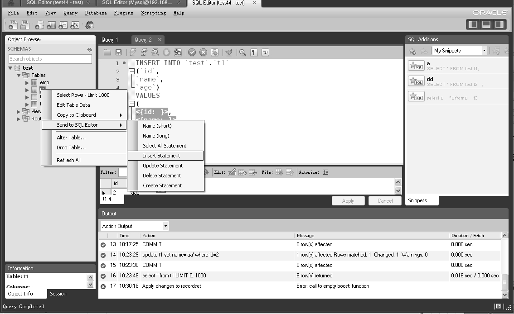
图6-6 SQL开发──SQL模板

下面以t1表为例，演示了如何在SQL记录显示区中进行基本的数据更新操作。

（1）在SQL编辑区中执行要修改的记录，如图6-7所示。

图6-7 SQL开发──执行SQL

此时发现 SQL 记录区右下角红圈处显示“ReadOnly”提示，且工具栏上面并没有出现修改记录的编辑按钮，将鼠标放到“ReadOnly”提示上发现无法修改的原因为t1表没有主键。（2）为t1表添加主键。

用鼠标右键单击对象树中的 t1，在弹出的快捷菜单中选择“alter table”命令，进入如图 6-8所示的界面。

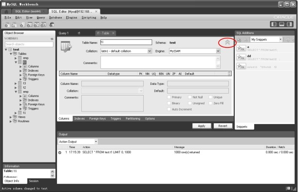
图6-8 SQL开发──alter table

单击图6-8中圆圈内的按钮，显示t1的列信息，如图6-9所示。

图6-9 SQL开发──添加主键

选中在“id”列后面的“PK”复选框，此时发现“NN”（NOT NULL）复选框也同时被选中，这说明主键约束不能为空。单击右下角的“Apply”按钮，显示如图6-10所示的界面。

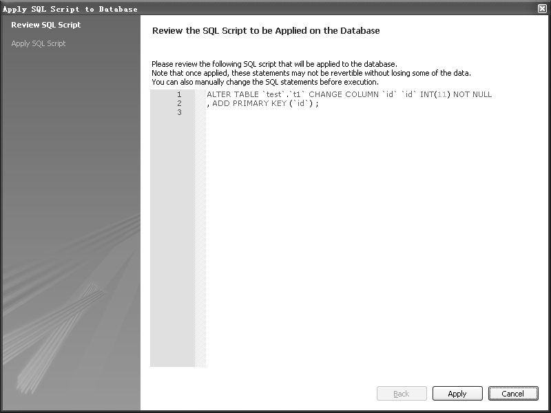
图6-10 SQL开发──添加主键SQL

最后确认下更改对应的SQL语句，如果没有问题，单击“Apply”按钮执行。执行成功后显示如图6-11所示的界面。

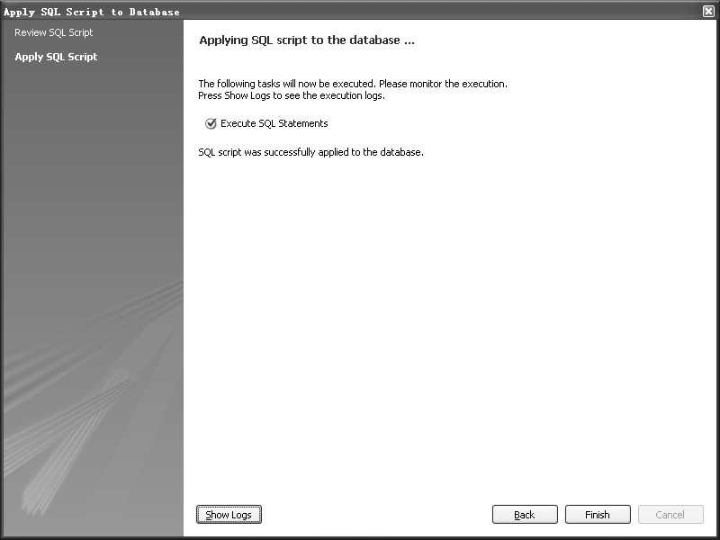
图6-11 SQL开发──Apply SQL

单击“Finish”按钮完成本次操作。

（3）更新记录。

上一步完成了 t1表主键的添加，现在再一次在SQL编辑器中执行“select * from t1”，结果如图6-12所示。

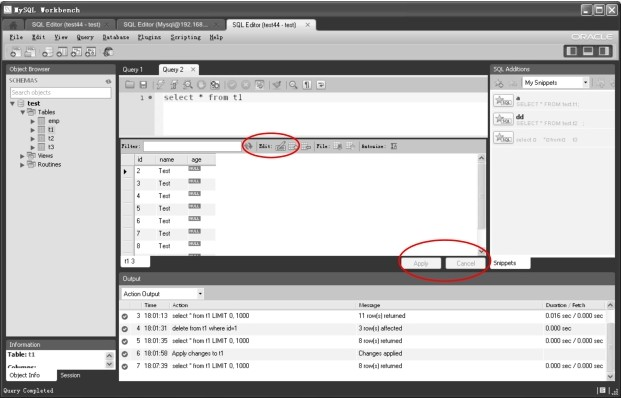
图6-12 SQL开发──加主键后再次执行查询

此时发现，原来右下角的“ReadOnly”提示消失，改成了“Apply”和“Cancel”按钮，上面的按钮也增加了记录编辑的图标。

现在已经进入了记录编辑状态，让我们更新一条“id=2”的记录，将name字段改成“abc”。操作过程很简单，直接将鼠标放在“id=2”记录的 name 列，写入“abc”。然后将鼠标单击其他任意记录，右下角的“Apply”/“Cancel”按钮将由灰色变为黑色，单击“Apply”按钮，显示如图6-13所示的确认界面。

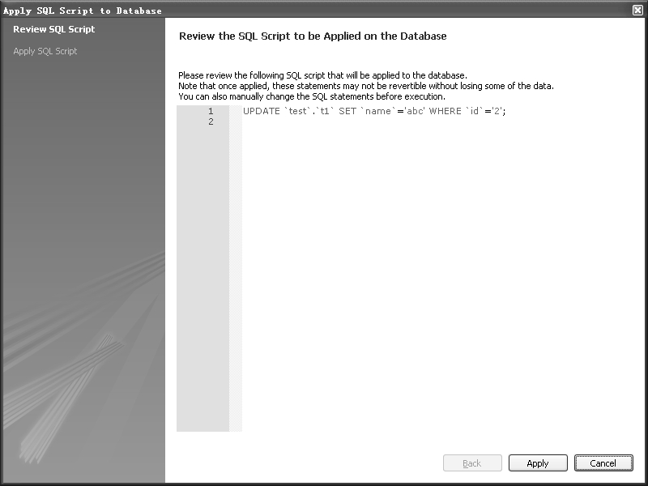
图6-13 SQL开发──添加主键后执行更新

单击“Apply”按钮，开始执行SQL。在下一个界面单击“Finish”按钮，完成本次更新操作。

这里需要注意一下，上面的更新演示中我们没有发现事物的提交过程，原因是 SQL 编辑器中的 SQL 提交模式按钮按下，提交回滚按钮为灰色
，意味着所有事物 Apply 的时候全部自动提交，对于非事物表，比如MyISAM，提交模式没有意义；但对于InnoDB等事物表，出于事物安全考虑，通常希望能手工提交，则将此按钮按起来即可，提交回滚按钮也将变成正常状态，此时，单击“Apply”按钮会弹出如图6-14所示的对话框。

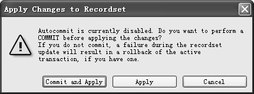
图6-14 SQL开发──自动提交提示

此时，默认会选择“Commit and Apply”按钮，将事物进行提交。如果单击“Apply”按钮，则事物不会提交，需要单击提交按钮
才可以提交。

对于插入和删除操作，通过工具栏按钮
进行操作即可，使用很简单，这里不再演示。

**3．编辑SQL脚本（Edit SQL Script）**

在主界面中单击“Edit SQL Script”按钮，将打开如图 6-15所示的对话框。

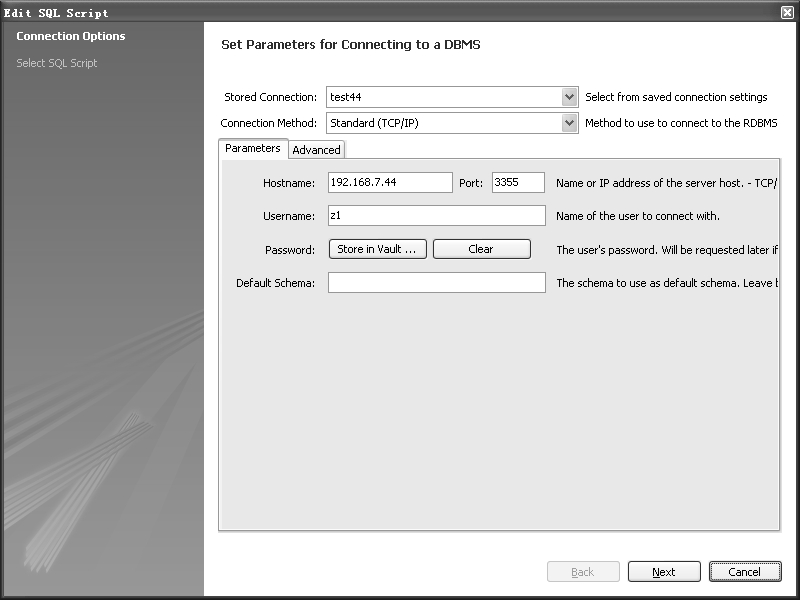
图6-15 SQL开发──打开连接

在“Strored Connection”下拉列表框中选择要编辑的连接，相关连接参数自动显示在下面的“Parameters”选项卡中的相应文本框中，单击“Next”按钮进入如图6-16所示的界面。

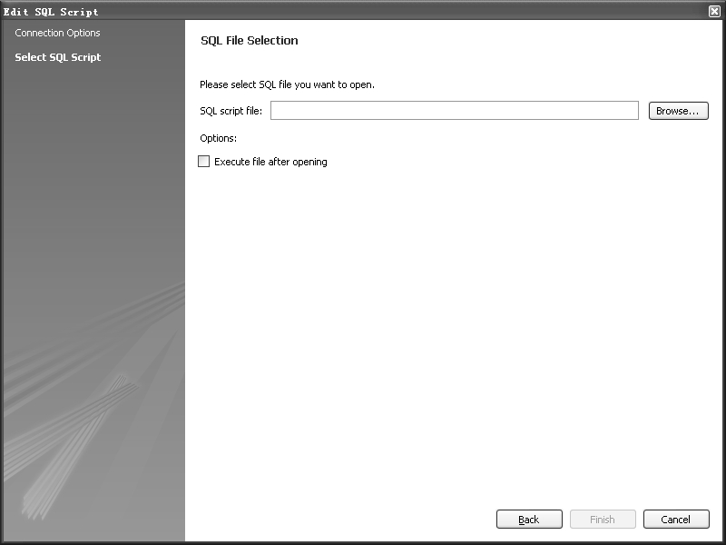
图6-16 SQL开发──输入脚本路径

在“SQL script file”文本框中，输入要编辑的SQL脚本文件路径或者单击“Browser”按钮来找到要编辑的文件，单击“Finish”按钮，相应的SQL文件在SQL编辑器中被打开进行编辑。

**4．管理连接（Manage Connections）**

当管理的 MySQL 较多时，可以通过管理连接功能进行方便的管理。在主界面中单击“Manage Connections”按钮，打开如图 6-17所示的界面。

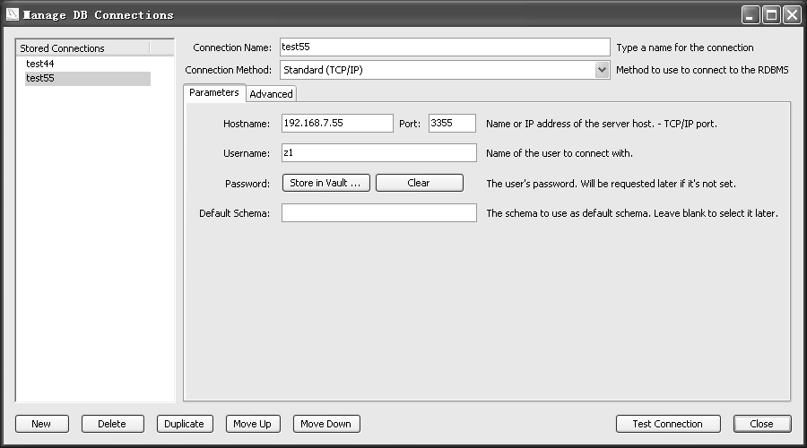
图6-17 SQL开发──管理连接

管理界面很简单，左面显示连接名列表，右面显示选定连接的详细连接信息。对这些信息可以按需进行修改，并通过“Test Connection”按钮测试连接是否正确。左下方的几个按钮是对连接名进行操作的，可以新建连接（New）、删除连接（Delete）、复制连接（Duplicate）、上移或者下移指定的连接（Move Up和Move Down）。

