数据建模（Data Modeling）位于主界面中心的中间，如图 6-18所示。

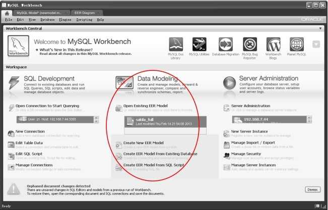
图6-18 Workbench主界面──数据建模

数据建模工具可以很方便地创建物理模型，然后通过正向工程将物理模型转换为实际的数据库对象。通过这种方式，可以大大提高数据库设计的效率。比较有名的建模工具包括PowerDesigner、ERWin等。

从主界面可以看到，数据建模主要包含了3个功能：

创建新的EER模型（Create New EER Model）；

使用已有数据库来创建EER模型（Create EER Model from Existing Database）；

使用SQL脚本来创建EER模型（Create EER Model from SQL Script）。

这里我们通过学生、学科、成绩的例子来重点介绍如何创建一个EER模型。

学生、课程、成绩的关系如下：一个学生可以选修多个课程，一个课程可以有多个学生选修，因此学生与课程是多对多的关系，成绩表中学生 id、课程 id 为主键，得分（score）为非主属性。

使用Data Modeling的操作步骤如下。

（1）在主界面单击“Create New EER Model”按钮，在弹出的面板中双击“Add Diagram”，打开模型编辑器，如图6-19所示。

图6-19 数据建模──模型编辑器

（2）单击中间图标工具栏上创建表图标
，然后在编辑区的任意位置单击一下，一个新表产生，默认表名为table1，双击table1图标，进入如图6-20所示的编辑界面。

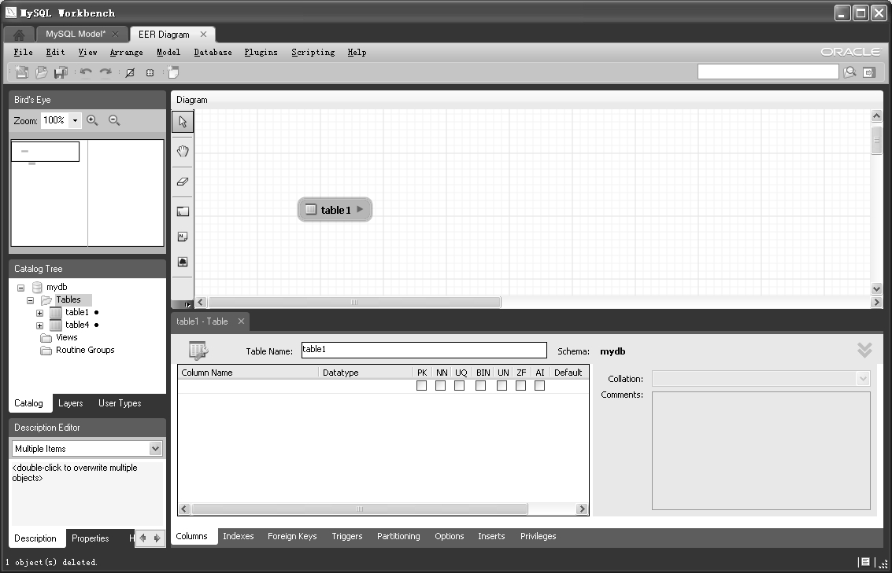
图6-20 数据建模──创建表

（3）将table1改名为student，并增加列stuid（int）和stdname（varchar(20)），并设置stuid为主键，如图6-21所示。

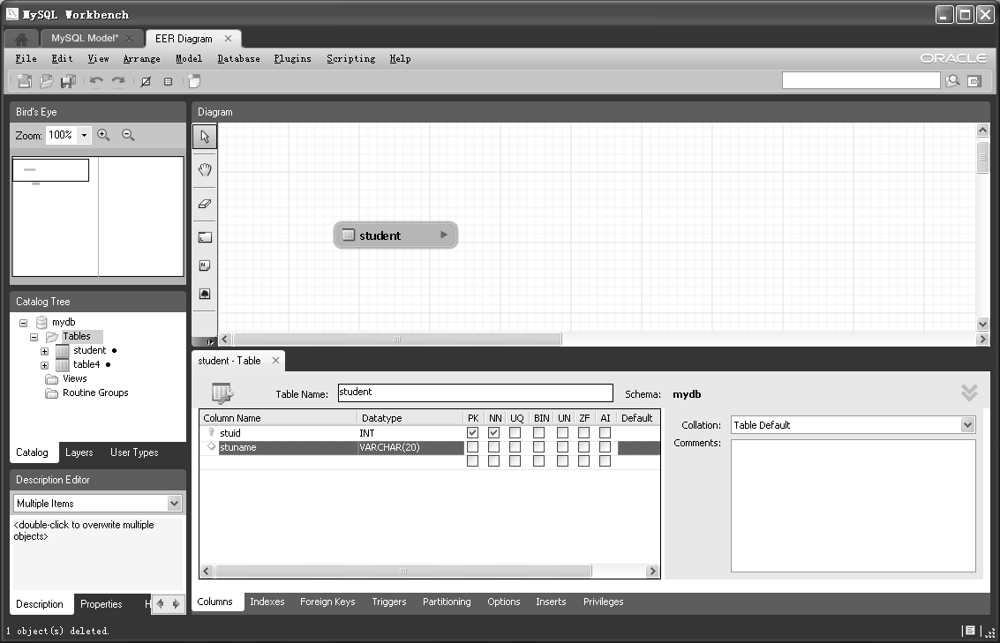
图6-21 数据建模──编辑表

（4）按照上述步骤继续添加课程表 subject（subid int和 subname varchar(20)），完成后的界面如图6-22所示。

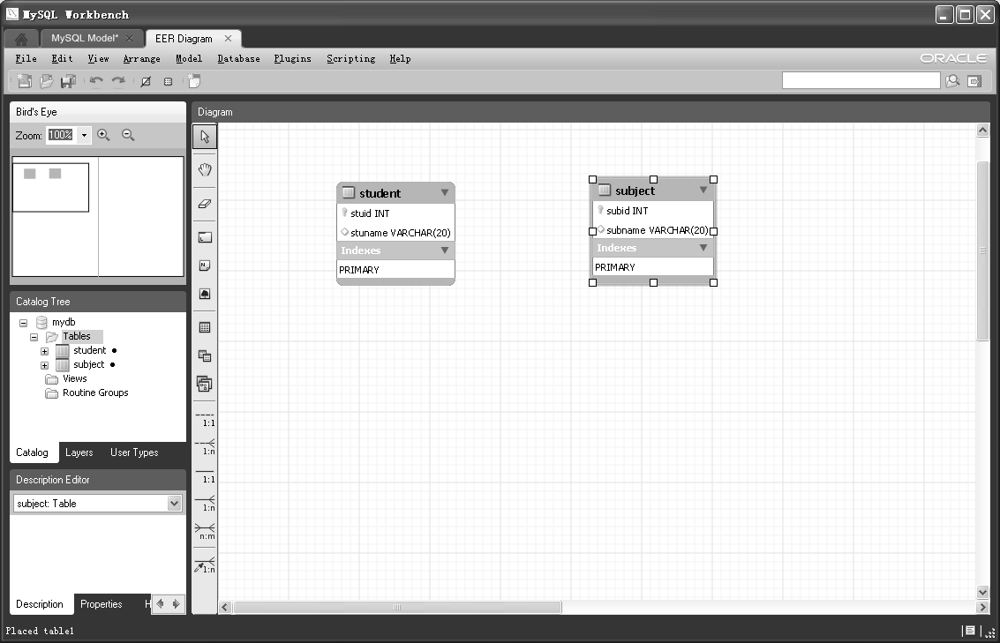
图6-22 数据建模──显示所有表

（5）选择工具栏上 n:m 连接线，然后分别在 student 和 subject 两表上进行单击，如图6-23所示。

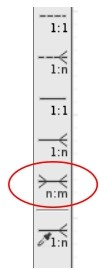
图6-23 数据建模──选择关系

（6）此时两表的多对多关系生效，系统自动生成了中间表student_has_subject，包含两个字段student_stuid和subject_subid，都设置为中间表的外键，引用的表为两表主键，如图6-24所示。

图6-24 数据建模──生成关系表

此时任务并未完成，设计的模型需要生成相应的SQL脚本，然后在数据库中创建。

（7）单击主界面上面菜单“FileÆExportÆForward Engineer SQL Script”命令或者直接按“Ctrl+Shift+G”快捷键，弹出如图6-25所示的SQL脚本导出选项窗口。

（8）在文本框中输入或者单击后面的“Browse”按钮浏览要保存的路径和文件名，单击“Next”按钮，显示如图6-26所示的界面。

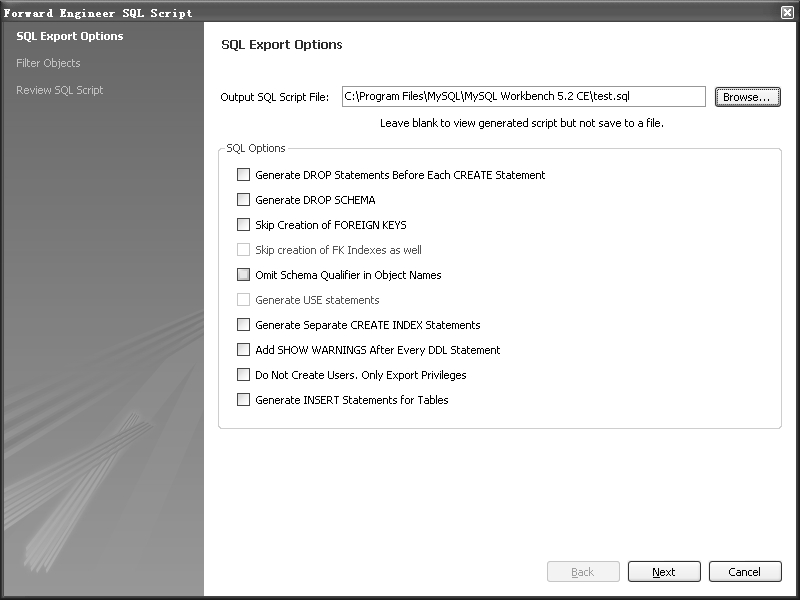
图6-25 数据建模──正向工程

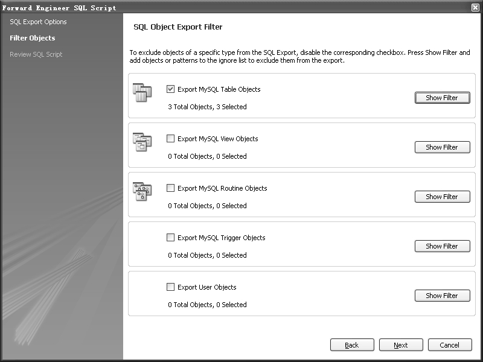
图6-26 数据建模──导出对象选择

（9）这个界面显示了可以导出的所有对象，单击右边的“Show Filter”按钮，则显示此类对象的过滤界面，如图6-27所示。

（10）通过左右箭头可以对要导出的对象进行过滤。这里不进行操作，单击“Next”按钮，显示如图6-28所示的界面。

（11）图6-28显示了所有表的DDL创建脚本，确认后单击“Finish”按钮完成创建过程。

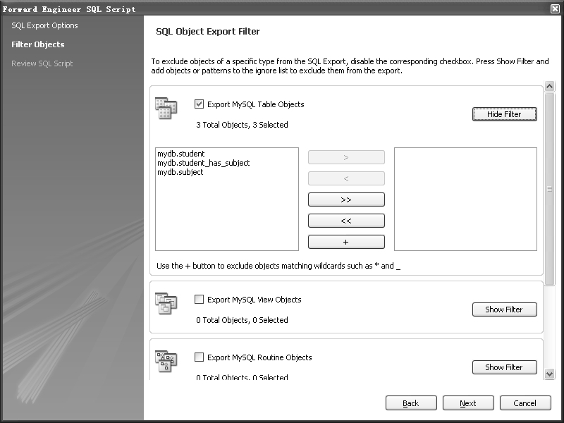
图6-27 数据建模──导出对象过滤器

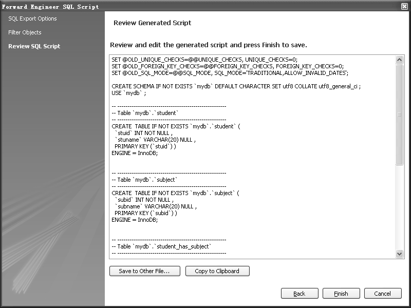
图6-28 数据建模──导出SQL文本

（12）对于生成的脚本，单击主界面中的“Edit SQL Script”按钮，按提示找到 test.sql文件，并选中“Execute file after opening”复选框，单击“Finish”按钮，完成脚本创建过程，如图 6-29所示。

（13）脚本创建后，新的mydb库和3个表显示在对象树中，如图6-30所示。

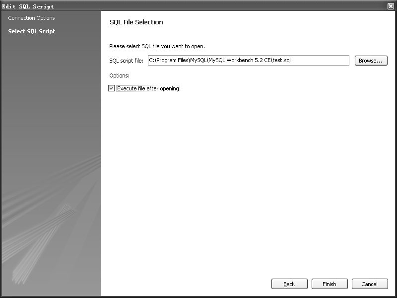
图6-29 数据建模──打开正向工程的SQL文件

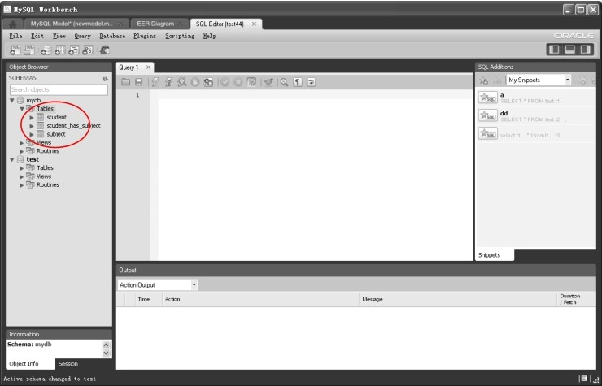
图6-30 数据建模──显示建模的物理对象

至此，数据建模到物理对象创建过程全部完成。

主界面中数据建模还有两个功能按钮：**使用已有数据库来创建EER模型**（Create EER Model from Existing Database）**和使用SQL脚本来创建EER模型**（Create EER Model from SQL Script），前者需要使用菜单中的“DatabaseÆReverse Engineer（逆向工程）”命令来直接将数据库对象生成模型，后者则直接用生成的脚本来创建模型，过程和前述类似，这里不再赘述。

