服务器管理（Server Administrator）位于主界面中心右侧，如图 6-31所示。

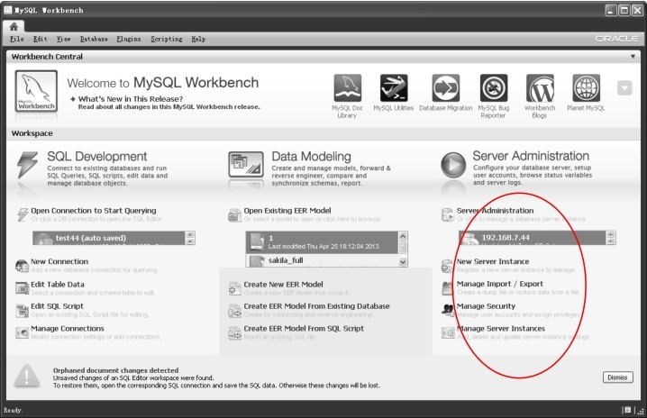
图6-31 Workbench主界面──服务器管理

服务器管理可以方便地管理多个MySQL实例。在很多生产环境中，为了应付越来越大的访问量，很多系统都使用了分布式数据库，成百上千的MySQL集群越来越普遍。对这么多实例的集中管理显得非常必要，先前MySQL采用MySQL Adminstrator作为图形化管理工具，现在这些功能已经集成在Workbench环境中。

该界面上显示了4个主要功能，下面分别介绍。

**1．新建服务器实例（New Server Instance）**

（1）单击“New Server Instance”按钮，进入如图 6-32所示的界面。

（2）根据服务器在本地还是远程来选择“localhost”或者“Remote Host”，如果是 SQL Development 中已经创建了连接，则可以选中最后一个单选按钮，并在下面的下拉列表框中选择一个连接名。这里选择第三项，下拉列表框中选择“test44”，单击“Next”按钮，进入如图6-33所示的界面。

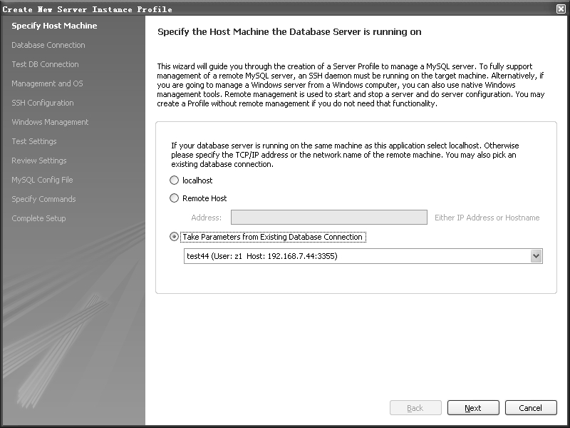
图6-32 服务器管理──创建MySQL实例

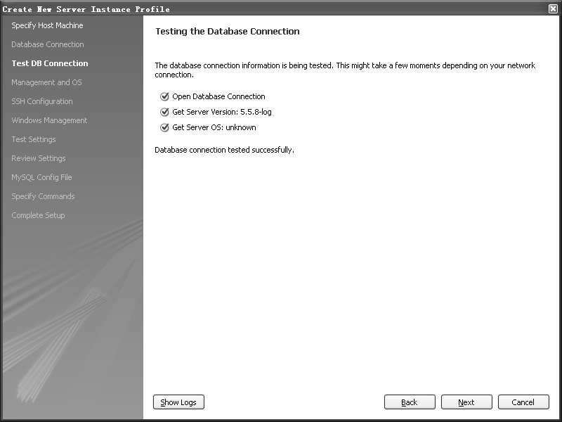
图6-33 服务器管理──连接测试

（3）在图6-33中，会对选择的连接进行测试，如果全部打“√”通过，则单击“Next”按钮，进入如图6-34所示的界面。

（4）在图6-34中，要求选择远程管理的方式和目标主机，如果选择第一项（Do not use remote management），则不能远程启动和关闭MySQL，并且不能远程修改参数文件；如果需要这些功能，则使用另外两种管理方式──**自主**Windows**远程管理**（Native Windows remote management）和**基于**SSH**的远程管理**（SSH login based management），前者只能在Windows环境下，后者则可以应用于多种操作系统。这里选择第三项，并根据实际环境选择下拉列表框中的操作系统和MySQL的安装类型，单击“Next”按钮，显示如图6-35所示的界面。

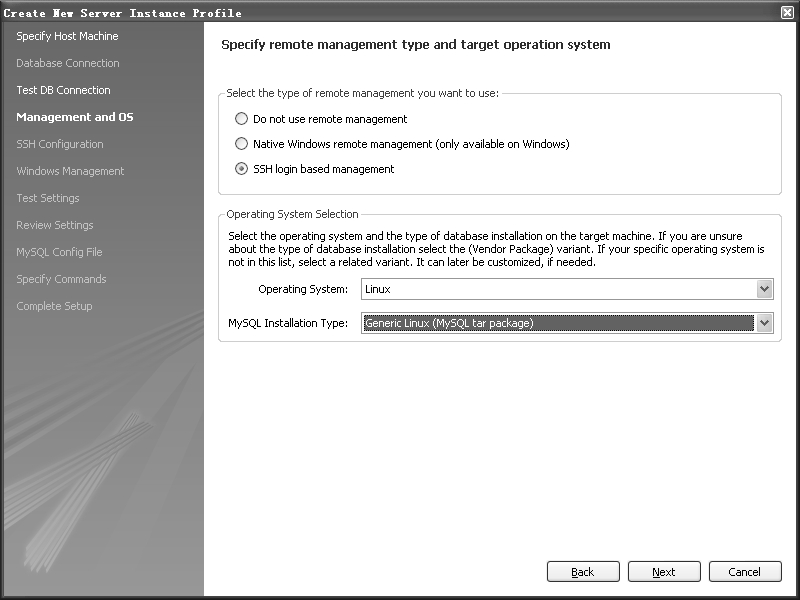
图6-34 服务器管理──远程管理方式选择

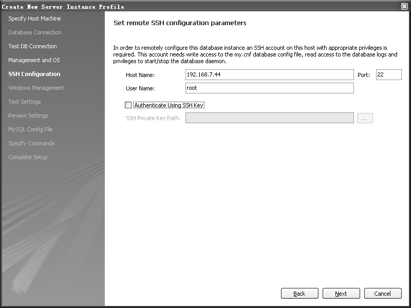
图6-35 服务器管理──SSH配置

（5）在图6-35中要求填入SSH连接的相关参数，包括IP、端口、连接用户名，如果采用公钥登录，还需要选中“Authenticate Using SSH Key”复选框，并在下面的文本框中填入私钥路径。如果读者对公钥认证不熟悉，可以找相关资料参考，这里不再详述。

（6）单击“Next”按钮，进行连接测试，如果测试成功，则显示如图6-36所示的界面。

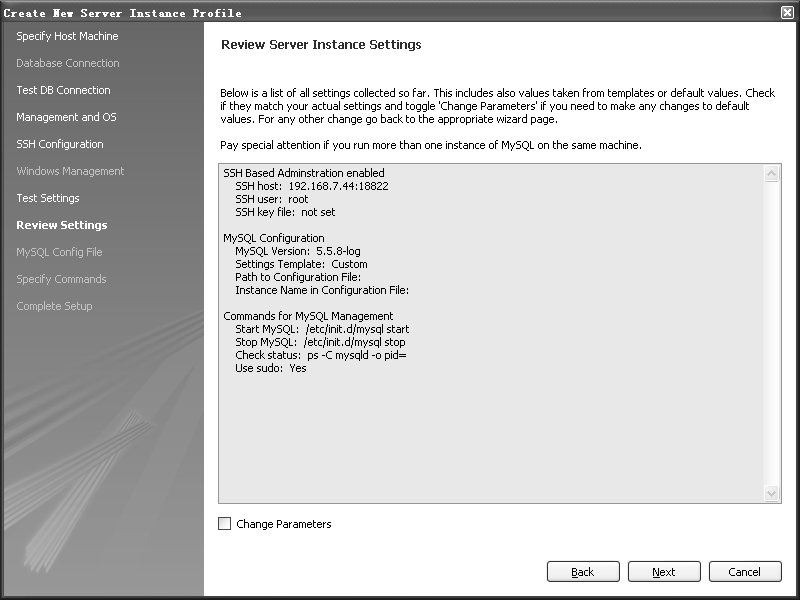
图6-36 服务器管理──SSH配置报告

（7）图6-36中显示了MySQL实例的连接信息、SSH配置信息、启动关闭MySQL的命令信息等，如果这些参数需要修改，则选中下面的“Change Parameters”复选框，单击“Next”按钮进行修改。这里直接单击“Next”按钮，显示如图6-37所示的界面。

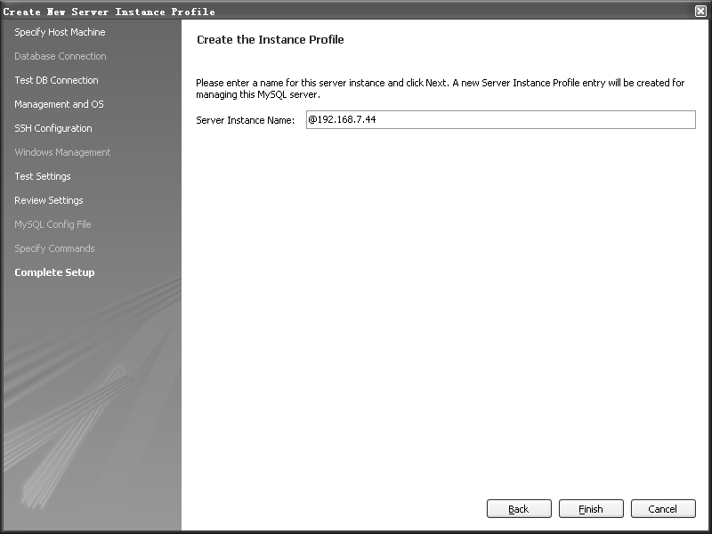
图6-37 服务器管理──填写实例名

（8）在图6-37中，要求输入实例名，这个实例名不是真正的MySQL实例名，而只是显示在主界面中，用来作为实例入口使用。这里输入“test44”，单击“Finish”按钮，完成实例的创建过程。新的实例名 test44显示在Server Administration的列表中。

（9）双击test44，进入实例的管理界面，如图6-38所示。

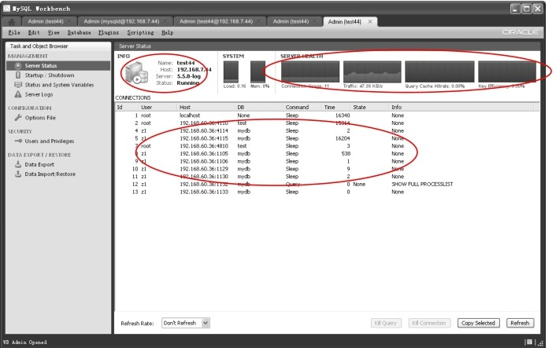
图6-38 服务器管理──服务器状态管理

管理界面分为两部分，左面是功能栏，右面是功能的显示区域。从功能栏可以看到，管理功能分为实例管理、参数配置、安全管理、数据导入导出。实例管理下面的二级功能又分为**服务器状态**（Server Status）、**启动/关闭**（Startup/Shutdown）、**状态变量**和**系统变量**（Status and System Variables）4个功能。这里重点介绍服务器状态（Server Status），如图 6-38所示。

图 6-38 中的左上圆圈部分显示了 Server 的基本状态，包括实例名、IP、版本、运行状态（running表示正在运行）；右上的圆圈部分用图形显示了Server较详细的状态信息，包括Server的负载、内存使用率、连接数、流量、查询缓存命中率、key buffer使用效率；下面的圆圈部分则是所有连接到此Server的线程信息，这与SHOW PROCESSLIST命令的执行结果相同。由于SHOW PROCESSLIST命令不能指定查看某个PID或者某个用户的信息，当数据库连接非常多的时候，执行SHOW PROCESSLIST命令就会返回很多条结果，不便查找问题。但管理控制台可以方便地拖动滚动条找到用户关心的PID的信息，或者通过对用户的分组快速定位到数据库连接的信息。最下面的几个功能按钮，比较重要的是可以对连接和查询进行kill操作，这在处理有性能问题的SQL时会非常方便。

从上面这些信息中，可以对 MySQL 实例的基本运行状况有一个大致的了解，对于 DBA来说，一些负载较高、活动连接数较高的系统是需要重点关注的。

**2．导入/导出管理（Manage Import/Export）**

导入导出的主要用途是为了进行数据的备份和恢复，在数据迁移中也经常使用。这里以数据库 test为例来演示一下导入导出过程。单击主界面的导入/导出管理（Manage Import/Export）或者在实例管理界面中单击“Data Export”都可以进入导出界面，如图 6-39所示。

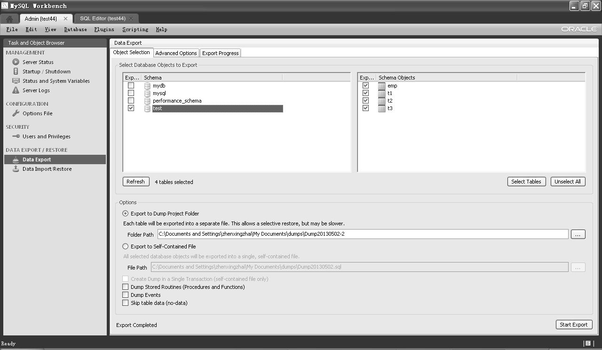
图6-39 服务器管理──导出数据

右边区域的操作界面很简单直观，上方的标签页有3个按钮，用途分别为导出对象选择、高级选项、导出进度。默认显示导出对象选择按钮，功能区如图 6-39 所示，左上部分选择数据库，右上部分选择相应表，下部则显示输出文件的选项，可以选择每个表一个文件或者整体导出为一个文件。这里选择导出test数据库下的所有表，导出路径为默认路径，导出方式为每个表一个文件。单击“Start Export”按钮开始导出操作，界面切换到导出进度条标签页，显示导出进度，并记录导出过程日志，如图6-40所示。

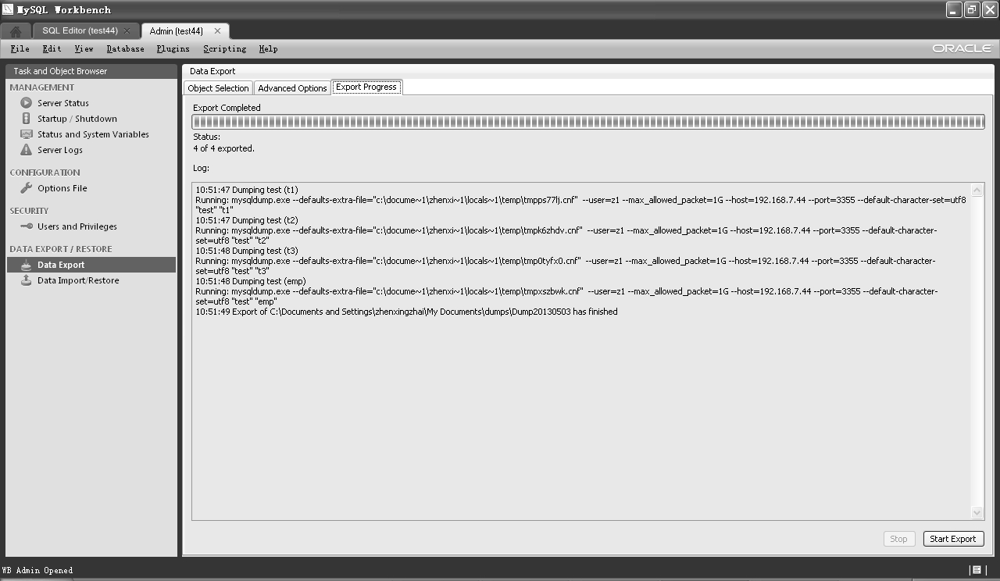
图6-40 服务器管理──导出日志

从日志可以看出，导出实际是调用了MySQL的逻辑导出工具mysqldump，关于此工具的详细介绍，可以参考本书的第27章。

单击左边功能树“Data Import/Restore”按钮，显示导入功能界面，如图 6-41所示。

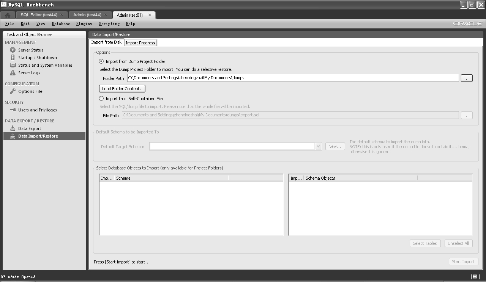
图6-41 服务器管理──导入数据

将刚才test库的备份文件恢复到另外一个MySQL实例test81下。因为前面的备份是按照一个表一个文件进行备份，因此这里要选中“Import from Dump Project Folder”单选按钮，单击浏览按钮，找到刚才备份的具体路径。左下的文本框中自动载入了备份文件中的数据库名，单击数据库名，旁边列表框显示了此库下的所有表，可以单独选择一个或多个表进行导入操作，这里默认全选，如图6-42所示。

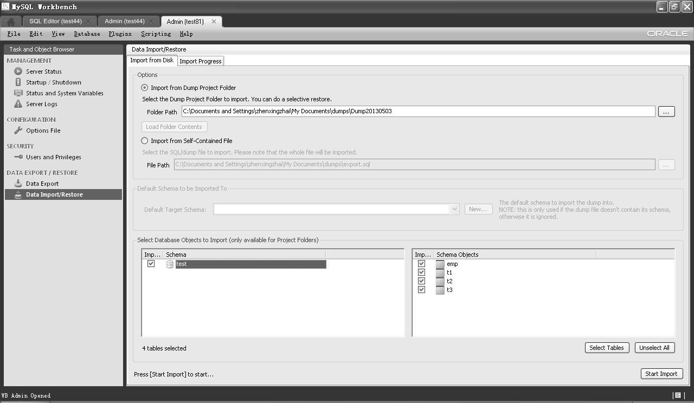
图6-42 服务器管理──导入数据选择

单击“Start Import”按钮，显示导入进度和导入日志，从日志中可以看出，导入操作调用的是MySQL命令。MySQL命令的详细用法可以参考本书的第25章。

**3．安全管理（Manage Security）**

安全管理的主要功能包括服务器权限管理和数据库权限管理，前者主要包括登录的权限和全局权限的管理，比如file、process等，后者包括每个数据库具体的权限，常见的DDL和DML都属于数据库权限。关于权限管理的详细内容，可以参考第28章，这里简单介绍一下界面操作。

单击“SECURITYÆUsers and Privileges”按钮，进入如图 6-43所示的界面。

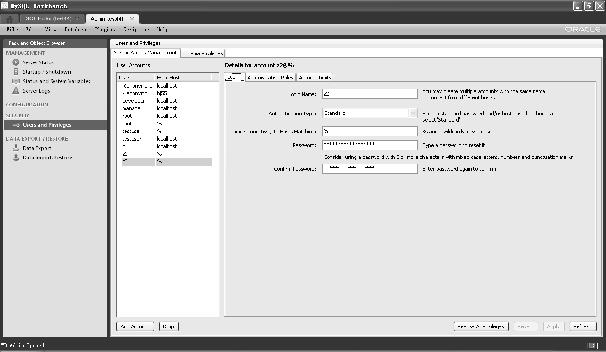
图6-43 服务器管理——安全管理

功能区标签页分为“Server Access Management”和“Schema Privileges”，对应于服务器权限管理和数据库权限管理，默认选中前者。功能区左边显示了当前实例中的所有用户，功能区右边显示了对每个用户可以进行的权限操作，这里又有一个标签页将功能分为 3 块：Login、Adminstrative Roles和Account Limits，分别对应于密码修改、管理角色设置、用户并发设置。读者可以自己测试一下，这里不再详述。

**4．服务器实例管理（Manage Server Instances）**

对于多实例的管理维护，Workbench 也提供了相应的管理功能，单击主界面的“Manage Server Instances”按钮，进入如图 6-44所示的管理界面。

和连接管理界面非常类似，左面显示实例名列表，右面显示选定实例的详细配置信息。对这些信息可以按需进行修改，操作都很简单，读者可以自行测试。

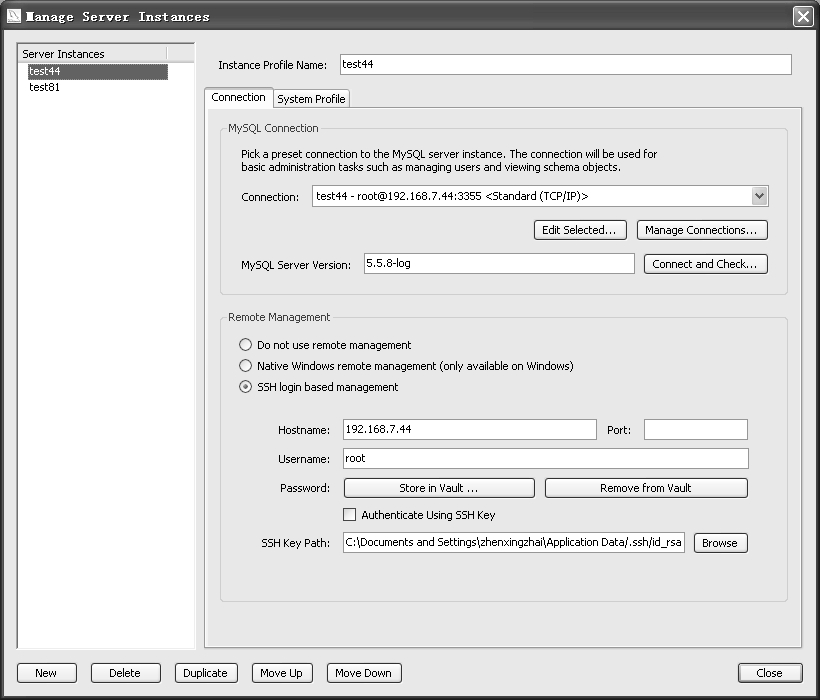
图6-44 服务器管理──实例管理

