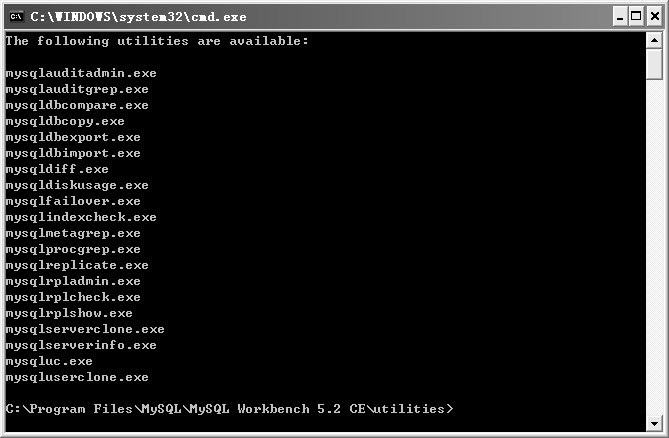
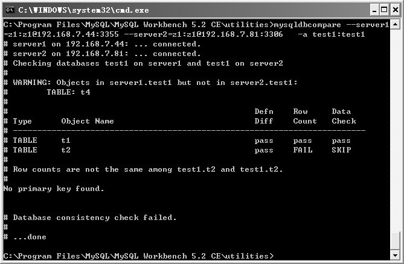
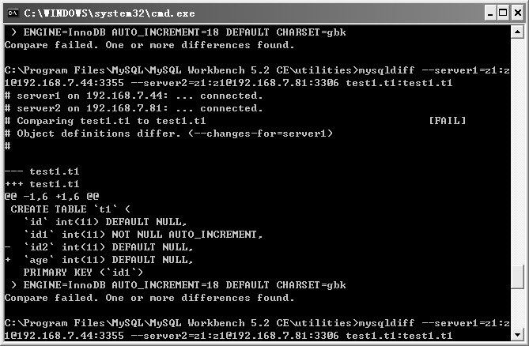
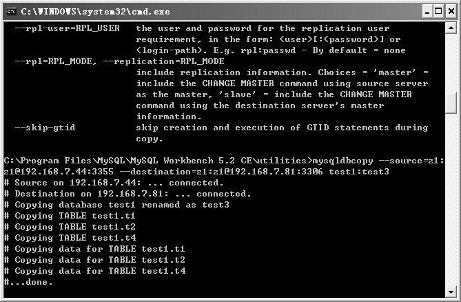
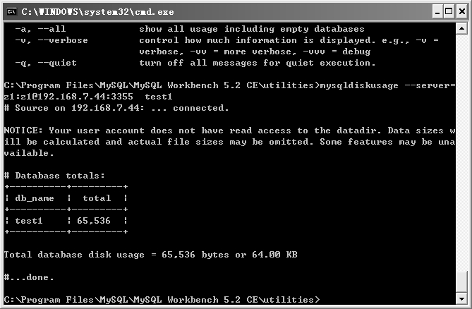
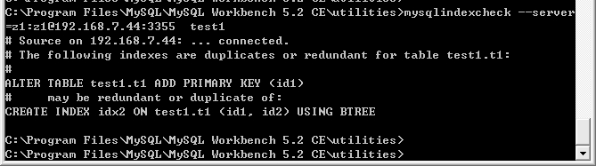

MySQL Utilities是Workbench提供的一组附带 Python库的工具集，这些工具可以帮我们轻松地完成一些常见任务，本节会重点介绍一些常用的工具。

在主界面中单击菜单中的“PluginsÆStart Shell for MySQL Utilities”命令或者单击主界面上部的“MySQL Utilities”图标，都可以打开如图 6-45所示的命令行 shell。

图6-45 MySQL Utilities

shell中列出了工具集中所有的工具，这些工具根据用途可以分为以下几类。

审计日志管理：mysqlauditadmin、mysqlauditgrep。

数据库检查比较：mysqldbcompare、mysqldiff、mysqlindexcheck。

数据库导入导出：msyqldbexport、mysqldbimport。

数据库克隆：mysqlserverclone、mysqluserclone、mysqlcp。

数据库复制：mysqlfailover、mysqlreplicate、mysqlrpladmin、mysqlrplcheck、mysqlrplshow。

数据库过滤：mysqlmetagrep、mysqlprocgrep。

数据空间查询：mysqldiskusage。

Workbench客户端：mysqluc。

下面对这些工具中常用的一些进行举例介绍，例子中大多只用了部分参数，更详细的参数使用方法可以通过“命令 –help”来进行查阅。

**1．mysqldbcompare**

**作用：**可以用来对比两个数据库之间的差别，产生报告。

**语法：**

mysqldbcompare --server1=user:passwd@host1:port --server2=user:passwd@host2:port db1:db2

**示例：**比较两个实例下test1库的区别，如图6-46所示。

C:\Program Files\MySQL\MySQL Workbench 5.2 CE\utilities>mysqldbcompare --server1=z1:z1@192.168.7.44:3355 --server2=z1:z1@192.168.7.81:3306 -a test1:test1

图6-46 mysqldbcompare示例

从比较结果可以看出，server1比server2多了一个表t4，在同名表t1和t2表的比较结果可以看出，两表的表定义一致，但行数不一致。总的来说，两个库一致性检查失败。

**2．mysqldiff**

**作用：**比较对象的定义，并输出报告，比mysqldbcompare粒度更小。

**语法：**

mysqldiff.exe --server1=user:pass@host:port:socket --server2=user:pass@host:port:socket db1.object1:db2.object1 db3:db4

**示例：**比较两个实例下test1库中的表t1，如图6-47所示。

C:\Program Files\MySQL\MySQL Workbench 5.2 CE\utilities>mysqldiff --server1=z1:z 1@192.168.7.44:3355 --server2=z1:z1@192.168.7.81:3306 test1.t1:test1.t1

图6-47 mysqldiff示例

从图6-47中可以看出，44和81上test1库下的t1表进行比较，两个对象定义不同，区别要看表定义前面的加减号。图6-47说明44上t1需要删除字段id2，增加字段age才可以和81上的t1结构完全一致。如果两个对象有不同的索引，那么同样可以显示出区别。

**3．mysqlcopy**

**作用：**在不同的MySQL服务器之间复制数据库，在同一服务器内复制数据库。

**语法：**

mysqldbcopy.exe --source=user:pass@host:port:socket --destination=user:pass@host: port:socket orig_db:new_db

**示例：**cp 44下的 test1到 81上，并命名为 test3，如图 6-48所示。

C:\Program Files\MySQL\MySQL Workbench 5.2 CE\utilities>mysqldbcopy --source=z1:z1@192.168.7.44:3355 --destination=z1:z1@192.168.7.81:3306 test1:test3

此时从 81上使用 show databases命令可以看到 test3，对于 cp过程中可能存在的一些问题，比如数据的一致性、目标库已存在等问题，可以选择相应的参数进行解决。

图6-48 mysqldbcopy示例

**4．mysqldiskusage**

**作用：**查看数据库的磁盘占用情况。

**语法：**

mysqldiskusage.exe --server=user:pass@host:port:socket db1 –al

示例：查看44上test1库占用的磁盘空间，如图6-49所示。

C:\Program Files\MySQL\MySQL Workbench 5.2 CE\utilities>mysqldiskusage --server=z1:z1@192.168.7.44:3355 test1

图6-49 mysqldiskuage示例

从图6-49中可以看出，test1库总共占用了64KB的磁盘空间。

**5．mysqlindexcheck**

**作用：**它可以读取一个或多个表的索引和识别重复的、潜在的冗余索引。

**语法：**

mysqlindexcheck.exe --server=user:pass@host:port:socket db1.table1 db2 db3.table2

**示例：**查看44上test1库下所有表的索引使用情况，如图6-50所示。

C:\Program Files\MySQL\MySQL Workbench 5.2 CE\utilities>mysqlindexcheck ––server=z1:z1@192.168.7.44:3355 test1

图6-50 mysqlindexcheck示例

从图6-50中可以看出，test1库下的表t1存在冗余索引，因为id1是主键，id1和id2又组成了联合索引idx2，后者完全是冗余的。

上面介绍了一些常用工具，还有一些很有用的工具限于篇幅这里不再介绍，比如复制相关的几个工具，对于复制的设置、拓扑展示、切换等非常有用。读者只需要了解这些工具能帮我们解决哪些问题，遇到相应问题的时候能够想到这些工具就可以了。

