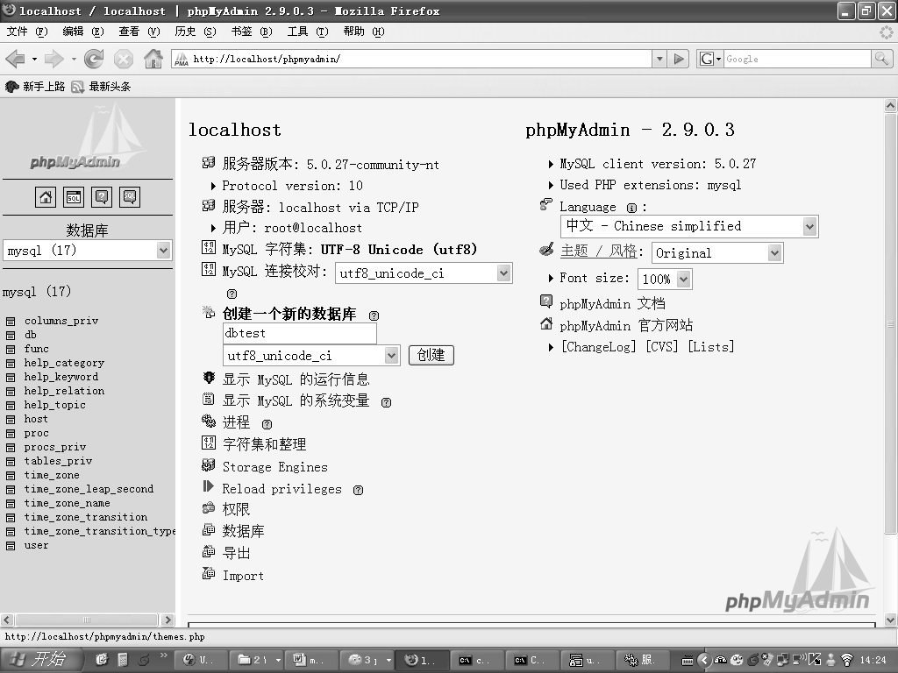

登录后进入 phpMyAdmin 的主页面，在主页面中 phpMyAdmin 列出了当前数据库的一些基本信息，包括数据库版本、连接方式、连接用户、MySQL 字符集等，可以在主页面选择创建一个新的数据库，或者在窗口的左边下拉列表框中选择一个已经存在的数据库。在窗口的下方，列出一些常用管理功能，其中包括进程管理、用户管理、数据导入导出、存储引擎管理等。

图 6-51 显示的是在主页面中创建一个新数据库：首先输入要创建的数据库名字，选择数据库的字符集，然后，单击“创建”按钮即可成功创建一个新的数据库。

图6-51 phpMyAdmin主页面

从图6-51中可以看到，在窗口的左边因为选择了MySQL数据库，可以看到下拉列表框下方列出了MySQL数据库中的数据库对象，括号中的数字“17”表示MySQL数据库中包含的数据库对象的数量。如果需要查看数据库对象的详细情况或者数据库对象保存的数据，则可以直接选择该数据库对象，打开对应的数据库对象的窗口。

数据库的创建和选择都可以在主页面上完成，如果需要删除数据库，则需要进入数据库对象管理的页面中，在菜单的最后一项选择DROP命令可以删除当前选择的数据库。注意，删除数据库操作会删除该数据库包含的所有数据库对象，删除之前最好确保已有备份。

