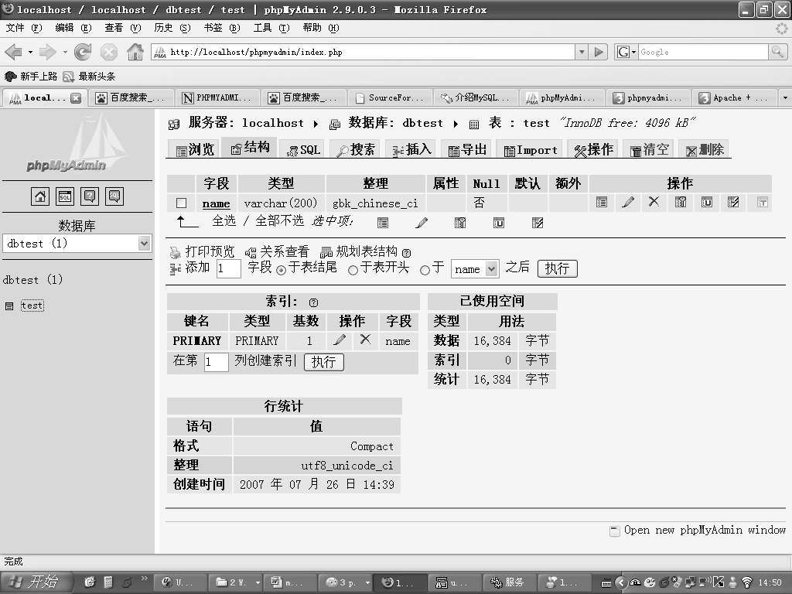

在主页面完成创建数据库的操作或者在主页面选择已经存在的数据库后，可以进入表的管理、维护界面，进行表的创建、更新、删除等管理维护工作。

图6-52显示了一个标准的数据库对象管理页面，在窗口的左边选择了表test，那么在窗口的右边就可以看到该表的表结构、索引情况、空间使用的情况等详细信息，同时可以对表的结构、索引进行修改。

这些操作都和实际执行命令行操作所完成的功能是相同的，不同的是使用图形界面可以大大方便修改的过程，屏蔽因为语法错误带来的相关问题。

图6-52 phpMyAdmin表管理维护页面

在页面的最上方，可以看到所有数据库对象管理可以完成的操作，包括直接执行 SQL 语句、插入记录、导出导入数据、表分析表检查、清空表、删除表等，这里不再对这些页面进行逐一介绍，建议读者对每个功能都进行简单的测试，便于在以后的开发维护中能够更加熟练地使用这些功能。

