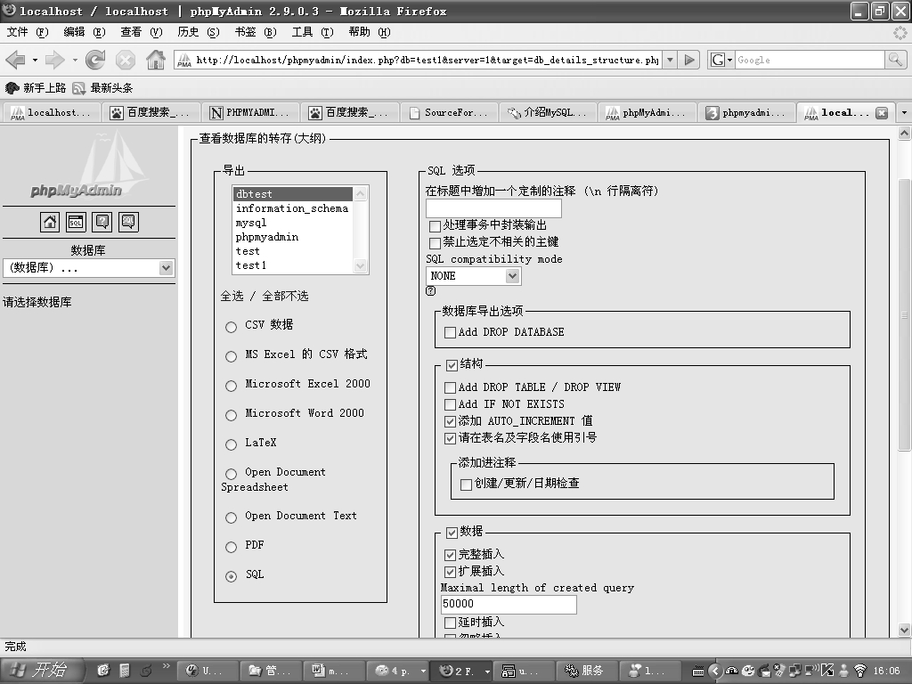
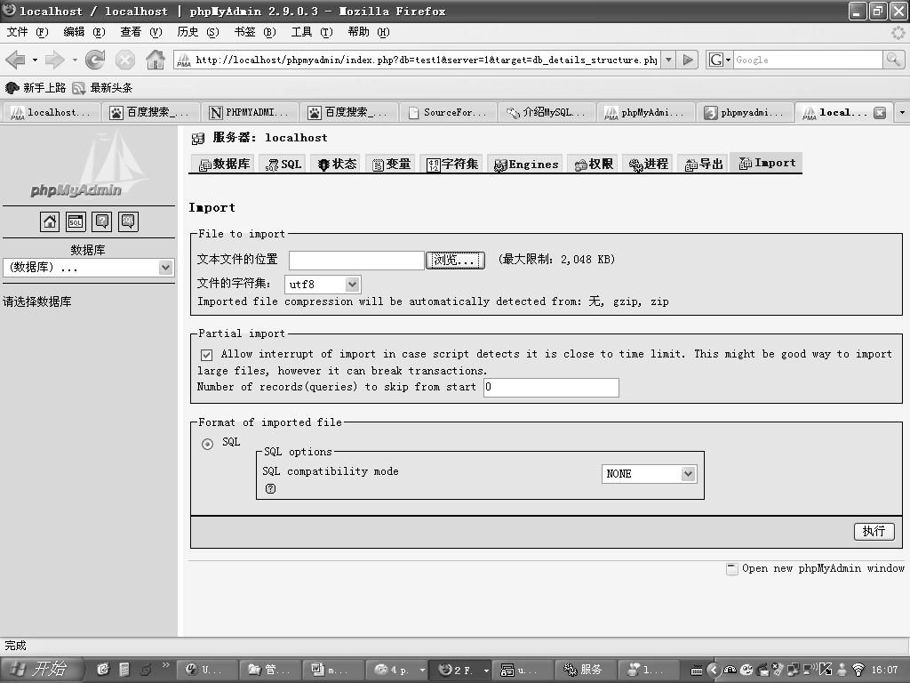
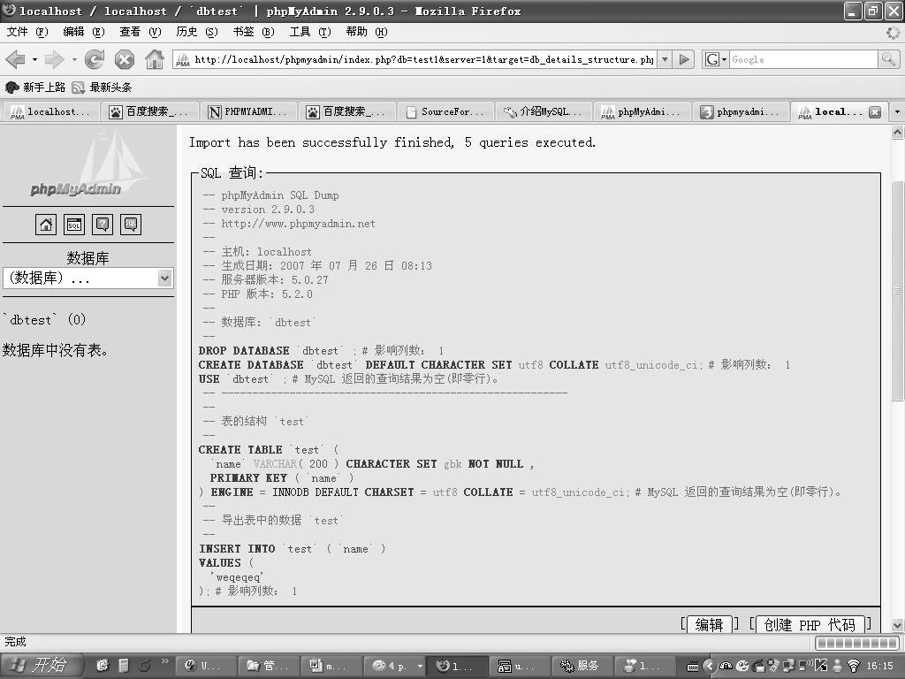

数据的导入导出是数据库管理工具一项非常重要的功能，phpMyAdmin提供的导入导出功能也比较完善，支持导出成 CSV、Excel、Text、PDF、SQL 等多种格式，SQL 兼容性允许导出其他数据库语法的 SQL 语句，支持的数据库包括 DB2、Oracle、SQL Server、MaxDB、PostgreSQL等，为数据在异构数据库间的迁移提供了便利。

图6-53 phpMyAdmin权限管理

进入主页后单击“导出”按钮后，进入数据导出页面，导出页面如图 6-54 所示，使用者在导出数据时，需要先选择导出的数据库，再选择导出的数据格式，然后根据导出数据格式设置相应的选项，最后单击“执行”按钮完成数据导出。

图6-54 phpMyAdmin数据库的转存

导入数据的操作也非常简单。从主页进入导入数据管理界面后，在图6-55中单击“浏览”按钮，选择用户要导入的文件，然后单击“执行”按钮，即可完成导入操作。

导入成功后会出现导入是否成功的详细信息，导入结束后的提示界面如图6-56所示。

图6-55 phpMyAdmin导入数据

图6-56 phpMyAdmin导入成功显示

