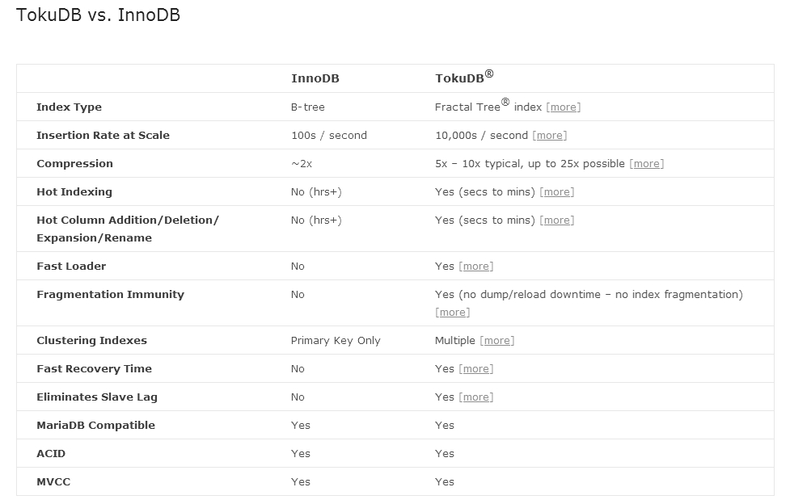

前面介绍的都是MySQL自带的存储引擎，除了这些之外，还有一些常见的第三方存储引擎，在某些特定应用中也有广泛使用，比如列式存储引擎Infobright、高写性能高压缩的TokuDB就是其中非常有代表性的两种，本节将简单介绍一下TokuDB。

TokuDB是一个高性能、支持事务处理的MySQL和MariaDB的存储引擎，具有高扩展性、高压缩率、高效的写入性能，支持大多数在线DDL操作。最新版本已经开源，读者可以从Tokutek官方网站中进行下载和安装（http://www.tokutek.com/products/downloads/）。

针对 TokuDB 存储引擎的主要特性， Tokutek 网站公布了这款优秀存储引擎与经典的InnoDB存储引擎的对比结果，如图7-1所示。

图7-1 TokuDB与 InnoDB的比较

通过对比，我们可以看出TokuDB主要有以下几项特性：

使用Fractal树索引保证高效的插入性能；

优秀的压缩特性，比InnoDB高近10倍；

Hot Schema Changes特性支持在线创建索引和添加、删除属性列等DDL操作；

使用Bulk Loader达到快速加载大量数据；

提供了主从延迟消除技术；

支持ACID和MVCC。

关于各特性的具体性能测试数据，读者可以从Tokutek网站获得（***http://www.tokutek.com/resources/tokudb-vs-innodb***）。

通过上面的介绍，我们发现TokuDB特别适用以下几种场景：

日志数据，因为日志通常插入频繁且存储量大；

历史数据，通常不会再有写操作，可以利用TokuDB的高压缩特性进行存储；

在线DDL较频繁的场景，使用TokuDB可以大大增加系统的可用性。

