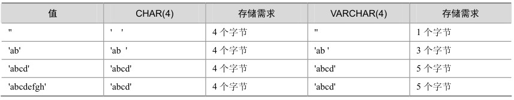

CHAR和VARCHAR类型类似，都用来存储字符串，但它们保存和检索的方式不同。CHAR属于固定长度的字符类型，而VARCHAR属于可变长度的字符类型。

表8-1显示了将各种字符串值保存到CHAR(4)和VARCHAR(4)列后的结果，说明了CHAR和VARCHAR之间的差别。

表8-1 CHAR和VARCHAR的对比

注意表8-1中最后一行的值只适用MySQL运行在非“严格模式”时，如果MySQL运行在严格模式，超过列长度的值将不会保存，并且会出现错误提示，关于“严格模式”，将在第16章“SQL Mode及相关问题”中详细介绍。

从CHAR(4)和VARCHAR(4)列检索的值并不总是相同，因为检索时从CHAR列删除了尾部的空格。下面通过一个例子来说明该差别：

mysql> CREATE TABLE vc (v VARCHAR(4), c CHAR(4));

Query OK, 0 rows affected (0.02 sec)

mysql> INSERT INTO vc VALUES ('ab ', 'ab ');

Query OK, 1 row affected (0.00 sec)

mysql> SELECT CONCAT(v, '+'), CONCAT(c, '+') FROM vc;

+----------------+----------------+

| CONCAT(v, '+') | CONCAT(c, '+') |

+----------------+----------------+

| ab + | ab+ |

+----------------+----------------+

1 row in set (0.00 sec)

由于CHAR是固定长度的，所以它的处理速度比VARCHAR快得多，但是其缺点是浪费存储空间，程序需要对行尾空格进行处理，所以对于那些长度变化不大并且对查询速度有较高要求的数据可以考虑使用CHAR类型来存储。

另外，随着MySQL版本的不断升级，VARCHAR数据类型的性能也在不断改进并提高，所以在许多的应用中，VARCHAR类型被更多地使用。

在MySQL中，不同的存储引擎对CHAR和VARCHAR的使用原则有所不同，这里简单概括如下。

MyISAM存储引擎：建议使用固定长度的数据列代替可变长度的数据列。

MEMORY 存储引擎：目前都使用固定长度的数据行存储，因此无论使用 CHAR 或VARCHAR列都没有关系。两者都是作为CHAR类型处理。

InnoDB存储引擎：建议使用VARCHAR类型。对于InnoDB数据表，内部的行存储格式没有区分固定长度和可变长度列（所有数据行都使用指向数据列值的头指针），因此在本质上，使用固定长度的CHAR列不一定比使用可变长度VARCHAR列性能要好。因而，主要的性能因素是数据行使用的存储总量。由于CHAR平均占用的空间多于VARCHAR，因此使用VARCHAR来最小化需要处理的数据行的存储总量和磁盘I/O是比较好的。

