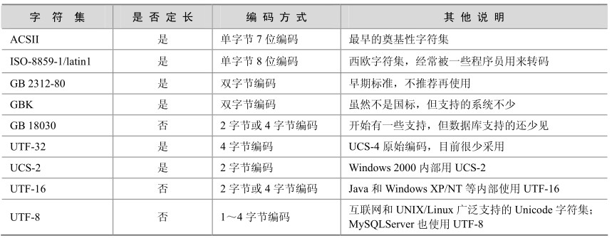

在计算机发展的不同阶段，我国也参照当时的国际标准和实际需要，制定了一些汉字字符集编码标准，主要内容如下。

GB 2312-80：全称《信息交换用汉字编码字符集 基本集》，于 1980 年发布。根据ISO/IEC 2022提供的字符编码扩充规范，形成双字节编码的字符集。收录了 6763个常用汉字和682个非汉字图形符号。

GB 13000：全称《信息技术 通用多八位编码字符集（UCS）第一部分：体系结构与基本多文种平面》，于 1993年发布。根据 ISO/IEC 10646-1:1993，在CJK（中、日、韩简称）统一汉字区和CJK统一汉字扩充区A，除收录GB 2312-80外，还收录了第1、3、5、7辅助集的全部汉字，共27484个，以及一些偏旁部首等。但GB 13000推出后，几乎没有得到业界的支持，也就成了一个形式上的标准。

GBK：全称《汉字内码扩展规范》1.0版，发布于1995年。GBK在GB 2312内码系统的基础上进行了扩充，收录了GB 13000.1-1993的全部20902个CJK统一汉字，包括GB 2312的全部6763个汉字。此外，它增补编码了52个汉字，13个汉字结构符（在 ISO/IEC 10646.1: 2000中称为表意文字描述符）和一些常用部首与汉字部件。在GBK的内码系统中，GB 2312汉字所在码位保持不变，这样，保证了GBK对GB 2312的完全兼容。同时，GBK内码与GB 13000.1代码一一对应，为GBK向GB 13000.1的转换提供了解决办法。有意思的是GBK并不是一个强制性的国家标准，只是一个行业指导规范，并没有强制力，但由于得到了Microsoft Windows 95的支持而大为流行。

GB 18030：全称《信息技术信息交换用汉字编码字符集、基本集的扩充》，发布于2000年。根据 ISO/IEC 10646-1:2000，收录了 ISO/IEC 10646.1: 2000全部27484个CJK统一汉字， 13个表意文字描述符、部分汉字部首和部件、欧元符号等。GB 18030采用2字节或4字节编码，其二字节编码部分与GBK保持一致，因此，GB 18030是GBK的超集，也完全与GB 13000向上兼容，制定GB 18030也是为了解决GBK强制力不够的问题。

以上简要介绍了几种汉字字符集，下面将一些常用字符集的特点归纳如表9-1所示。

表9-1 常用字符集比较

