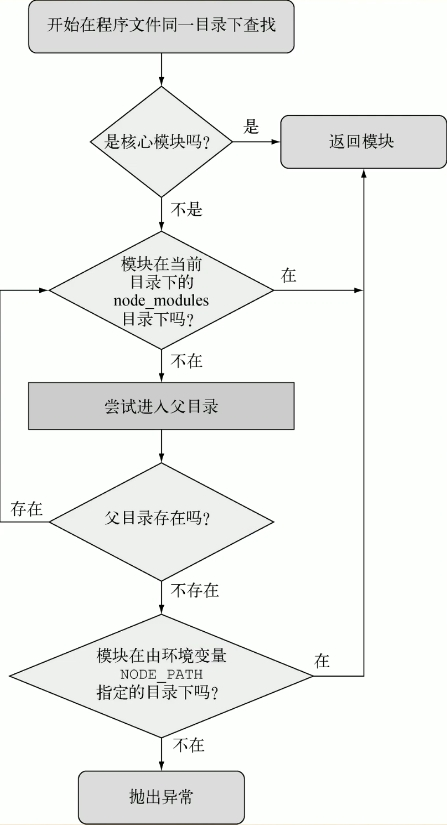

`Node` 中有一个独特的模块引入机制，可以不必知道模块在文件系统中的具体位置。这个机制就是使用 `node_modules` 目录。

假设有如下引入模块的代码：

```js
const currency = require('./currency');
```

如果省略 `./`，只写 `currency`，`Node` 会遵照几个规则搜寻这个模块：



用环境变量 `NODE_PATH` 可以改变 `Node` 模块的默认路径。如果用了它
