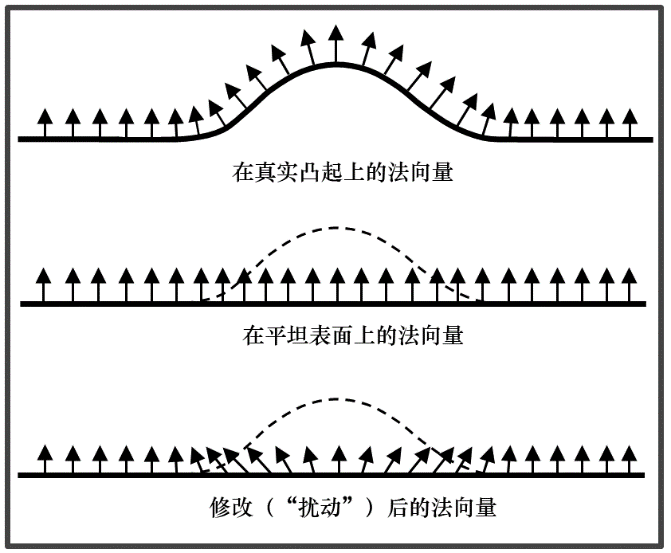
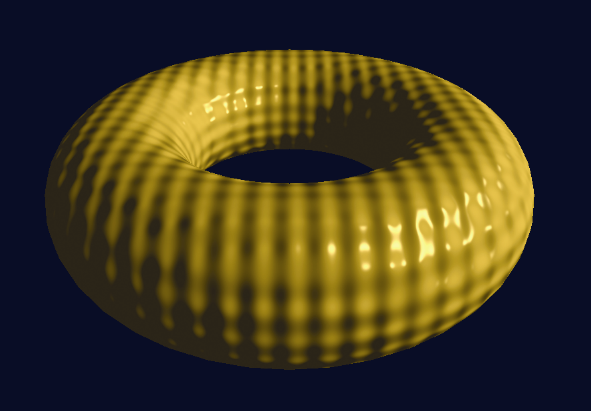

### 10.1　凹凸贴图

在第7章中，我们了解了表面法向量在创建令人信服的光照效果中是至关重要的。像素处的光强度主要由反射角确定，即需要考虑到光源位置、相机位置和像素处的法向量。因此，如果我们能找到生成相应法向量的方法，就可以避免生成与凹凸不平或褶皱表面相对应的顶点。

图10.1展示了对于单个“凸起”修改法向量的概念。


<center class="my_markdown"><b class="my_markdown">图10.1　用于凹凸贴图的扰动法向量</b></center>

因此，如果我们想让一个物体看起来好像有凹凸（或皱纹，陨石坑等），一种方法是计算当表面确实凹凸不平时其上的法向量。当场景点亮时，光照会让人产生我们所期望的幻觉。这是Blinn在1978年首次提出的<sup class="my_markdown">[BL78]</sup>，随着在片段着色器拥有了可以对每个像素进行光照计算的能力，这种方法就变得切实可行了。

程序10.1中展示了顶点着色器和片段着色器的一个示例，这段程序会生成一个带有“高尔夫球”表面的环面，如图10.2所示。其代码几乎与我们之前在程序7.2中看到的相同。片段着色器中唯一显著的变化是——输入的已插值法向量（在原程序中名为“varyingNormal”）在这里变得凹凸不平了，其方法是对环面模型的原始（未变形）顶点的X、Y和Z轴应用正弦函数。请注意，这里需要顶点着色器将未经变换的顶点沿管线传递给片段着色器。


<center class="my_markdown"><b class="my_markdown">图10.2　过程式凹凸贴图示例</b></center>

以这种方式对法向量进行改变，即在运行时使用数学函数进行计算，称为过程式凹凸贴图。

程序10.1　过程式凹凸贴图

```c
顶点着色器
#version 430
// 与Phong着色相同，但添加此输出顶点属性
out vec3 originalVertex;
. . .
void main(void)
{ // 添加原始顶点，传递以进行插值
  originalVertex = vertPos;   . . .
}
片段着色器
#version 430
// 与Phong着色相同，但添加此输入顶点属性
in vec3 originalVertex;
. . .
void main(void)
{ . . . 
  // 添加如下代码以扰乱传入的法向量
  float a = 0.25;  // a 控制凸起的高度
  float b = 100.0; // b 控制凸起的宽度
  float x = originalVertex.x;   float y = originalVertex.y;   float z = originalVertex.z;   N.x = varyingNormal.x + a*sin(b*x);   // 使用正弦函数扰乱传入法向量
  N.y = varyingNormal.y + a*sin(b*y);   N.z = varyingNormal.z + a*sin(b*z);   N = normalize(N);   // 光照计算以及输出的fragColor（未更改）现在使用扰动过的法向量N
  . . .
}

```

