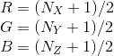
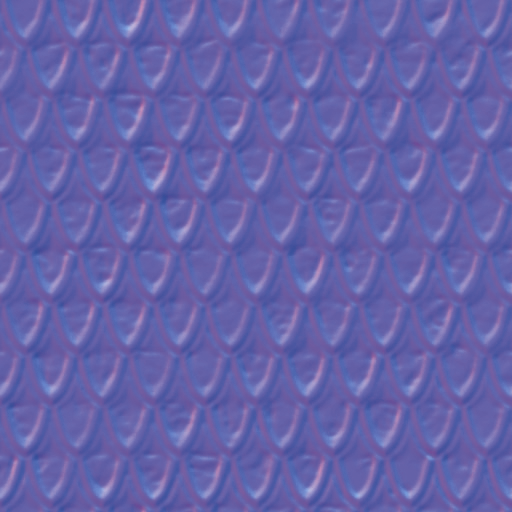
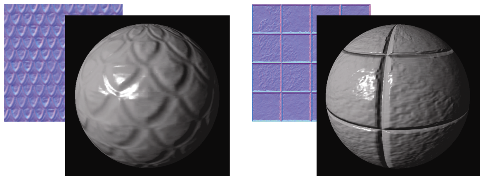
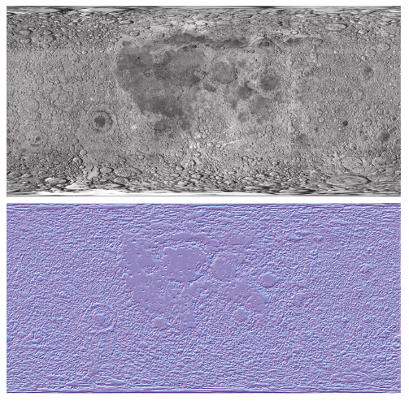
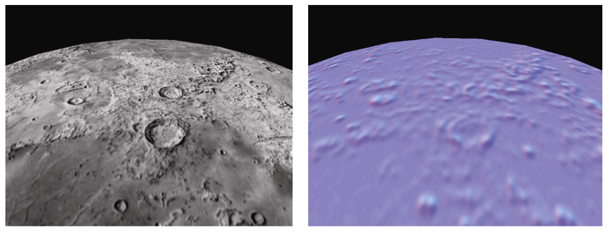
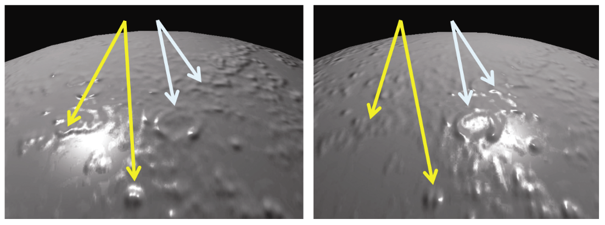
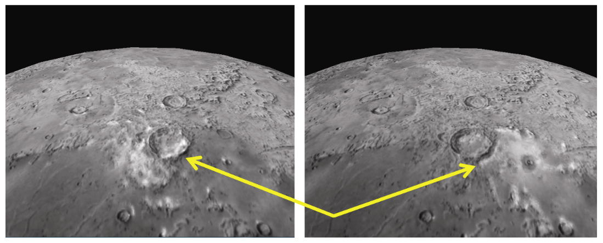
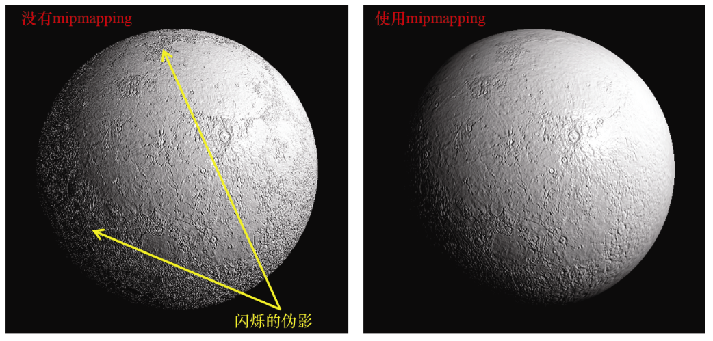
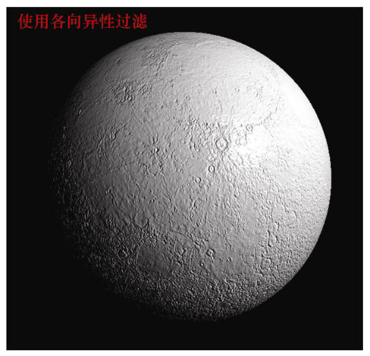
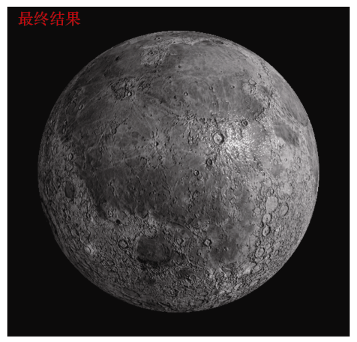

### 10.2　法线贴图

凹凸贴图的一种替代方法是使用查找表来替换法向量。这样我们就可以在不依赖数学函数的情况下，对凸起进行构造，例如月球上的陨石坑所对应的凸起。一种使用查找表的常见方法叫作法线贴图。

为了理解法线贴图的工作原理，我们首先注意，向量通过3字节存储，X、Y和Z分量各占1字节，就可以达到合理的精度。这样，我们就可以将法向量存储在彩色图像文件中，其中R、G和B分量分别对应于X、Y和Z。图像中的RGB值以字节存储，通常被解释为[0…1]范围内的值，但是向量可以有正负值分量。如果我们将法向量分量限制在[−1…+1]范围内，那么在图像文件中将法向量**N**存储为像素的简单转换是：



法线贴图使用一个图像文件（称为法线贴图），该图像文件包含在光照下所期望表面外观的法向量。在法线贴图中，向量相对于任意平面XY表示，其X和Y分量表示与“垂直”的偏差，其Z分量设置为1，严格垂直于XY平面的向量（即没有偏差）将表示为（0, 0, 1），而不垂直的向量将具有非零的X和/或Y分量。我们需要使用上面的公式将值转换至RGB空间；例如，（0, 0, 1）将存储为（0.5, 0.5, 1），因为实际偏移的范围为[−1…+1]，而RGB值的范围为[0…1]。

我们可以通过纹理单元的另一种妙用来生成这样一幅法线贴图：我们在纹理单元中存储所需的法向量而非颜色。然后，在给定片段中，我们就可以使用采样器从法线贴图中查找值，接下来，我们将所得的值作为法向量，而非输出像素颜色（在纹理贴图中我们是这么做的）。

图10.3展示了一个法线贴图图像文件的例子，通过将GIMP法线贴图插件<sup class="my_markdown">[GI16]</sup>应用于Luna <sup>[LU16]</sup>纹理而生成。法线贴图图像文件并不适合作为图像查看，我们展示这幅图就是为了指明这一点，法线贴图最终看起来基本都是蓝色的。这是因为图像文件中每个像素的B值（蓝色值）都是1（最大蓝色值），这会让它在作为图像时看起来是“蓝色的”。


<center class="my_markdown"><b class="my_markdown">图10.3　法线贴图图像文件示例<sup class="my_markdown">[ME11]</sup></b></center>

图10.4展示了两个不同的法线贴图图像文件（它们都由Luna <sup class="my_markdown">[LU16]</sup>的纹理构建）以及在Blinn-Phong光照模型下将它们应用于球体的结果。


<center class="my_markdown"><b class="my_markdown">图10.4　法线贴图示例</b></center>

从法线贴图查找到的法向量不能直接使用，因为它们是相对于上述的任意XY平面定义的，并没有考虑它们在物体上的位置以及在相机空间中的方向。这个问题的解决策略是建立一个转换矩阵，用于将法向量转换为相机空间，如下所示。

在对象的每个顶点处，我们考虑与对象相切的平面。顶点处的物体的法向量垂直于该切面。我们在该切面中定义两个相互垂直的向量，同时也垂直于法向量，称为切向量和副切向量（有时称为副法向量）。构造我们期望的变换矩阵要求我们的模型包括每个顶点的切向量（可以通过计算切向量和法向量的叉积来构建副切向量）。如果模型中没有定义切向量，则需要通过计算得到它们。在球体的情况下，可以通过计算得到精确的切向量。以下是对程序6.1的修改：

```c
. . .
for (int i=0; i<=prec; i++) { 
   for (int j=0; j<=prec; j++) { 
      float y = (float)cos(toRadians(180.0f - i*180.0f / prec)); 
      float x = -(float)cos(toRadians(j*360.0f / prec)) * (float)abs(cos(asin(y))); 
      float z = (float)sin(toRadians(j*360.0f / prec)) * (float)abs(cos(asin(y))); 
      vertices[i*(prec+1)+j] = glm::vec3(x, y, z);
      // 计算切向量
      if (((x==0) && (y==1) && (z==0)) || ((x==0) && (y==-1) && (z==0))) // 如果是北极或南极，
      { tangent[i*(prec+1)+j] = glm::vec3(0.0f, 0.0f, -1.0f);       // 设置切向量为 -Z 轴
      }       else                 // 否则，计算切向量
      { tangent[i*(prec+1)+j] = glm::cross(glm::vec3(0.0f, 1.0f, 0.0f), glm::vec3(x,y,z));       }       . . . // 其余计算代码不变
   }
}

```

对于那些表面不可导以至于无法精确求解切向量的模型，其切向量可以通过近似得到，例如在构造（或加载）模型时，将每个顶点指向下一个顶点的向量作为切向量。请注意，这种近似可能会导致切向量与顶点法向量不严格垂直。因此，如果要实现适用于各种模型的法线贴图，需要考虑这种可能性（我们的解决方案中对此进行了处理）。

切向量与顶点、纹理坐标以及法向量一样，是从缓冲区（VBO）传递到顶点着色器中的顶点属性。然后，顶点着色器通过应用MV矩阵的逆转置并将结果沿着流水线转发以由光栅器进行插值并最终进入片段着色器，从而对正常向量进行处理。逆转置的应用将法向量和切向量转换为相机空间，之后我们使用叉积构造副切向量。

一旦我们在相机空间中得到法向量、切向量和副切向量，就可以使用它们来构造矩阵（依其分量命名为“TBN”矩阵），该矩阵用于将从法线贴图中检索到的法向量转换为在相机空间中相对于物体表面的法向量。

在片段着色器中，新法向量的计算在calcNewNormal()函数中完成。函数的第三行［包含dot（tangent，normal）］的计算确保切向量垂直于法向量。新的切向量和法向量的叉积就是副切向量。

然后，我们创建一个类型为mat3的3×3矩阵，作为TBN。mat3构造函数接收3个向量作为参数，生成一个矩阵，其中顶行是第一个向量，中间行是第二个向量，底行是第三个向量（类似于从摄像机位置构建视图矩阵，见图3.13）。

着色器使用片段的纹理坐标来提取与当前片段对应的法线贴图单元。着色器在提取时使用采样器变量“normMap”，并被绑定到纹理单元0（注意：因此在C++ / OpenGL应用程序中必须将法线贴图图像附加到纹理单元0）。因为需要将颜色分量从纹理中存储范围[0…1]转换为其原始范围[−1 … + 1]，我们将其乘以2.0再减去1.0。

然后将TBN矩阵应用于所得法向量以产生当前像素的最终法向量。着色器的其余部分与用于Phong光照的片段着色器相同。片段着色器代码基于Etay Meiri <sup class="my_markdown">[ME11]</sup>的版本，如程序10.2所示。

制作法线贴图图像可以使用各种各样的工具。有的图像编辑工具就有制作法线贴图的功能，例如GIMP <sup class="my_markdown">[GI16]</sup>和Photoshop <sup>[PH16]</sup>。它们通过分析图像中的边缘，推断凸起和凹陷，并产生相应的法线贴图。

图10.5显示了由Hastings-Trew <sup class="my_markdown">[HT16]</sup>基于NASA卫星数据创建的月面纹理图。其相应的法线贴图由GIMP法线贴图插件<sup>[GP16]</sup>，通过处理由Hastings-Trew创建的黑白版本月面纹理图生成。

程序10.2　法线贴图片段着色器

```c
#version 430
in vec3 varyingLightDir;
in vec3 varyingVertPos;
in vec3 varyingNormal;
in vec3 varyingTangent; in vec3 originalVertex;
in vec2 tc;
in vec3 varyingHalfVector;
out vec4 fragColor;
layout (binding=0) uniform sampler2D normMap; // 其余统一变量同前
. . .
vec3 calcNewNormal() { vec3 normal = normalize(varyingNormal);   vec3 tangent = normalize(varyingTangent);   tangent = normalize(tangent - dot(tangent, normal) * normal); // 切向量垂直于法向量
  vec3 bitangent = cross(tangent, normal);   mat3 tbn = mat3(tangent, bitangent, normal);       // 用来变换到相机空间的TBN矩阵
  vec3 retrievedNormal = texture(normMap,tc).xyz;   retrievedNormal = retrievedNormal * 2.0 - 1.0;     // 从RGB空间转换
  vec3 newNormal = tbn * retrievedNormal;   newNormal = normalize(newNormal);   return newNormal; }
void main(void)
{ // 正规化光照向量，法向量和视图向量
  vec3 L = normalize(varyingLightDir); 
  vec3 V = normalize(-varyingVertPos); 
  vec3 N = calcNewNormal();
  // 获得光照向量和曲面法向量之间的角度
  float cosTheta = dot(L,N); 
  // 为Blinn优化计算半向量
  vec3 H = normalize(varyingHalfVector); 
  // 视图向量和反射光向量之间的角度
  float cosPhi = dot(H,N);
  // 计算ADS贡献（每个像素）
  fragColor = globalAmbient * material.ambient 
  + light.ambient * material.ambient 
  + light.diffuse * material.diffuse * max(cosTheta,0.0) 
  + light.specular * material.specular * pow(max(cosPhi,0.0), material.shininess*3.0);
}

```


<center class="my_markdown"><b class="my_markdown">图10.5　月球纹理（上）和法线贴图（下）</b></center>

图10.6展示了使用两种不同方式渲染的，用以表现月球表面的球体。图10.6左图中，球体使用了原始的纹理贴图；图10.6右图中，球体使用法线贴图的图像作为纹理（供参考）。它们都没有应用法线贴图。虽然左侧使用了纹理的“月球”非常逼真，但仔细观察可以发现，纹理图案很明显拍摄于阳光从左侧照亮月球的时候，因为其山脊的阴影投射到了右侧（在底部中心附近的火山口中最明显）。如果我们使用Phong着色为此场景添加光照，然后移动月球、相机或灯光来给场景添加动画，就会发现月球上的阴影不会如我们期望地改变。

此外，随着光源的移动（或相机移动），期望中会在山脊上出现许多镜面高光。但是图10.6左图使用了标准纹理的球体将只产生一个镜面高光，对应于光滑球体上所出现的高光，这看起来非常不现实。配合法线贴图可以显著提高这类对象在光照下的真实感。


<center class="my_markdown"><b class="my_markdown">图10.6　使用月面纹理的球体（左）和使用法线贴图的球体（右）</b></center>

当我们在球体上使用法线贴图（而不是纹理）时，我们会得到图10.7所示的结果。尽管它不像标准纹理那么真实（现在），但是现在它确实响应了光照变化。图10.7的第一张图像中从左侧进行光照，第二张图像中则从右侧进行光照。请注意蓝色和黄色箭头所示部分展示了山脊周围漫反射光的变化以及镜面反射高光的移动。


<center class="my_markdown"><b class="my_markdown">图10.7　法线贴图对月球的影响</b></center>

图10.8展示了在使用Phong光照模型的情况下，将法线贴图与标准纹理相结合的效果。月球的图像通过漫射区域进行了增强，镜面高光区域也会响应光源的移动（或相机或物体移动）。两个图像中的光照分别来自左侧和右侧。


<center class="my_markdown"><b class="my_markdown">图10.8　纹理加法线贴图，分别从左侧和右侧进行光照</b></center>

我们的程序现在需要两个纹理—— 一个用于月球表面图像，一个用于法线贴图——因此需要有两个采样器。片段着色器使用之前在7.6节中所描述的技术，将纹理颜色与经光照计算所得的颜色进行混合，如程序10.3所示。

程序10.3　纹理加法线贴图

```c
// 片段着色器中的变量和结构与之前相同，加上
layout (binding=0) uniform sampler2D s0;     // 法线贴图
layout (binding=1) uniform sampler2D s1;     // 纹理
void main(void)
{ // 计算与之前相同，直到
  vec3 N = calcNewNormal(); 
  vec4 texel = texture(s1,tc);     // 标准纹理
  . . . 
  // 反射计算与之前相同，然后混合结果
  fragColor = globalAmbient + 
     texel * (light.ambient + light.diffuse * max(cosTheta,0.0) 
     + light.specular * pow(max(cosPhi,0.0), material.shininess));
}
```

有趣的是，法线贴图可以从多级渐远纹理贴图（Mipmapping）中受益，因为在第5章中看到的纹理化产生的“锯齿”伪影，在使用纹理图像进行法线贴图时也会发生。图10.9分别展示了未使用多级渐远纹理贴图和使用了多级渐远纹理贴图进行法线贴图的月球。尽管在静止的图像中不容易观察到，但是左边的球体（未使用多级渐远纹理贴图）周边有闪烁的伪影。


<center class="my_markdown"><b class="my_markdown">图10.9　发现贴图伪影，以及使用多级渐远纹理贴图校正后的图像</b></center>

对于法线贴图而言，各向异性过滤（AF）更有效，它不但减少了闪烁的伪影，同时还保留了细节，如图10.10所示（比较右下角边缘的细节）。图10.11中展示了使用相等的纹理权重和光照权重，光照应用了法线贴图及AF的情况下得到的结果。


<center class="my_markdown"><b class="my_markdown">图10.10　使用各向异性过滤进行法线贴图</b></center>


<center class="my_markdown"><b class="my_markdown">图10.11　纹理加各向异性过滤法线贴图</b></center>

最终的渲染结果并不完美。无论光照如何，原始纹理图像中出现的阴影仍将显示在渲染结果上。此外，虽然法线贴图可以影响漫反射和镜面反射效果，但它无法投射阴影。因此，当表面特征较小时，最适用法线贴图。

