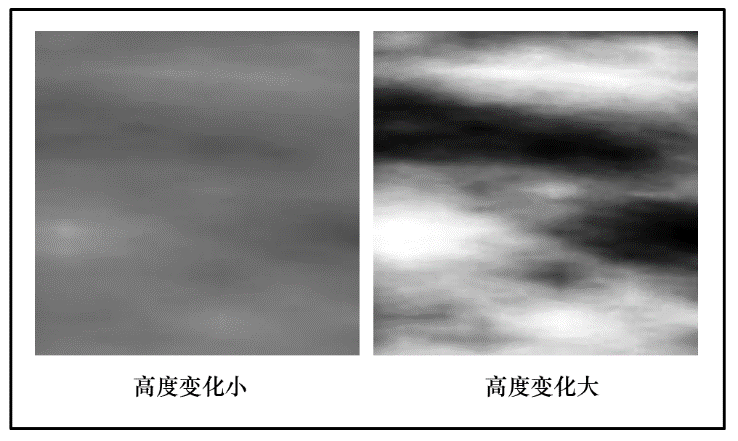
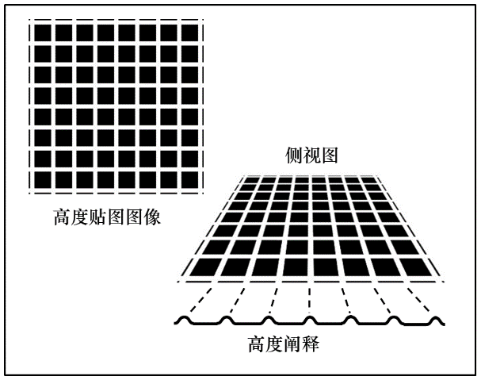
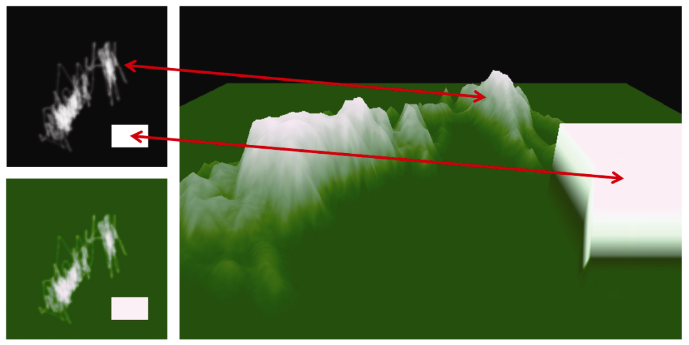

### 10.3　高度贴图

现在我们扩展法线贴图的概念——从纹理图像用于扰动法向量到扰乱顶点位置本身。实际上，以这种方式修改对象的几何体具有一定的优势，例如使表面特征沿着对象的边缘可见，并使特征能够响应阴影贴图。我们将会看到，它还可以帮助构建地形。

一种实用的方法是使用纹理图像来存储高度值，然后使用该高度值来提升（或降低）顶点位置。含有高度信息的图像称为高度图，使用高度图更改对象的顶点的方法称为高度贴图<sup class="my_markdown">[1]</sup>。高度图通常将高度信息编码为灰度颜色：（0,0,0）（黑色）=低高度，（1,1,1）（白色）=高高度。这样一来通过算法或使用“画图”程序就可以轻松创建高度图。图像的对比度越高，其表示的高度变化越大。这些概念将在图10.12（显示随机生成的地图）和图10.13（显示有组织的模式的地图）中说明。


<center class="my_markdown"><b class="my_markdown">图10.12　高度图示例</b></center>


<center class="my_markdown"><b class="my_markdown">图10.13　高度贴图阐释</b></center>

改变顶点位置是否有用取决于改变的模型。顶点操作可以在顶点着色器中轻松完成，当模型顶点细节级别够高（例如在足够高精度的球体中）时，改变顶点高度的方法效果很好。但是，当模型的顶点数量很少（例如立方体的角）时，渲染对象的表面需要依赖于光栅器中的顶点插值来填充细节。当顶点着色器中可用于改变高度的顶点很少时，许多像素的高度将无法从高度图中检索，而需要由插值生成，从而导致表面细节较差。当然，在片段着色器中是不可能进行顶点操作的，因为这时顶点已被光栅化为像素位置。

程序10.4展示了一个将顶点“向外”（即在表面法向量的方向上）移动的顶点着色器代码。它通过将顶点法向量乘以从高度图检索所得的值，然后将该乘积与顶点位置相加，以“向外”移动顶点。

程序10.4　顶点着色器中的高度贴图

```c
#version 430
layout (location=0) in vec3 vertPos;
layout (location=1) in vec2 texCoord;
layout (location=2) in vec3 vertNormal;
out vec2 tc;
uniform mat4 mv_matrix;
uniform mat4 proj_matrix;
layout (binding=0) uniform sampler2D t;    // 用于纹理
layout (binding=1) uniform sampler2D h;    // 用于高度图
void main(void)
{ // "p"是高度图所改变的顶点位置
  // 由于高度图是灰度图，因此使用其任何颜色分量
  // 都可以（我们使用"r"）。除以5.0用来调整高度
  vec4 p = vec4(vertPos,1.0) + vec4( (vertNormal * ((texture(h, texCoord).r) / 5.0f)),1.0f );   tc = tex_coord; 
  gl_Position = proj_matrix * mv_matrix * p;
}

```

图10.14（见彩插）展示了通过在画图程序中涂鸦创建的简单高度图（左上角）。高度图图像中还绘制了一个白色矩形。绿色版本的高度图（左下角）用作纹理。使用程序10.4中展示的着色器将高度图应用于100×100的矩形网格模型时，会产生类似“地形”的感觉（如图10.14右图所示）。注意白色矩形是如何生成右边的悬崖的。


<center class="my_markdown"><b class="my_markdown">图10.14　地形，在顶点着色器中进行高度贴图</b></center>

图10.14展示的渲染结果还算可以，因为模型（网格和球体）有足够数量的顶点来对高度贴图值进行采样。也就是说，模型具有大量的顶点，而高度图相对粗糙并且以低分辨率充分地采样。然而，仔细观察仍然会发现存在分辨率伪影，例如沿图10.14中地形右侧凸起的矩形盒子的左下边缘。凸起的矩形盒子两侧看起来不是完美矩形，而且颜色有渐变效果，其原因是底层网格100像素×100像素的分辨率无法与高度图中的白色矩形完全对齐，从而导致纹理的光栅化坐标沿侧面产生伪影。

当尝试将其应用于要求更严苛的高度贴图时，在顶点着色器中进行高度贴图的限制会进一步暴露。考虑图10.5中展示的月球图像。法线贴图在捕获图像细节方面表现非常出色（如图10.9和图10.11所示），而且由于它是灰度图，因此尝试将其作为高度图应用似乎很自然。但是，基于顶点着色器的高度贴图会无法胜任这个任务，因为顶点着色器中采样的顶点数（即使对于精度=500的球体）比起图像中的细节级别，仍然太少。相较之下，法线贴图能够很好地捕获细节，因为在片段着色器中对法线贴图的采样是像素级的。

我们将会在之后的第12章继续学习高度图，在那里我们会了解使用曲面细分着色器生成大量顶点的方法。

