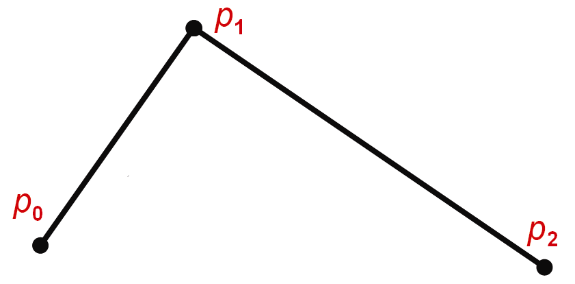
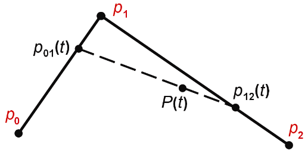
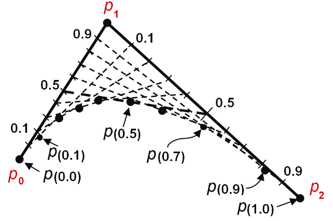
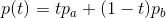
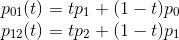
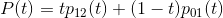
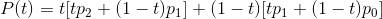
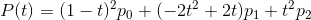
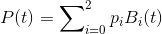
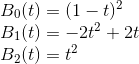

### 11.1　二次贝塞尔曲线

二次贝塞尔曲线由一组参数方程定义，方程组中使用3个控制点指定特定的曲线的形状，每个控制点都是2D空间中的一个点。[1]考虑图11.1中所示的一组3个点[p0，p1，p2]。

<b class="my_markdown">图11.1　贝塞尔曲线的控制点</b>

通过引入参数t，我们可以构建一个用来定义曲线的参数方程组。t表示从一个控制点到另一控制点间线段距离的分数。对于在线段上的点，t的值在[0…1]的范围内。图11.2显示了一个这样的值：t = 0.75，分别应用于连接p0-p1和p1-p2的线段。通过t在两条原始线段上定义了两个新点p01(t)和p12(t)。我们对连接两个新点p01(t)和p12(t)的线段重复该过程，产生点P(t)，其中沿线段p01(t)和p12(t)在t = 0.75得到点P(t)。P(t)是最终得到的曲线上的点，因此用大写字母P表示。

<b class="my_markdown">图11.2　参数位置处的点t = 0.75</b>

针对各种t值收集大量的点P(t)，则会产生一条曲线，如图11.3所示。采样的t的参数值越多，生成的点P(t)越多，得到的曲线则越平滑。

<b class="my_markdown">图11.3　建立二次贝塞尔曲线</b>

现在可以导出二次贝塞尔曲线的分析定义。首先，我们注意到连接两个点pa和pb的线段pa−pb上的任意点p可以用参数t表示如下：

使用该等式，我们解出点p01和p12（分别在p0−p1和p1−p2上的点）如下：

同理，在这两点所连接的线段上的点可以表示为：

替换p12和p01的定义得：

分解并重新合并各项可得：

或

其中

因此，我们通过控制点的加权和解出曲线上的任意点。加权函数B通常被称为“混合函数”（尽管名称“B”实际上源自Sergei Bernstein [BE16]，他首先描述了这个多项式族）。请注意，混合函数的形式都是二次的，这就是为什么得到的曲线称为二次贝塞尔曲线。

