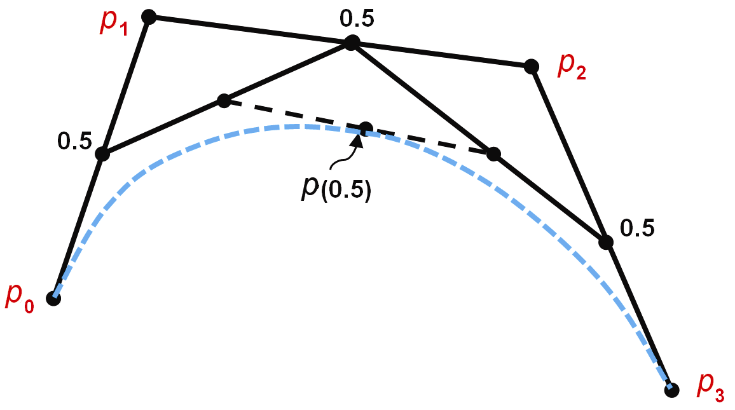
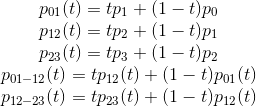
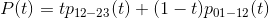
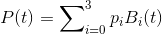
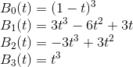
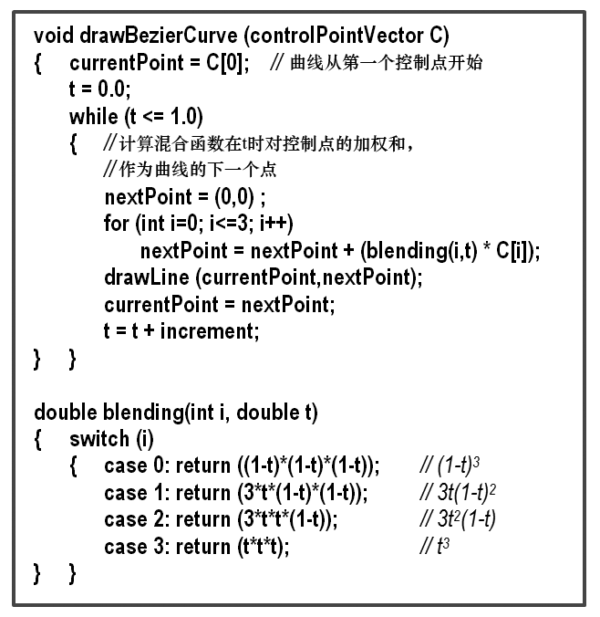
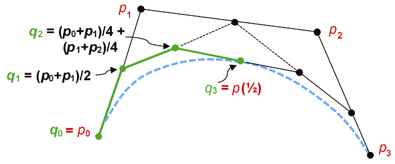
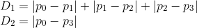
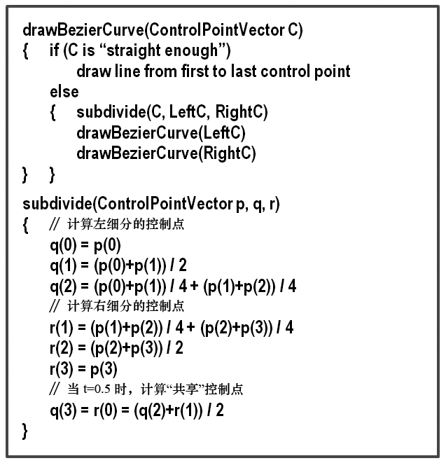

### 11.2　三次贝塞尔曲线

我们现在将曲线模型扩展到4个控制点，就会得到一个三次贝塞尔曲线，如图11.4所示。与二次曲线相比，三次贝塞尔曲线能够定义的形状更加丰富，而二次曲线仅限于定义凹形。

<b class="my_markdown">图11.4　建立一个三次贝塞尔曲线</b>

同二次曲线时的情形，我们可以推导出三次贝塞尔曲线的解析定义：

曲线上的点则是：

使用p12−23和p01−12的定义替换等式中的项，再合并得：

其中：

渲染贝塞尔曲线时，可以使用许多不同的技术。其中一种方法是，使用固定的增量，在0.0～1.0范围内，迭代增加得出t的后继值。例如，当增量为0.1时，我们可以使用t值为0.0、0.1、0.2、0.3等的循环。对于t的每个值，计算贝塞尔曲线上的对应点，并绘制连接连续点的一系列线段，如图11.5中的算法所述。

<b class="my_markdown">图11.5　渲染贝塞尔曲线的迭代算法</b>

另一种方法是使用de Casteljau算法递归地将曲线对半细分，其中，在每个递归步骤t = 1/2。图11.6展示了左侧曲线细分后的新三次控制点（q0，q1，q2，q3），以绿色显示（见彩插）。该算法由de Casteljau提出（完整推导见[AS14]）。

<b class="my_markdown">图11.6　细分三次贝塞尔曲线</b>

算法见图11.7。该算法重复将曲线段细分为两半的过程，直到每个曲线段足够直，进一步的细分不会产生实际的好处。在极限情况下（随着生成的控制点越来越靠近），曲线段本身实际上与第一个控制点和最后一个控制点（q0和q3）之间的线段相同。因此，可以通过比较从第一控制点到最后一个控制点的距离与连接4个控制点的3条线段的长度之和来确定曲线段是否“足够直”：

当D1−D2小于一个足够小的阈值时，进一步的细分就没有意义了。

de Casteljau算法有一个有趣的特性，它可以在不使用之前描述的混合函数的情况下，生成曲线上所有的点。同时请注意，p(1/2)处的中心点是“共享”的，即它既是左细分中最右的控制点，也是右细分中最左的控制点。它可以使用t = 1/2处的混合函数或使用由de Casteljau导出的公式(q2 + r1)/2来计算。

另请注意，图11.7中所示的subdivide()函数假定传入的参数p、q和r是“引用”参数，因此，图11.7上方列出的drawBezierCurve函数对于subdivide()的调用，导致subdivide()函数中的计算修改了调用中所传的实际参数。

<b class="my_markdown">图11.7　贝塞尔曲线的递归细分算法</b>

