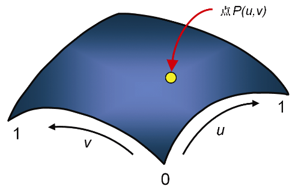
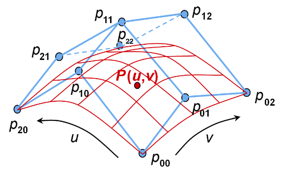
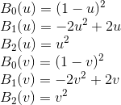
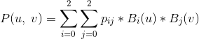

### 11.3　二次贝塞尔曲面

贝塞尔曲线定义了曲线（在2D或3D空间中），而贝塞尔曲面定义了3D空间中的曲面。将我们在曲线中看到的概念扩展到曲面，需要将参数方程组中的参数个数从一个扩展到两个。对于贝塞尔曲线，我们将参数称为t。对于贝塞尔曲面，我们将参数称为u和v。曲线由点P(t)组成，而曲面将由点P(u, v)组成，如图11.8所示。

<b class="my_markdown">图11.8　参数曲面</b>

对于二次贝塞尔曲面，每个轴u和v上有3个控制点，总共9个控制点。图11.9（见彩插）使用蓝色展示了一组共9个控制点（通常称为控制点“网格”）的示例，以及相应的曲面（红色）。

<b class="my_markdown">图11.9　二次贝塞尔控制网格和相应的表面</b>

网格中的9个控制点标记为pij，其中i和j分别代表u和v方向上的索引。每组3个相邻控制点（例如（p00，p01，p02））会定义一条贝塞尔曲线。然后将表面上的点P(u，v)定义为两个混合函数的和，一个在u方向，一个在v方向。则用于构建贝塞尔曲面的两个混合函数的形式遵循先前为贝塞尔曲线给出的方法：

接下来生成构成贝塞尔曲面的点P(u, v)。对于每个控制点pij，将其与第i个混合函数在u处的值相乘，再与第j个混合函数在v处的值相乘。最后将所有控制点的结果求和，生成贝塞尔曲面上的点P(u, v)：

组成贝塞尔曲面的生成点集有时会称为补丁。术语“补丁”有时会让人感到困惑，我们稍后在研究曲面细分着色器时会看到（对于实际实现贝塞尔曲面非常有用）。因为通常控制点组成的网格才称为“补丁”。

