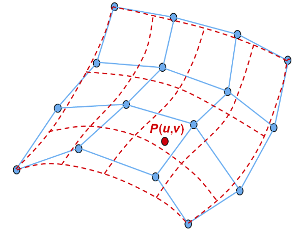
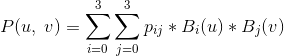
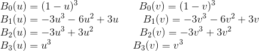
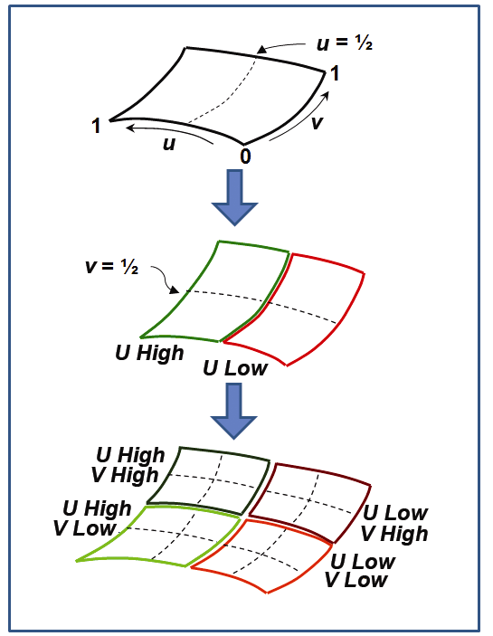
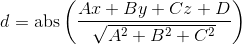

### 11.4　三次贝塞尔曲面

从二次曲面到三次曲面需要使用更大的网格——4×4而非3×3。图11.10（见彩插）显示了16控制点网格（蓝色）和相应曲面（红色）的示例。

<b class="my_markdown">图11.10　三次贝塞尔控制网格和相应的曲面</b>

同上，我们可以通过组合三次贝塞尔曲线的相关混合函数来推导表面上的点P(u, v)的公式：

其中：

渲染贝塞尔曲面也可以通过递归细分[AS14]完成，方法是交替地将曲面沿每个维度分成两半，如图11.11所示。每个细分产生4个新的控制点网格，每个网格包含16个点，这些点定义了曲面的一个象限。

<b class="my_markdown">图11.11　贝塞尔曲面的递归细分</b>

当渲染贝塞尔曲线时，我们在曲线“足够直”时停止细分。而对于贝塞尔曲面，我们在曲面“足够平坦”时停止递归。一种实现方法是，确保子象限控制网格上所有递归生成的点，距由该网格的4个角点中的3个定义的平面的距离，都小于一个允许的范围。点(x,y,z)与平面(A,B,C,D)之间的距离d为：

如果d小于某个足够小的阈值，则我们停止细分过程，并简单地使用子象限网格的4个角的控制点来绘制两个三角形。

对于贝塞尔曲线，OpenGL管线的细分阶段为基于图11.5中的迭代算法渲染贝塞尔曲面提供了一种有吸引力的替代方法。其策略是让曲面细分生成一个大的顶点网格，然后使用混合函数将这些顶点重新定位到贝塞尔曲面上，由三次贝塞尔控制点指定。我们在第12章中实现了这一点。

