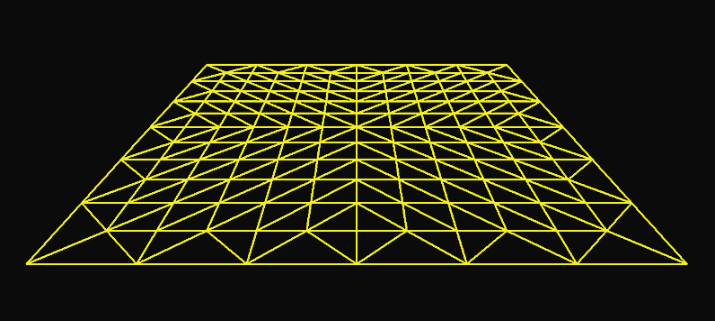
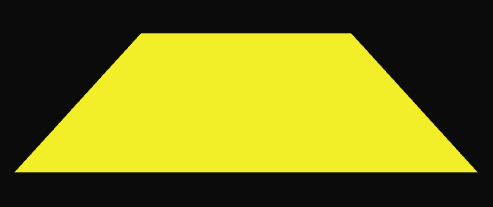

### 12.1　OpenGL中的曲面细分

OpenGL对硬件曲面细分的支持，通过3个管线阶段提供：

（1）曲面细分控制着色器；

（2）曲面细分器；

（3）曲面细分评估着色器。

第（1）和第（3）阶段是可编程的；而中间的第（2）阶段不是。为了使用曲面细分，程序员通常会提供控制着色器和评估着色器。

曲面细分器（其全名是曲面细分图元生成器，或TPG）是硬件支持的引擎，可以生成固定的三角形网格。<sup class="my_markdown">[2]</sup>控制着色器允许我们配置曲面细分器要构建什么样的三角形网格。然后，评估着色器允许我们以各种方式操控网格。然后，被操控过的三角形网格，会作为通过管线前进的顶点的源数据。回想一下图2.2，在管线上，曲面细分着色器位于顶点着色器和几何着色器阶段之间。

让我们从一个简单的应用程序开始，该应用程序只使用曲面细分器创建顶点的三角形网格，然后在不进行任何操作的情况下显示它。为此，我们需要以下模块。

（1）C++/OpenGL应用程序：

创建一个摄像机和相关的MVP矩阵，视图（v）和投影（p）矩阵确定摄像机朝向，模型（m）矩阵可用于修改网格的位置和方向。

（2）顶点着色器：

在这个例子中基本上什么都不做，顶点将在曲面细分器中生成。

（3）曲面细分控制着色器：

指定曲面细分器要构建的网格。

（4）曲面细分评估着色器：

将MVP矩阵应用于网格中的顶点。

（5）片段着色器：

只需为每个像素输出固定颜色。

程序12.1显示了整个应用程序的代码。即使像这样的简单示例也相当复杂，因此许多代码元素都需要解释。请注意，这是我们第一次使用除顶点和片段着色器之外的组件构建GLSL渲染程序。因此，我们实现了createShaderProgram()的4参数重载版本。

程序12.1　基本曲面细分器网格

```c
C++ / OpenGL应用程序
GLuint createShaderProgram(const char *vp, const char *tCS, const char *tES, const char *fp) { 
  string vertShaderStr = readShaderSource(vp);
  string tcShaderStr = readShaderSource(tCS);   string teShaderStr = readShaderSource(tES);   string fragShaderStr = readShaderSource(fp);
  const char *vertShaderSrc = vertShaderStr.c_str(); 
  const char *tcShaderSrc = tcShaderStr.c_str();   const char *teShaderSrc = teShaderStr.c_str();   const char *fragShaderSrc = fragShaderStr.c_str(); 
  GLuint vShader = glCreateShader(GL_VERTEX_SHADER); 
  GLuint tcShader = glCreateShader(GL_TESS_CONTROL_SHADER);   GLuint teShader = glCreateShader(GL_TESS_EVALUATION_SHADER);   GLuint fShader = glCreateShader(GL_FRAGMENT_SHADER); 
  glShaderSource(vShader, 1, &vertShaderSrc, NULL); 
  glShaderSource(tcShader, 1, &tcShaderSrc, NULL);   glShaderSource(teShader, 1, &teShaderSrc, NULL);   glShaderSource(fShader, 1, &fragShaderSrc, NULL); 
  glCompileShader(vShader); 
  glCompileShader(tcShader);   glCompileShader(teShader);   glCompileShader(fShader); 
  GLuint vtfprogram = glCreateProgram(); 
  glAttachShader(vtfprogram, vShader); 
  glAttachShader(vtfprogram, tcShader);   glAttachShader(vtfprogram, teShader);   glAttachShader(vtfprogram, fShader); 
  glLinkProgram(vtfprogram); 
  return vtfprogram;
}
void init(GLFWwindow* window) { 
  . . . 
  renderingProgram = createShaderProgram("vertShader.glsl",     "tessCShader.glsl", "tessEShader.glsl", "fragShader.glsl"); }
void display(GLFWwindow* window, double currentTime) { 
  . . . 
  glUseProgram(renderingProgram); 
  . . . 
  glPatchParameteri(GL_PATCH_VERTICES, 1);   glPolygonMode(GL_FRONT_AND_BACK, GL_LINE);   glDrawArrays(GL_PATCHES, 0, 1); }
顶点着色器
#version 430
uniform mat4 mvp_matrix;
void main(void) { }
曲面细分控制着色器
#version 430
uniform mat4 mvp_matrix;
layout (vertices = 1) out;
void main(void)
{ gl_TessLevelOuter[0] = 6;
  gl_TessLevelOuter[1] = 6;   gl_TessLevelOuter[2] = 6;   gl_TessLevelOuter[3] = 6;   gl_TessLevelInner[0] = 12;   gl_TessLevelInner[1] = 12; }
曲面细分评估着色器
#version 430
uniform mat4 mvp_matrix;
layout (quads, equal_spacing, ccw) in;
void main (void)
{ float u = gl_TessCoord.x;
  float v = gl_TessCoord.y;   gl_Position = mvp_matrix * vec4(u,0,v,1); }
片段着色器
#version 430
out vec4 color;
uniform mat4 mvp_matrix;
void main(void)
{ color = vec4(1.0, 1.0, 0.0, 1.0); // 黄色
} 

```

得到的输出网格如图12.1所示（见彩插）。


<center class="my_markdown"><b class="my_markdown">图12.1　Tessellator三角形网格输出</b></center>

曲面细分器生成由两个参数定义的顶点网格：内层级别和外层级别。在这种情况下，内层级别为12，外层级别为6——网格的外边缘被分为6段，而跨越内部的线被分为12段。

程序12.1中的特别相关的新结构被高亮显示。让我们首先讨论第一部分——C++/ OpenGL代码。

编译这两个新着色器，跟顶点和片段着色器完全相同。然后将它们附加到同一个渲染程序，并且链接调用保持不变。唯一的新项目是用于指定要实例化的着色器类型的常量——新常量如下：

```c
GL_TESS_CONTROL_SHADER
GL_TESS_EVALUATION_SHADER
```

请注意display()函数中的新项目。glDrawArrays()调用现在指定GL_PATCHES。当使用曲面细分时，从C++/OpenGL应用程序发送到管线（即在VBO中）的顶点不会被渲染，但通常会被当作控制点，就像我们在贝塞尔曲线中看到的那些一样。一组控制点被称作“补丁”，并且在使用曲面细分的代码段中，GL_PATCHES是唯一允许的图元类型。“补丁”中顶点的数量在glPatchParameteri()的调用中指定。在这个特定示例中，没有任何控制点被发送，但我们仍然需要指定至少一个。类似地，在glDrawArrays()调用中，我们指示起始值为0，顶点数量为1，即使我们实际上没有从C++程序发送任何顶点。

对glPolygonMode()的调用指定了如何光栅化网格。默认值为GL_FILL。而我们的代码中显示的是GL_LINE，如我们在图12.1中看到的那样，它只会导致连接线被光栅化（因此我们可以看到由曲面细分器生成的网格本身）。如果我们将该行代码更改为GL_FILL（或将其注释掉，从而使用默认行为GL_FILL），我们将得到如图12.2所示的版本。


<center class="my_markdown"><b class="my_markdown">图12.2　使用GL_FILL渲染的细分网格</b></center>

现在让我们来过一遍4个着色器。如前所述，顶点着色器几乎没什么可做的，因为C++/OpenGL应用程序没有提供任何顶点。它包含的是一个统一变量声明，以和其他着色器相匹配，以及一个空的main()。在任何情况下，所有着色器程序都必须包含顶点着色器。

曲面细分控制着色器指定曲面细分器要生成的三角形网格的拓扑结构。通过将值分配给名为gl_TessLevelxxx的保留字，设置6个“级别”参数——两个“内部”和4个“外部”级别。我们这里细分了一个由三角形组成的大矩形网格，称为四边形。<sup class="my_markdown">[3]</sup>级别参数告诉曲面细分器在形成三角形时如何细分网格，它们的排列如图12.3所示。


<center class="my_markdown"><b class="my_markdown">图12.3　细分级别</b></center>

请注意控制着色器中的代码行：

```c
layout (vertices=1) out;
```

这与之前的GL_PATCHES讨论有关，用来指定从顶点着色器传递给控制着色器（以及“输出”给评估着色器）的每个“补丁”的顶点数。在我们现在这个程序中没有任何顶点，但我们仍然必须指定至少一个，因为它也会影响控制着色器被执行的次数。稍后这个值将反映控制点的数量，并且必须与C++/OpenGL应用程序中glPatchParameteri()调用中的值匹配。

接下来让我们看一下曲面细分评估着色器。它以一行代码开头，形如：

```c
layout (quads, equal_spacing, ccw) in;
```

乍一看这好像与控件着色器中的“out”布局语句有关，但实际上它们是无关的。相反，这行代码是我们指示曲面细分器去生成排列在一个大矩形（“四边形”）中顶点的位置。它还指定了细分线段（包括内部和外部）具有相等的长度（稍后我们将看到长度不等的细分的应用场景）。“ccw”参数指定生成曲面细分网格顶点的缠绕顺序（在当前情况下，是逆时针）。

然后，由曲面细分器生成的顶点被发送到评估着色器。因此，评估着色器既可以从控制着色器（通常作为控制点），又可以从曲面细分器（曲面细分网格）接收顶点。在程序12.1中，仅从曲面细分器接收顶点。

评估着色器对曲面细分器生成的每个顶点执行一次。可以使用内置变量gl_TessCoord访问顶点位置。曲面细分网格的朝向使得它位于X-Z平面中，因此gl_TessCoord的X和Y分量被应用于网格的X和Z坐标。网格坐标，以及gl_TessCoord的值，范围为0.0～1.0（这在计算纹理坐标时会很方便）。然后，评估着色器使用MVP矩阵定向每个顶点（这在前面章节的示例中，是由顶点着色器完成的）。

最后，片段着色器只为每个像素输出一个恒定的黄色。当然，我们也可以使用它来为我们的场景应用纹理或光照，就像我们在前面的章节中看到的那样。

