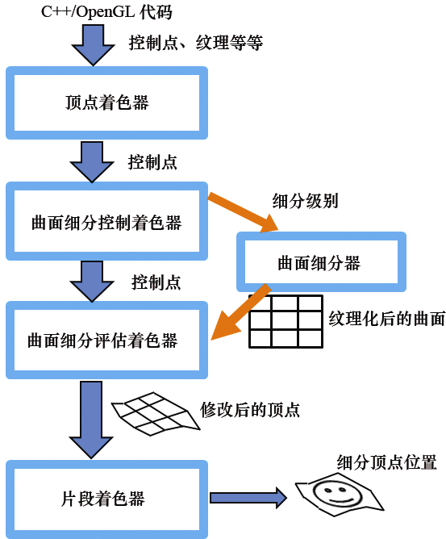
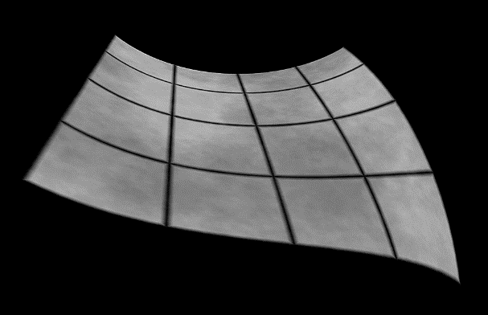

### 12.2　贝塞尔曲面细分

现在让我们扩展我们的程序，使它将我们简单的矩形网格转换为贝塞尔曲面。细分网格应该为我们提供了足够的顶点来对曲面进行采样（如果我们想要更多的话，我们可以增加内部/外部细分级别）。我们现在需要的是通过管线发送控制点，然后使用这些控制点执行计算以将细分网格转换为我们所需的贝塞尔曲面。

假设我们希望建立一个立方体贝塞尔曲面，我们将需要16个控制点。我们可以通过VBO从C++端发送它们，或者我们可以在顶点着色器中硬编码写死它们。图12.4概述了来自C++端的控制点的过程。


<center class="my_markdown"><b class="my_markdown">图12.4　贝塞尔曲面的曲面细分概述</b></center>

现在是更准确地解释曲面细分控制着色器（TCS）如何工作的好时机。与顶点着色器类似，TCS对每个传入顶点执行一次。另外，回想一下第2章，OpenGL提供了一个名为gl_VertexID的内置变量，它保存一个计数器，指示顶点着色器当前正在执行哪次调用。曲面细分控制着色器中存在一个类似的内置变量gl_InvocationID。

曲面细分的一个强大功能是TCS（以及TES）着色器可以同时访问数组中的所有控制点顶点。首先，当每个调用都可以访问所有顶点时，TCS对每个顶点执行一次可能会让人感到困惑。在每个TCS调用中，冗余地在赋值语句中指定曲面细分级别也是违反直觉的。尽管所有这些看起来都很奇怪，但这样做是因为曲面细分的架构设计使得TCS调用可以并行运行。

OpenGL提供了几个用于TCS和TES着色器的内置变量。我们已经提到过的是gl_InvocationID，当然还有gl_TessLevelInner和gl_TessLevelOuter。以下是一些最有用的内置变量的更多细节和描述。

曲面细分控制着色器（TCS）内置变量。

+ gl_in[ ]——包含每个传入的控制点顶点的数组——每个传入顶点是一个数组元素。可以使用“.”表示法将特定顶点属性作为字段进行访问。一个内置属性是gl_Position——因此，输入顶点“i”的位置可以通过gl_in[i].gl_Position访问。
+ gl_out[ ]——用于将输出控制点的顶点发送到TES的一个数组——每个输出顶点是一个数组元素。可以使用“.”表示法将特定顶点属性作为字段进行访问。一个内置属性是gl_Position——因此，输出顶点“i”的位置可以通过gl_out[i].gl_Position访问。
+ gl_InvocationID——整型ID计数器，指示TCS当前正在执行哪个调用。一个常见的用途是用于传递顶点属性；例如，将当前调用的顶点位置从TCS传递到TES可以用如下方式完成：gl_out[gl_InvocationID].gl_Position = gl_in[gl_InvocationID].gl_Position。

曲面细分评估着色器（TES）内置变量。

+ gl_in[ ]——包含每个传入的控制点顶点的数组——每个传入顶点是一个数组元素。可以使用“.”表示法将特定顶点属性作为字段进行访问。一个内置属性是gl_Position——因此，输入顶点“i”的位置可以通过gl_in[i].gl_Position访问。
+ gl_Position——曲面细分网格顶点的输出位置，可能在TES中被修改。重要的是要注意gl_Position和gl_in[xxx].gl_Position是不同的——gl_Position是起源于曲面细分器的输出顶点的位置，而gl_in[xxx].gl_Position是一个从TCS进入TES的控制点顶点位置。

值得注意的是，TCS中的输入和输出控制点顶点属性是数组。不同的是，TES中的输入控制点顶点和顶点属性是数组，但输出顶点是标量。此外，很容易混淆哪些顶点来自于控制点，哪些顶点是细分建立的，然后移动以形成结果曲面。总而言之，TCS的所有顶点输入和输出都是控制点，而在TES中，gl_in[ ]保存输入控制点，gl_TessCoord保存输入的细分网格点，gl_Position保存用于渲染的输出表面顶点。

我们的曲面细分控制着色器现在有两个任务：指定曲面细分级别并将控制点从顶点着色器传递到评估着色器。然后，评估着色器可以根据贝塞尔控制点修改网格点（gl_TessCoords）的位置。

程序12.2显示了所有4个着色器——顶点、TCS、TES和片段——用于指定控制点补丁，生成平坦的曲面细分顶点网格，在控制点指定的曲面上重新定位这些顶点，并使用纹理图像绘制生成的曲面。它还显示了C++/OpenGL应用程序的相关部分，特别是在display()函数中。在此示例中，控制点源自顶点着色器（它们在那里硬编码写死），而不是从C++/OpenGL应用程序进入OpenGL管线。代码后面会讲述其他详细信息。

程序12.2　贝塞尔曲面的曲面细分

```c
顶点着色器
#version 430
out vec2 texCoord;
uniform mat4 mvp_matrix;
layout (binding = 0) uniform sampler2D tex_color;
void main(void)
{ // 这次由顶点着色器指定和发送控制点
  const vec4 vertices[ ] =   vec4[ ] (vec4(-1.0, 0.5, -1.0, 1.0), vec4(-0.5, 0.5, -1.0, 1.0),            vec4( 0.5, 0.5, -1.0, 1.0), vec4( 1.0, 0.5, -1.0, 1.0),
           vec4(-1.0, 0.0, -0.5, 1.0), vec4(-0.5, 0.0, -0.5, 1.0),            vec4( 0.5, 0.0, -0.5, 1.0), vec4( 1.0, 0.0, -0.5, 1.0),
           vec4(-1.0, 0.0, 0.5, 1.0), vec4(-0.5, 0.0, 0.5, 1.0),            vec4( 0.5, 0.0, 0.5, 1.0), vec4( 1.0, 0.0, 0.5, 1.0),
           vec4(-1.0, -0.5, 1.0, 1.0), vec4(-0.5, 0.3, 1.0, 1.0),            vec4( 0.5, 0.3, 1.0, 1.0), vec4( 1.0, 0.3, 1.0, 1.0) );
  // 为当前顶点计算合适的纹理坐标，从[-1...+1]转换到[0...1]
  texCoord = vec2((vertices[gl_VertexID].x + 1.0) / 2.0, (vertices[gl_VertexID].z + 1.0) / 2.0);   gl_Position = vertices[gl_VertexID]; }
曲面细分控制着色器
#version 430
in vec2 texCoord[ ]; out vec2 texCoord_TCSout[ ];  // 以标量形式从顶点着色器传来的纹理坐标输出，以数组形式被接收，然后被发送给评估着色器
uniform mat4 mvp_matrix;
layout (binding = 0) uniform sampler2D tex_color;
layout (vertices = 16) out;     // 每个补丁有16个控制点
void main(void)
{ int TL = 32;                  // 曲面细分级别都被设置为这个值
  if (gl_InvocationID == 0)   { gl_TessLevelOuter[0] = TL; gl_TessLevelOuter[2] = TL;
    gl_TessLevelOuter[1] = TL; gl_TessLevelOuter[3] = TL;
    gl_TessLevelInner[0] = TL; gl_TessLevelInner[1] = TL;
  }   // 将纹理和控制点传递给TES
  texCoord_TCSout[gl_InvocationID] = texCoord[gl_InvocationID];   gl_out[gl_InvocationID].gl_Position = gl_in[gl_InvocationID].gl_Position; }
曲面细分评估着色器
#version 430
layout (quads, equal_spacing,ccw) in;
uniform mat4 mvp_matrix;
layout (binding = 0) uniform sampler2D tex_color;
in vec2 texCoord_TCSout[ ]; out vec2 texCoord_TESout;           // 以标量形式传来的纹理坐标数组被一个个传出
void main (void)
{ vec3 p00 = (gl_in[0].gl_Position).xyz;
  vec3 p10 = (gl_in[1].gl_Position).xyz;   vec3 p20 = (gl_in[2].gl_Position).xyz;   vec3 p30 = (gl_in[3].gl_Position).xyz;   vec3 p01 = (gl_in[4].gl_Position).xyz;   vec3 p11 = (gl_in[5].gl_Position).xyz;   vec3 p21 = (gl_in[6].gl_Position).xyz;   vec3 p31 = (gl_in[7].gl_Position).xyz;   vec3 p02 = (gl_in[8].gl_Position).xyz;   vec3 p12 = (gl_in[9].gl_Position).xyz;   vec3 p22 = (gl_in[10].gl_Position).xyz;   vec3 p32 = (gl_in[11].gl_Position).xyz;   vec3 p03 = (gl_in[12].gl_Position).xyz;   vec3 p13 = (gl_in[13].gl_Position).xyz;   vec3 p23 = (gl_in[14].gl_Position).xyz;   vec3 p33 = (gl_in[15].gl_Position).xyz;
  float u = gl_TessCoord.x;
  float v = gl_TessCoord.y;
  // 立方贝塞尔基础函数
  float bu0 = (1.0-u) * (1.0-u) * (1.0-u);    // (1-u)^3
  float bu1 = 3.0 * u * (1.0-u) * (1.0-u);    // 3u(1-u)^2
  float bu2 = 3.0 * u * u * (1.0-u);          // 3u^2(1-u)
  float bu3 = u * u * u;                      // u^3
  float bv0 = (1.0-v) * (1.0-v) * (1.0-v);    // (1-v)^3
  float bv1 = 3.0 * v * (1.0-v) * (1.0-v);    // 3v(1-v)^2
  float bv2 = 3.0 * v * v * (1.0-v);          // 3v^2(1-v)
  float bv3 = v * v * v;                      // v^3
  // 输出曲面细分补丁中的顶点位置
  vec3 outputPosition =       bu0 * ( bv0*p00 + bv1*p01 + bv2*p02 + bv3*p03 )     + bu1 * ( bv0*p10 + bv1*p11 + bv2*p12 + bv3*p13 )     + bu2 * ( bv0*p20 + bv1*p21 + bv2*p22 + bv3*p23 )     + bu3 * ( bv0*p30 + bv1*p31 + bv2*p32 + bv3*p33 );   gl_Position = mvp_matrix * vec4(outputPosition,1.0f);
  // 输出插值过的纹理坐标
  vec2 tc1 = mix(texCoord_TCSout[0], texCoord_TCSout[3], gl_TessCoord.x);   vec2 tc2 = mix(texCoord_TCSout[12], texCoord_TCSout[15], gl_TessCoord.x);   vec2 tc = mix(tc2, tc1, gl_TessCoord.y);   texCoord_TESout = tc; }
片段着色器
#version 430
in vec2 texCoord_TESout; out vec4 color;
uniform mat4 mvp_matrix;
layout (binding = 0) uniform sampler2D tex_color;
void main(void)
{ color = texture(tex_color, texCoord_TESout);
}
C++/OpenGL 应用程序
// 这次我们也传入一个纹理以用来绘制表面
// 像往常一样在init()里加载纹理，并在display()里启用
void display(GLFWwindow* window, double currentTime) {
  . . .
  glActiveTexture(GL_TEXTURE0);   glBindTexture(GL_TEXTURE_2D, textureID);
  glFrontFace(GL_CCW);
  glPatchParameteri(GL_PATCH_VERTICES, 16);          // 每个补丁的顶点数量 = 16
  glPolygonMode(GL_FRONT_AND_BACK, GL_FILL);
  glDrawArrays(GL_PATCHES, 0, 16);                   // 补丁顶点的总数量：16 x 1个补丁= 16
}

```

顶点着色器现在指定代表特定贝塞尔曲面的16个控制点（“补丁”顶点）。在这个例子中，它们都被归一化到范围[−1…+1]。顶点着色器还使用控制点来确定适合细分网格的纹理坐标，其值在[0…1]范围内。很重要的是，要重申顶点着色器输出的顶点不是将要用来光栅化的顶点，而是贝塞尔控制点。使用曲面细分时，补丁顶点永远不会被光栅化——只有曲面细分顶点会被光栅化。

控制着色器仍然会指定内部和外部曲面细分级别。它现在还负责将控制点和纹理坐标发送到评估着色器。请注意，曲面细分级别只需要指定一次，因此该步骤仅在第0次调用期间完成（回想一下TCS每个顶点运行一次，因此在此示例中有16次调用）。为方便起见，我们为每个细分级别指定了32个细分。

接下来，评估着色器执行所有贝塞尔曲面计算。main()开头的大块赋值语句从每个传入gl_in的gl_Position中提取控制点（请注意，这些控制点对应于控制着色器的gl_out变量）。然后使用来自曲面细分器的网格点计算混合函数的权重，从而生成一个新的outputPosition，然后应用模型-视图-投影矩阵，为每个网格点生成输出gl_Position并形成贝塞尔曲面。

另外，还需要创建纹理坐标。顶点着色器仅为每个控制点位置提供一个纹理坐标。但我们并不是要渲染控制点，我们最终需要更多的曲面细分网格点的纹理坐标。有很多方法可以做到这一点，在这里我们利用GLSL方便的混合功能对它们进行线性插值。mix()函数需要3个参数：（a）起始点；（b）结束点；（c）内插值，范围为0～1。它返回与内插值对应的起点和终点之间的值。由于细分网格坐标的范围也是0～1，所以它们可以直接用于此目的。

这次在片段着色器中，不再是输出单一颜色，而是应用标准纹理。属性texCoord_TESout中的纹理坐标是在评估着色器中生成的纹理坐标。对C++程序的更改同样很简单——请注意，现在指定的补丁大小为16。结果输出如图12.5所示（应用了<sup class="my_markdown">[LU16]</sup>的平铺纹理）。


<center class="my_markdown"><b class="my_markdown">图12.5　曲面细分过的贝塞尔曲面</b></center>

