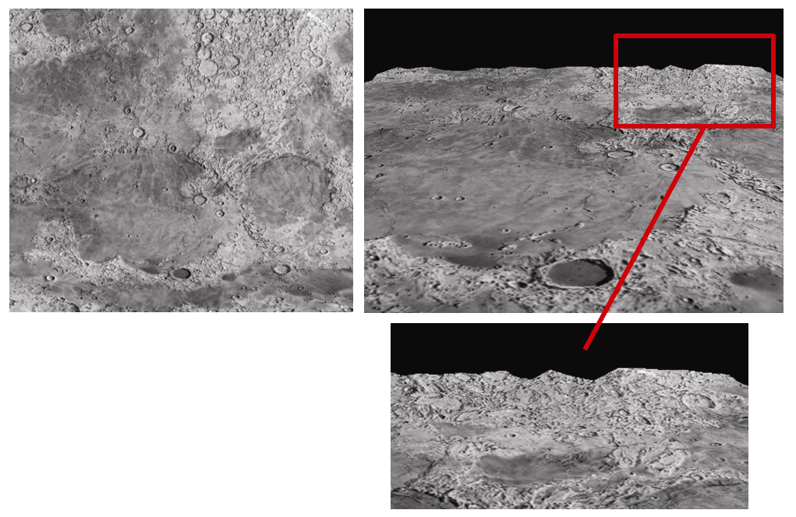
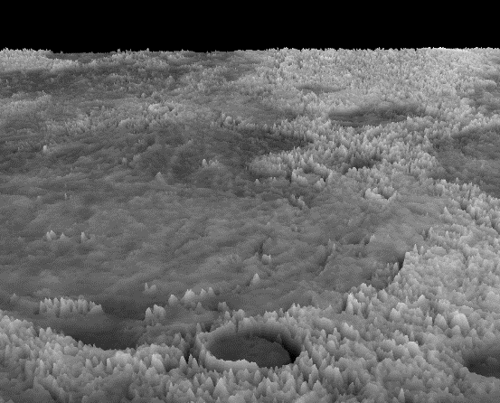
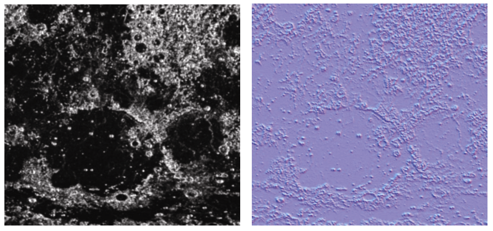
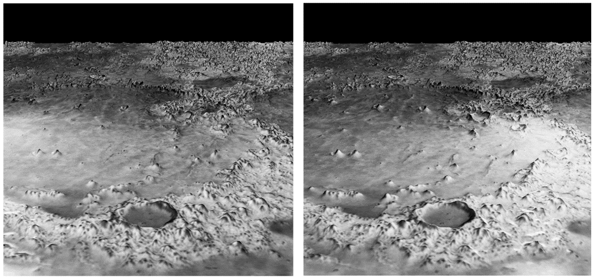

### 12.3　地形、高度图的细分

回想一下，在顶点着色器中执行高度贴图可能会遇到顶点数量不足以用来渲染所需的细节的情况。现在我们有了生成大量顶点的方法，让我们回到Hastings-Trew的月球表面纹理贴图<sup class="my_markdown">[HT16]</sup>并将其用作高度贴图，提升曲面细分顶点来生成月球表面细节。正如我们将看到的，这具有一些优点，可以让顶点的几何形状更好地匹配月亮图像，并且提升轮廓（边缘）细节。

我们的策略是修改程序12.1，在X-Z平面中放置细分网格，并使用高度贴图来设置每个细分网格点的Y坐标。要做到这一点，我们不需要补丁，因为可以硬编码细分网格的位置，因此我们将在glDrawArrays()和glPatchParameteri()中为每个补丁指定所需的最少的1个顶点，如程序12.1中所做的那样。Hastings-Trew的月亮纹理图像既用于颜色，也用作高度图。

我们通过将曲面细分网格的gl_TessCoord值映射到顶点和纹理的适当范围，在评估着色器中生成顶点和纹理坐标。<sup class="my_markdown">[4]</sup>评估着色器也通过添加月亮纹理的一小部分颜色分量到输出顶点的Y分量，来实现高度贴图。着色器的更改显示在程序12.3中。

程序12.3　简单的地形曲面细分

```c
顶点着色器
#version 430
uniform mat4 mvp_matrix; layout (binding = 0) uniform sampler2D tex_color; void main(void) { }
曲面细分控制着色器
. . .
layout (vertices = 1) out;       // 这个应用程序中不需要控制点
void main(void)
{ int TL=32;
  if (gl_InvocationID == 0)
  { gl_TessLevelOuter[0] = TL; gl_TessLevelOuter[2] = TL;
    gl_TessLevelOuter[1] = TL; gl_TessLevelOuter[3] = TL;
    gl_TessLevelInner[0] = TL; gl_TessLevelInner[1] = TL;
  }
}
曲面细分评估着色器
. . .
out vec2 tes_out; uniform mat4 mvp_matrix; layout (binding = 0) uniform sampler2D tex_color;
void main (void)
{ // 将曲面细分网格顶点从[0...1]映射到想要的顶点[-0.5...+0.5]
  vec4 tessellatedPoint = vec4(gl_TessCoord.x - 0.5, 0.0, gl_TessCoord.y - 0.5, 1.0);
  // 垂直“翻转” Y值，以将曲面细分网格顶点映射到纹理坐标
  // 左上顶点坐标是(0,0)，左下纹理坐标是(0,0)
  vec2 tc = vec2(gl_TessCoord.x, 1.0 - gl_TessCoord.y);
  // 图像是灰度图，所以任何一个颜色分量（R、G或B）都可以作为高度偏移量
  tessellatedPoint.y += (texture(tex_color, tc).r) / 40.0;     // 将颜色值等比例缩小应用于Y值
  // 将高度贴图提升的点转换到视觉空间
  gl_Position = mvp_matrix * tessellatedPoint;
  tes_out = tc;
}
片段着色器
. . .
in vec2 tes_out;
out vec4 color;
layout (binding = 0) uniform sampler2D tex_color;
void main(void)
{ color = texture(tex_color, tes_out);
}

```

这里的片段着色器类似于程序12.2的，只是根据纹理图像输出颜色。C++/OpenGL应用程序基本上没有变化——它加载纹理（用作纹理和高度图）并为其启用采样器。图12.6显示了纹理图像（左侧）和第一次尝试的最终输出，遗憾的是，它还没有实现正确的高度贴图。

第一次结果存在严重缺陷。虽然我们现在可以看到远处地平线上的轮廓细节，但是那里的凸起与纹理贴图中的实际细节不对应。回想一下，在高度图中，白色应该表示“高”，而黑色应该表示“低”。特别是图像右上方的区域显示的大山丘与其中的浅色和深色无关。

导致此问题的原因是细分网格的分辨率。曲面细分器可以生成的最大顶点数取决于硬件。要符合OpenGL标准，唯一的要求是每个曲面细分级别的最大值至少为64。我们的程序指定了一个内部和外部曲面细分级别均为32的单一细分网格，因此我们生成了大约32×32或者说刚刚超过1 000个顶点，这不足以准确反映图像中的细节。这在图12.6右上方（图中放大）尤其明显——边缘细节仅在沿地平线的32个点处采样，这会产生巨大而看起来很随机的山丘。即使我们将曲面细分值增加到64，总共64×64或刚刚超过4 000个顶点仍然不足以满足使用月球图像进行高度贴图的需要。


<center class="my_markdown"><b class="my_markdown">图12.6　细分地形——首次尝试失败，顶点数量不足</b></center>

增加顶点数量的一个好方法是使用我们在第4章中看到的实例化。我们的策略是让曲面细分器生成网格，并使用实例化重复数次。在顶点着色器中，我们构建了一个由4个顶点定义的补丁，每个顶点用于细分网格的每个角。在我们的C++/OpenGL应用程序中，我们将glDrawArrays()调用更改为glDrawArraysInstanced()。如此，我们指定一个64×64个补丁的网格，每个补丁包含一个细分级别为32的网格。这将带给我们总共64×64×32×32个，或者说超过400万个顶点。

顶点着色器首先指定4个纹理坐标(0,0)、(0,1)、(1,0)和(1,1)。使用实例化时，请回想一下，顶点着色器可以访问整数变量gl_InstanceID，它包含一个对应于当前正在处理的glDrawArraysInstanced()调用的计数器。我们使用此ID值来分配大网格中各个补丁的位置。补丁位于行和列中，第一个补丁位于(0,0)，第二个位于(1,0)，下一个位于(2,0)，依此类推，第一列中的最后一个补丁在(63,0)。下一列的补丁位于(0,1)、(1,1)，依此类推，直至(63,1)。最后一列的补丁位于(0,63)、(1,63)，依此类推，最后是(63,63)。给定补丁的X坐标是实例ID整除64，Y坐标是实例ID除以64（整数除法）。然后着色器将坐标向下缩放到范围[0...1]。

控制着色器没有更改，除了它将顶点和纹理坐标传递下去。

接下来，评估着色器获取传入的细分网格顶点（由gl_TessCoord指定）并将它们移动到传入补丁指定的坐标范围内。它对纹理坐标也进行一样的处理，并且也会以与程序12.3中相同的方式应用高度贴图。片段着色器没有修改。

每个组件的更改显示在程序12.4中。结果如图12.7所示。请注意，高点和低点现在更接近于图像的亮部和暗部。


<center class="my_markdown"><b class="my_markdown">图12.7　细分地形——第二次尝试，使用实例化</b></center>

程序12.4　实例化细分地形

```c
C++/OpenGL应用程序
// 和贝塞尔曲面例子相同，并做如下修改
glPatchParameteri(GL_PATCH_VERTICES, 4); glDrawArraysInstanced(GL_PATCHES, 0, 4, 64*64);
顶点着色器
. . .
out vec2 tc;
void main(void)
{ vec2 patchTexCoords[ ] = vec2[ ] (vec2(0,0), vec2(1,0), vec2(0,1), vec2(1,1));
  // 基于当前是哪个实例计算出坐标偏移量
  int x = gl_InstanceID % 64;   int y = gl_InstanceID / 64;
  // 纹理坐标被分配进64个补丁中，并归一化到[0..1]。翻转Y轴坐标
  tc = vec2( (x+patchTexCoords[gl_VertexID].x) / 64.0, (63 - y+patchTexCoords[gl_VertexID].y) / 64.0);
  // 顶点位置和纹理坐标相同，只是它的取值范围从-0.5到+0.5
  gl_Position = vec4(tc.x - 0.5, 0.0, (1.0 - tc.y) - 0.5, 1.0);         // 并且将Y轴坐标翻转回来
}
曲面细分控制着色器
. . .
layout (vertices = 4) out; in vec2 tc[ ]; out vec2 tcs_out[ ];
void main(void)
{ // 曲面细分级别的指定和之前例子中相同
  . . .
  tcs_out[gl_InvocationID] = tc[gl_InvocationID];   gl_out[gl_InvocationID].gl_Position = gl_in[gl_InvocationID].gl_Position; }
曲面细分评估着色器
. . .
in vec2 tcs_out[ ]; out vec2 tes_out; void main (void)
{ // 将纹理坐标映射到传入的控制点指定的子网格上
  vec2 tc = vec2(tcs_out[0].x + (gl_TessCoord.x) / 64.0, tcs_out[0].y + (1.0 - gl_TessCoord.y) / 64.0);
  // 将细分网格映射到传入的控制点指定的子网格上
  vec4 tessellatedPoint = vec4(gl_in[0].gl_Position.x + gl_TessCoord.x / 64.0, 0.0,                                gl_in[0].gl_Position.z + gl_TessCoord.y / 64.0, 1.0);
  // 将高度图的高度增加给顶点
  tessellatedPoint.y += (texture(tex_height, tc).r) / 40.0;
  gl_Position = mvp_matrix * tessellatedPoint;   tes_out = tc; }

```

现在我们已经实现了高度贴图，我们可以着手改进它并整合光照。一个挑战是我们的顶点还没有与它们相关的法向量。另一个挑战是简单地使用纹理图像作为高度图产生了过度“锯齿状”的结果——在这种情况下是因为并非纹理图像中的所有灰度变化都是由高度引起的。对于这个特定的纹理贴图，Hastings-Trew已经生成了一个改进的高度贴图，我们可以使用<sup class="my_markdown">[HT16]</sup>。如图12.8左图所示。

我们可以通过生成相邻顶点（或高度图中的相邻纹素）的高度，构建连接它们的向量以及使用叉积来计算法向量，以动态计算和创建法向量。这需要一些细微的调整，具体取决于场景的精度（和/或高度图图像）。在这里，我们使用GIMP“normalmap”插件<sup class="my_markdown">[GP16]</sup>来根据Hastings-Trew的高度图生成法线贴图，如图12.8右图所示。


<center class="my_markdown"><b class="my_markdown">图12.8　月球表面：高度图<sup class="my_markdown">[HT16]</sup>（左）和法线贴图（右）</b></center>

我们对代码进行的大部分更改现在只是为了实现Phong着色的标准方法。

+ C++/OpenGL应用程序。

我们加载并激活一个额外的纹理来保存法线贴图，还添加了代码来指定光照和材质，就像我们在以前的应用程序中所做的那样。

+ 顶点着色器。

唯一的增补是光照统一变量的声明和法线贴图的采样器。通常在顶点着色器中完成的光照代码被移动到曲面细分评估着色器，因为直到曲面细分阶段才生成顶点。

+ 曲面细分控制着色器。

唯一的增补是光照统一变量的声明和法线贴图的采样器。

+ 曲面细分评估着色器。

Phong光照的准备代码现在放在评估着色器中：

```c
varyingVertPos = (mv_matrix * position).xyz;
varyingLightDir = light.position - varyingVertPos;
```

+ 片段着色器。

这里完成了用于计算Phong（或Blinn-Phong）照明的典型代码段，以及从法线贴图中提取法向量的代码。然后将光照结果与纹理图像用加权求和的方式结合起来。

带有高度和法线贴图以及Phong照明的最终结果如图12.9所示。地形现在会响应光照。在此示例中，位置光已放置在左侧图像中心的左侧，右侧图像中心的右侧。


<center class="my_markdown"><b class="my_markdown">图12.9　具有法线贴图和光照的曲面细分地形（光源分别位于左侧和右侧）</b></center>

尽管从静止图像很难判断出对光的移动的响应，但是读者应该能够辨别出漫射光的变化，并且山峰的镜面高光在两个图像中是非常不同的。当摄像机或光源移动时，这当然会更明显。结果仍然不完美，因为无论什么样的光照，输出中包含的原始纹理都包括了将出现在渲染结果上的阴影。

