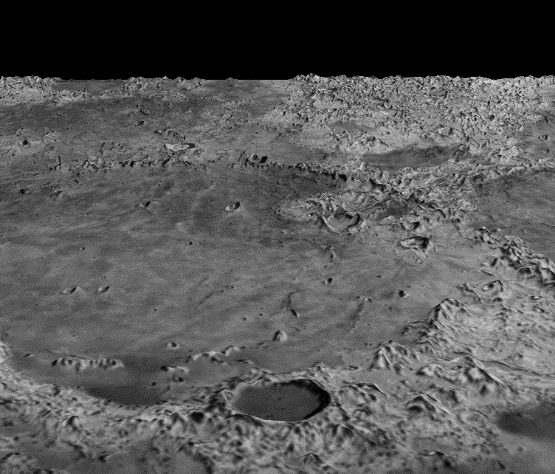

### 12.4　控制细节级别（LOD）

在程序12.4中，使用实例化来实时生成数百万个顶点，即使是装备精良的现代计算机也可能会感受到负担。幸运的是，将地形划分为单独的补丁的策略，正如我们为增加生成的网格顶点的数量所做的那样，也为我们提供了一种减少负担的好机制。

在生成的数百万个顶点中，许多顶点不是必需的。靠近摄像机的补丁中的顶点非常重要，因为我们希望能够识别附近物体的细节。但是，补丁越远离摄像机，甚至光栅化过程中有足够的像素来体现我们生成的顶点数量的可能性就越小！

根据距摄像机的距离更改补丁中的顶点数量是一种称为细节级别或LOD的技术。Sellers等人描述了一种通过修改控制着色器来控制实例化曲面细分中的LOD的方法<sup class="my_markdown">[SW15]</sup>。程序12.5显示了Sellers等人的方法的简化版本。策略是使用补丁的感知大小来确定其曲面细分级别的值。由于补丁的细分网格最终将放置在由进入控制着色器的4个控制点定义的方格内，我们可以使用控制点相对于摄像机的位置来确定应该为补丁生成多少个顶点。其步骤如下。

（1）通过将MVP矩阵应用于4个控制点，计算它们的屏幕位置。

（2）计算由控制点（在屏幕上的空间中）定义的正方形边长（即宽度和高度）。请注意，即使4个控制点形成正方形，这些边长也可能不同，因为应用了透视矩阵。

（3）根据曲面细分级别所需的精度（基于高度图中的细节数量），将长度的值按可调整常数进行缩放。

（4）将缩放长度值加1，以避免将曲面细分级别指定为0（这将导致不生成顶点）。

（5）将曲面细分级别设置为相应的计算宽度和高度值。

回想一下，在我们的实例中，我们不是只创建一个网格，而是创建64×64个网格。因此，对每个补丁执行以上列表中的5个步骤，细节级别因补丁而异。

所有更改都在控制着色器中，并显示在程序12.5中，生成的输出如图12.10所示。请注意，变量gl_InvocationID指的是正在处理补丁中的哪个顶点（而不是正在处理哪个补丁）。因此，告诉曲面细分器在每个补丁中生成多少个顶点的LOD计算发生在每个补丁的第0个顶点期间。

程序12.5　曲面细分细节级别（LOD）

```c
曲面细分控制着色器
. . .
void main(void)
{ float subdivisions = 16.0;        // 基于高度图中细节密度的可调整的常量
  if (gl_InvocationID == 0)
  { vec4 p0 = mvp * gl_in[0].gl_Position;       // 屏幕空间中控制点的位置
    vec4 p1 = mvp * gl_in[1].gl_Position;     vec4 p2 = mvp * gl_in[2].gl_Position;     p0 = p0 / p0.w;     p1 = p1 / p1.w;     p2 = p2 / p2.w;     float width = length(p2.xy - p0.xy) * subdivisions + 1.0;     // 曲面细分网格的感知"宽度"
    float height = length(p1.xy - p0.xy) * subdivisions + 1.0;    // 曲面细分网格的感知"高度"
    gl_TessLevelOuter[0] = height;           // 基于感知的边长设置曲面细分级别
    gl_TessLevelOuter[1] = width;     gl_TessLevelOuter[2] = height;     gl_TessLevelOuter[3] = width;     gl_TessLevelInner[0] = width;     gl_TessLevelInner[1] = height;   }
  //  像以前一样将纹理坐标和控制点发送给TES
  tcs_out[gl_InvocationID] = tc[gl_InvocationID];
  gl_out[gl_InvocationID].gl_Position = gl_in[gl_InvocationID].gl_Position;
}

```

将这些控制着色器的更改应用于图12.7中我们场景的实例化（但不带光照）版本，并将高度图替换为Hastings-Trew的更精细调整的版本（如图12.8所示），将会生成改善的场景，带有更逼真的地平线细节（如图12.10所示）。

在此示例中，更改评估着色器中的布局说明符也很有用：

```c
layout (quads, equal_spacing) in;
```

更改为：

```c
layout (quads, fractional_even_spacing) in;
```


<center class="my_markdown"><b class="my_markdown">图12.10　具有控制细节级别（LOD）的曲面细分月亮</b></center>

在静止图像中难以说明这种修改的原因。在动画场景中，当曲面细分对象在3D空间中移动时，如果使用LOD，有时可以在对象表面上看到曲面细分级别的变化，看起来像一种叫作“弹出”的摆动伪影。从等间距变为分数间距，通过使相邻补丁实例的网格几何体更相似，达成了即使它们的细节级别不同，也可以减少此影响的目的。（参见习题12.2和12.3。）

使用LOD可以显著降低系统负载。例如，在动画时，如果不控制LOD，场景可能会出现不稳定或滞后的情况。

将这种简单的LOD技术应用于包含Phong着色的版本（程序12.4）有点棘手。这是因为相邻补丁实例之间的LOD变化反过来会导致相关法向量的突然变化，从而导致光照中的弹出伪影！与以往一样，在构建复杂的3D场景时需要权衡和妥协。

