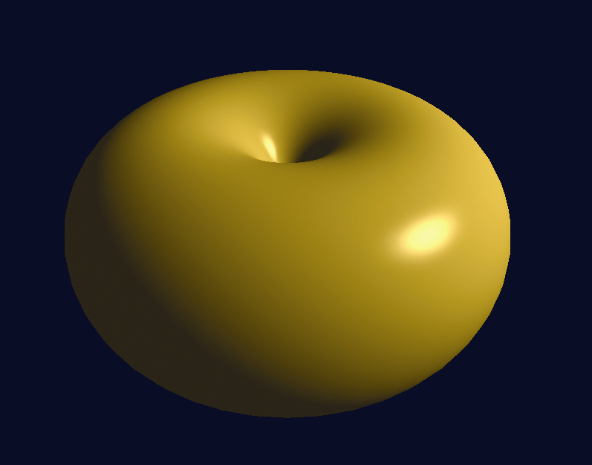
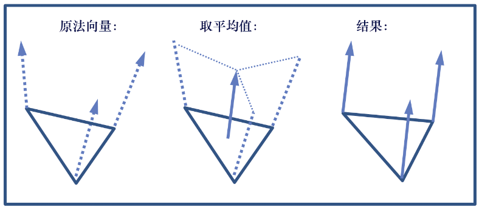
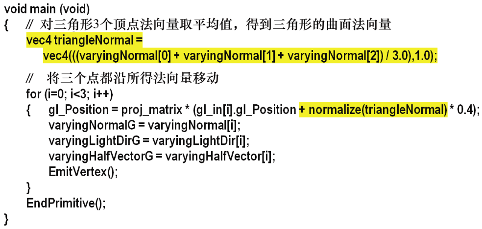
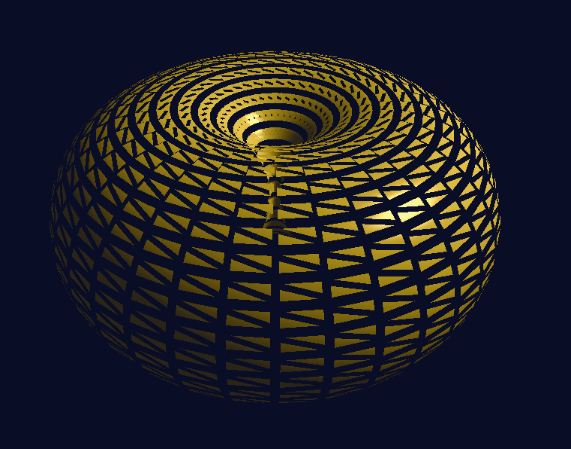
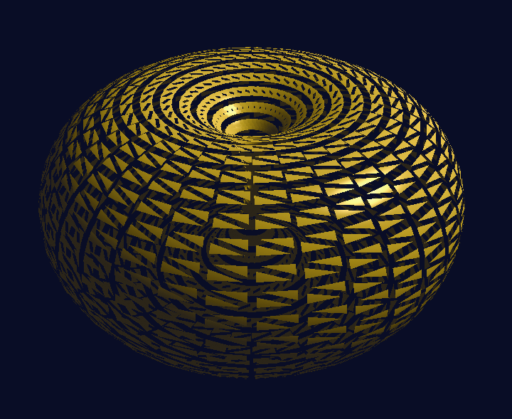

### 13.2　修改图元

当通过对图元（通常为三角形）的单独更改就可以影响对象形状的改变时，使用几何着色器就很方便。

例如，考虑我们之前在图7.12中呈现的环面。假设环面代表内部的空间（例如当表示轮胎时），而我们想要给它“充气”。简单地在C++/OpenGL代码中应用比例缩放因子将无法实现这一点，因为它的基本形状不会改变。想要让其显示出“充气”的外观，还需要在环面伸入空的中心空间时使内孔变小。

解决这个问题的一种方法是将表面法向量添加到每个顶点。虽然这可以在顶点着色器中完成，但是我们在几何着色器中进行练习。程序13.1显示了GLSL几何着色器的代码。其他模块与程序7.3相同，只有一些小改动：片段着色器输入名称现在需要反映几何着色器的输出（例如，varyingNormal变为varyingNormalG），C++/OpenGL应用程序需要编译几何着色器并在链接之前将其附加到着色器程序。新着色器被指定为几何着色器，如下所示。

```c
GLuint gShader = glCreateShader(GL_GEOMETRY_SHADER);
```

程序13.1　几何着色器：修改顶点

```c
#version 430
layout (triangles) in;
in vec3 varyingNormal[ ];        // 来自顶点着色器的输入
in vec3 varyingLightDir[ ];
in vec3 varyingHalfVector[ ];
out vec3 varyingNormalG;         // 输出给光栅着色器然后到片段着色器
out vec3 varyingLightDirG;
out vec3 varyingHalfVectorG;
layout (triangle_strip, max_vertices=3) out;
// 矩阵和光照统一变量和以前一样
. . .
void main (void)
{ // 沿着法向量移动顶点，并将其他顶点属性原样传递
  for (int i=0; i<3; i++)
  { gl_Position = proj_matrix *       gl_in[i].gl_Position + normalize(vec4(varyingNormal[i],1.0)) * 0.4;     varyingNormalG = varyingNormal[i];
    varyingLightDirG = varyingLightDir[i];
    varyingHalfVectorG = varyingHalfVector[i];
    EmitVertex();
  }
  EndPrimitive();
}

```

在程序13.1中需要注意，与顶点着色器的输出变量对应的输入变量被声明为数组。这为程序员提供了一种机制，可以使用索引0、1和2访问三角形图元中的每个顶点及其属性。我们希望沿着它们的表面法向量向外移动这些顶点。在顶点着色器中，顶点和法向量都已经被转换到视图空间。我们为每个传入的顶点位置（gl_in[i].gl_Position）添加法向量的一小部分，然后将投影矩阵应用于结果，生成每个输出gl_Position。


<center class="my_markdown"><b class="my_markdown">图13.1　“充气”的环面，顶点由几何着色器修改</b></center>

值得注意的是，使用GLSL调用EmitVertex()来指定我们何时完成了计算输出gl_Position及其相关的顶点属性并准备输出顶点。EndPrimitive()调用指定我们已经完成了组成图元（在本例中为三角形）的一组顶点的定义。结果如图13.1所示。

几何着色器包括两个布局限定符。第一个指定输入图元类型，并且必须与C++端glDrawArrays()或glDrawElements()调用中的图元类型兼容。选项如表13.1所示。

<center class="my_markdown"><b class="my_markdown">表13.1　图元输入类型的选项</b></center>

| 几何着色器输入图元类型 | 与glDrawArrays()调用兼容的图元类型 | 每次调用顶点的数量 |
| :-----  | :-----  | :-----  | :-----  | :-----  |
| points | GL_POINTS | 1 |
| lines | GL_LINES, GL_LINE_STRIP | 2 |
| lines_adjacency | GL_LINES_ADJACENCY, GL_LINE_STRIP_ADJACENCY | 4 |
| triangles | GL_TRIANGLES, GL_TRIANGLE_STRIP, GL_TRIANGLE_FAN | 3 |
| triangles_adjacency | CL_TRIANGLES_ADJACENCY, GL_TRIANGLE_STRIP_ADJACENCY | 6 |

各种OpenGL图元类型（包括“strip”和“fan”类型）在第4章中讲过。“相邻”类型在OpenGL中用来与几何着色器一起使用，并且它们可以访问与图元相邻的顶点。我们在本书中不使用它们，但为了完整性，依然列出它们。

输出图元类型必须是points、line_strip或triangle_strip。请注意，输出布局限定符也会指定着色器在每次调用中输出的最大顶点数。

在顶点着色器中可以更容易地对环面进行这种特定的改变。然而，假设不是沿着自己的表面法向量向外移动每个顶点，而是希望将每个三角形沿其表面法向量向外移动，实际上是将环面的组成三角形向外“爆炸”。顶点着色器做不到这一点，因为计算三角形的法向量需要对3个三角形顶点的顶点法向量进行平均，并且顶点着色器一次只能访问三角形中一个顶点的顶点属性。但是，我们可以在几何着色器中执行此操作，因为几何着色器可以访问每个三角形中的所有3个顶点。我们平均它们的法向量来计算三角形的曲面法向量，然后将该平均法向量加给三角形图元中的每个顶点。图13.2、图13.3和图13.4分别显示了曲面法向量的平均值、修改后的几何着色器main()代码和输出的结果。


<center class="my_markdown"><b class="my_markdown">图13.2　将平均三角形曲面法向量应用于三角形顶点</b></center>


<center class="my_markdown"><b class="my_markdown">图13.3　修改了几何着色器，用于“爆炸”环面</b></center>


<center class="my_markdown"><b class="my_markdown">图13.4　“爆炸”的环面</b></center>

通过确保环面的内部也是可见的（通常这些三角形会被OpenGL剔除，因为它们是“背面”），可以改善“爆炸”环面的外观。一种解决方式是使环面被渲染两次，一次以正常方式进行，一次使缠绕顺序反转（使缠绕顺序反转实际上相当于切换哪些面朝向前方，哪些面朝向后方）。我们还向着色器（通过统一变量）发送一个标志，以禁用背向三角形上的漫反射和镜面光，以使它们不那么突出。代码的更改如下。

对display()函数的修改：

```c
. . .
// 绘制前向三角形——启用光照
glUniform1i(lLoc, 1);     // 用来启用、禁用漫反射、镜面光组件的统一变量的位置
glFrontFace(GL_CCW);
glDrawElements(GL_TRIANGLES, numTorusIndices, GL_UNSIGNED_INT, 0);
// 绘制后向三角形——禁用光照
glUniform1i(lLoc, 0); glFrontFace(GL_CW); glDrawElements(GL_TRIANGLES, numTorusIndices, GL_UNSIGNED_INT, 0);

```

对片段着色器的修改：

```c
. . .
if (enableLighting == 1) { fragColor = …       // 当渲染前向表面时，使用正常的光照计算
}
else                  // 当渲染后向表面时，只启用环境光照组件
{ fragColor = globalAmbient * material.ambient + light.ambient * material.ambient;
}

```

由此产生的“爆炸”环面，包括背面，如图13.5所示。


<center class="my_markdown"><b class="my_markdown">图13.5　“爆炸”的环面，包括背面</b></center>

