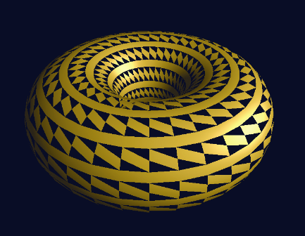
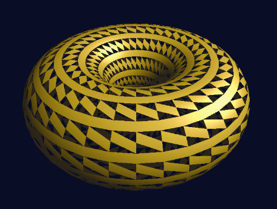

### 13.3　删除图元

几何着色器的一个常见用途是通过合理地删除一些图元来从简单的对象构建丰富的装饰对象。例如，从我们的环面中移除一些三角形可以将其变成一种复杂的格子结构，而从零开始建模这个结构是更加困难的。执行此操作的几何着色器显示在程序13.2中，输出如图13.6所示。


<center class="my_markdown"><b class="my_markdown">图13.6　几何着色器：删除图元</b></center>

程序13.2　几何着色器：删除图元

```c
// 输入、输出和统一变量和以前一样
. . .
void main (void)
{ if ( mod(gl_PrimitiveIDIn,3) != 0 )
  {    for (int i=0; i<3; i++)
       {   gl_Position = proj_matrix * gl_in[i].gl_Position;
           varyingNormalG = varyingNormal[i];
           varyingLightDirG = varyingLightDir[i];
           varyingHalfVectorG = varyingHalfVector[i];
           EmitVertex();
       }
  }
  EndPrimitive();
}

```

不需要对代码进行其他更改。请注意这里使用了mod函数——所有顶点，除了每3个图元中的第一个图元的顶点被忽略之外，都被传递。在这里，渲染背向三角形也可以提高真实感，如图13.7所示。


<center class="my_markdown"><b class="my_markdown">图13.7　显示背面的图元删除</b></center>

