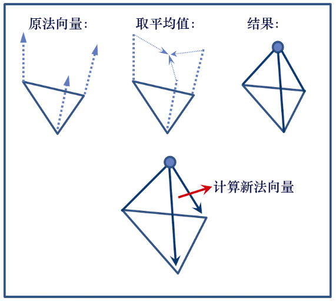
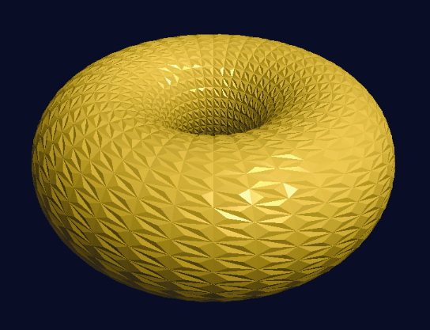

### 13.4　添加图元

也许几何着色器最有趣和最有用的用途是为正在渲染的模型添加额外的顶点和/或图元。这使得可以进行诸如增加对象中的细节以改善高度贴图，或者完全改变对象的形状之类的事情。

考虑以下示例，我们将环面中的每个三角形更改为一个微小的三角形金字塔。

我们的策略类似于我们之前的“爆炸”环面示例，如图13.8所示。传入三角形图元的顶点用于定义金字塔的基座。金字塔的壁由那些顶点和通过平均原始顶点的法向量计算的新点（称为“尖峰点”）构成。然后通过从尖峰点到基座的两个向量的叉积计算金字塔的3个“边”中的每一个的新法向量。


<center class="my_markdown"><b class="my_markdown">图13.8　将三角形转换为金字塔</b></center>

程序13.3中的几何着色器为环面中的每个三角形图元执行此操作。对于每个输入三角形，它输出3个三角形图元，总共9个顶点。每个新三角形都在函数makeNewTriangle()中构建，该函数被调用3次。它计算指定三角形的法向量，然后调用函数setOutputValues()为发出的每个顶点分配适当的输出顶点属性。在发出所有3个顶点之后，它调用EndPrimitive()。为了确保准确地执行光照，为每个新创建的顶点计算光照方向向量的新值。

程序13.3　几何着色器：添加图元

```c
. . .
vec3 newPoints[ ], lightDir[ ];
float sLen = 0.01;     // sLen 是"尖峰长度"，小金字塔的高度
void setOutputValues(int p, vec3 norm)
{ varyingNormal = norm;
  varyingLightDir = lightDir[p];
  varyingVertPos = newPoints[p];
  gl_Position = proj_matrix * vec4(newPoints[p], 1.0);
}
void makeNewTriangle(int p1, int p2)
{  // 为这个三角形生成表面法向量
   vec3 c1 = normalize(newPoints[p1] - newPoints[3]);
   vec3 c2 = normalize(newPoints[p2] - newPoints[3]);
   vec3 norm = cross(c1,c2);
   // 生成并发出3个顶点
   setOutputValues(p1, norm); EmitVertex();
   setOutputValues(p2, norm); EmitVertex();
   setOutputValues(3, norm); EmitVertex();
   EndPrimitive();
}
void main(void)
{ // 给三个三角形顶点加上原始表面法向量
  vec3 sp0 = gl_in[0].gl_Position.xyz + varyingOriginalNormal[0]*sLen;
  vec3 sp1 = gl_in[1].gl_Position.xyz + varyingOriginalNormal[1]*sLen;
  vec3 sp2 = gl_in[2].gl_Position.xyz + varyingOriginalNormal[2]*sLen;
  // 计算组成小金字塔的新点
  newPoints[0] = gl_in[0].gl_Position.xyz;
  newPoints[1] = gl_in[1].gl_Position.xyz;
  newPoints[2] = gl_in[2].gl_Position.xyz;
  newPoints[3] = (sp0 + sp1 + sp2)/3.0; // 尖峰点
  // 计算从顶点到光照的方向
  lightDir[0] = light.position - newPoints[0];
  lightDir[1] = light.position - newPoints[1];
  lightDir[2] = light.position - newPoints[2];
  lightDir[3] = light.position - newPoints[3];
  // 构建3个三角形，以组成小金字塔的表面
  makeNewTriangle(0,1);      // 第三个点永远是尖峰点
  makeNewTriangle(1,2);
  makeNewTriangle(2,0);
}
```

结果输出如图13.9所示。如果尖峰长度（sLen）变量增加，则添加的表面“金字塔”将更高。然而，在没有阴影的情况下，它们可能看起来并不真实。将阴影贴图添加到程序13.3留作练习。


<center class="my_markdown"><b class="my_markdown">图13.9　几何着色器：添加图元</b></center>

仔细应用这种技术可以模拟尖峰、荆棘和其他精细表面突起，或者反向的压痕、凹坑（参考资料<sup class="my_markdown">[DV14, TR13, KS16]</sup>）等。

