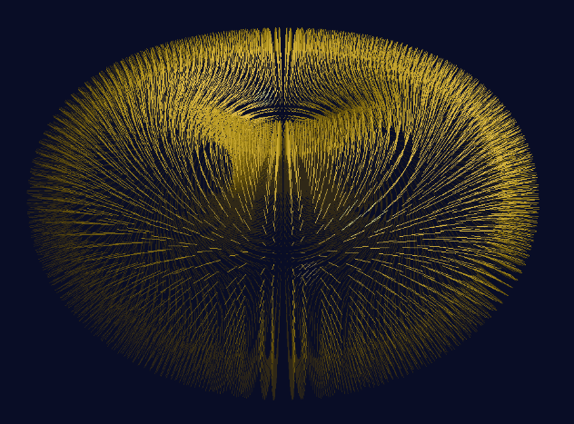

### 13.5　更改图元类型

OpenGL允许在几何着色器中更改图元类型。此功能的一个常见用途是将输入三角形转换为一个或多个输出线段，来模拟毛发或头发。虽然生成令人信服的头发仍然是更难的现实世界项目之一，但几何着色器可以在许多情况下帮助实现实时渲染。

程序13.4显示了一个几何着色器，它将每个输入的3个顶点的三角形转换为一个向外的两个顶点的线段。它首先通过平均三角形顶点位置生成三角形的质心，来计算头发束的起点。然后它使用和程序13.3中相同的“尖峰点”作为头发的终点。输出图元被指定为具有两个顶点的线段，第一个顶点是起点，第二个顶点是终点。结果显示在图13.10中，用于实例化维数为72个切片的环面。


<center class="my_markdown"><b class="my_markdown">图13.10　将三角形图元更改为线图元</b></center>

当然，这仅仅是产生完全逼真头发的起点。使头发弯曲或移动将需要若干修改，例如为线条生成更多顶点并沿曲线计算它们的位置和/或结合随机性。由于线段没有明显的表面法向量，光照会很复杂；在这个例子中，我们简单地指定法向量与原始三角形的表面法向量相同。

程序13.4　几何着色器：改变图元类型

```c
layout (line_strip, max_vertices=2) out;
. . .
void main(void)
{ vec3 op0 = gl_in[0].gl_Position.xyz;                                 // 原始三角形顶点
  vec3 op1 = gl_in[1].gl_Position.xyz;
  vec3 op2 = gl_in[2].gl_Position.xyz;
  vec3 ep0 = gl_in[0].gl_Position.xyz + varyingNormal[0]*sLen;         // 偏移三角形顶点
  vec3 ep1 = gl_in[1].gl_Position.xyz + varyingNormal[1]*sLen;
  vec3 ep2 = gl_in[2].gl_Position.xyz + varyingNormal[2]*sLen;
  // 计算组成小线段的新点
  vec3 newPoint1 = (op0 + op1 + op2)/3.0;              // 原始（起始）点
  vec3 newPoint2 = (ep0 + ep1 + ep2)/3.0;              // 结束点
  gl_Position = proj_matrix * vec4(newPoint1, 1.0);
  varyingVertPosG = newPoint1;
  varyingLightDirG = light.position - newPoint1;
  varyingNormalG = varyingNormal[0];
  EmitVertex();
  gl_Position = proj_matrix * vec4(newPoint2, 1.0);
  varyingVertPosG = newPoint2;
  varyingLightDirG = light.position - newPoint2;
  varyingNormalG = varyingNormal[1];
  EmitVertex();
  EndPrimitive();
}
```

