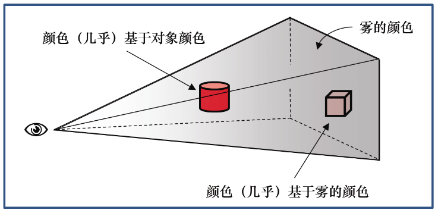
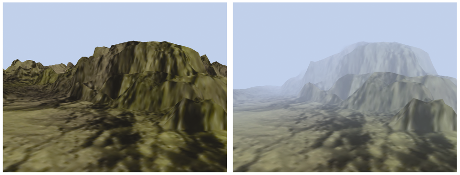

### 14.1　雾

通常当人们想到雾时，他们会想到有雾的早晨，能见度很低。事实上，大气雾霾（如雾）比我们大多数人认为的更常见。大多数时候，空气中都会有一定程度的雾霾，我们已经习惯于看到它，通常不会意识到它的存在，所以我们可以通过引入雾来增强我们室外场景的真实感——即使只是少量。

雾也可以增强深度感。近处物体比远处物体具有更高的清晰度，对于我们的大脑是可以用来破译3D场景的地形结构的另一个视觉提示。

模拟雾的方法有很多种，从非常简单的模型到包含光散射效应的复杂模型。即使非常简单的方法也是有效的。有一种方法是基于物体距眼睛的距离将实际像素颜色与另一种颜色（“雾”的颜色通常是灰色或蓝灰色——也用于背景颜色）混合。

图14.1（见彩插）说明了这个概念。眼睛（相机）显示在左侧，两个红色物体放置在视锥体中。圆柱体更靠近眼睛，所以它主要是原始颜色（红色）；立方体远离眼睛，所以它主要是雾色。对于这个简单的实现，几乎所有的计算都可以在片段着色器中执行。


<center class="my_markdown"><b class="my_markdown">图14.1　雾：基于距离的混合</b></center>

程序14.1显示了一个非常简单的雾算法的相关代码，该算法按照从相机到像素的距离，使用从对象颜色到雾颜色的线性混合。具体来说，此示例将雾添加到程序10.4中的高度贴图示例。

程序14.1　简单的雾生成

```c
顶点着色器
. . .
out vec3 vertEyeSpacePos;
. . .
// 在视觉空间中不考虑透视计算顶点位置，并将它发送给片段着色器
// 变量"p"是高度贴图后的顶点，正如程序10.4中所述
vertEyeSpacePos = (mv_matrix * p).xyz;
片段着色器
. . .
in vec3 vertEyeSpacePos;
out vec4 fragColor;
. . .
void main(void)
{ vec4 fogColor = vec4(0.7, 0.8, 0.9, 1.0);
  float fogStart = 0.2;
  float fogEnd = 0.8;
  // 在视觉空间中从摄像机到顶点的距离就是到这个顶点的向量的长度，因为摄像机在视觉空间中的(0,0,0)位置
  float dist = length(vertEyeSpace.xyz);
  float fogFactor = clamp(((fogEnd - dist) / (fogEnd - fogStart)), 0.0, 1.0);
  fragColor = mix(fogColor, (texture(t,tc), fogFactor);
}
```

变量fogColor指定雾的颜色。变量fogStart和fogEnd指定输出颜色从对象颜色过渡到雾色的范围（在视觉空间中），并且可以调整以满足场景的需要。在对象颜色中混合的雾的百分比在变量fogFactor中计算，该变量是顶点与fogEnd的接近程度与过渡区域的总长度之比。GLSL的clamp()函数用于将此比率限制在值0.0和1.0之间。然后，GLSL的mix()函数根据fogFactor的值返回雾颜色和对象颜色的加权平均值。图14.2（见彩插）展示了向具有高度贴图地形的场景添加雾（<sup class="my_markdown">[LU16]</sup>的岩石纹理也已应用）。


<center class="my_markdown"><b class="my_markdown">图14.2　雾的例子</b></center>

