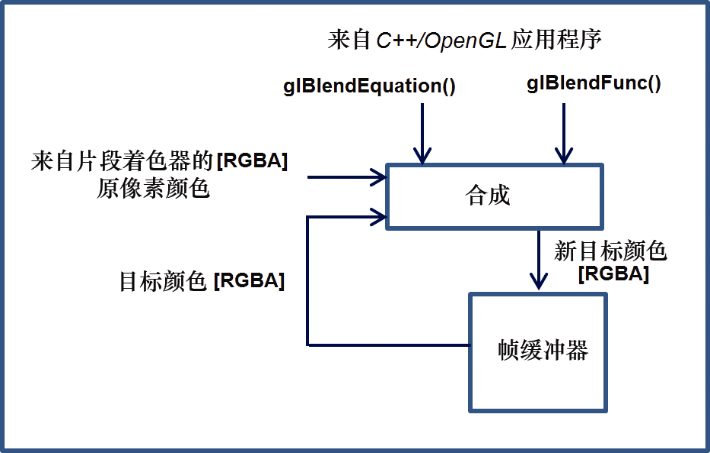
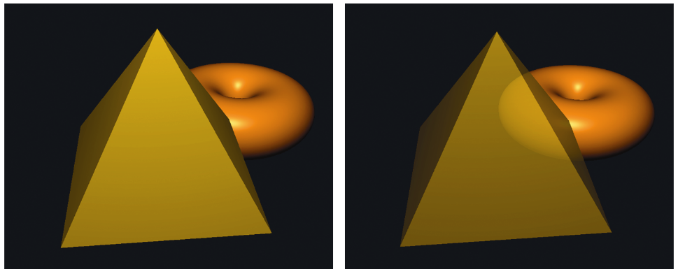
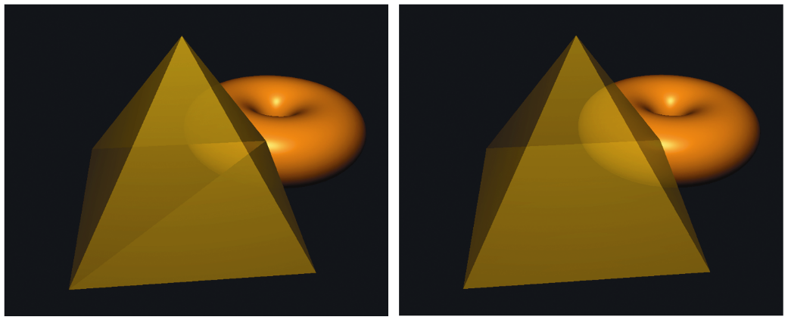

### 14.2　复合、混合、透明度

我们已经看到了一些混合的例子，比如第7章的补充说明以及我们刚才实现的雾。但是，我们还没有看到如何在像素操作期间利用片段着色器之后的混合（或合成）功能（回想一下图2.2所示的管线序列）。透明度在那个步骤被处理，我们现在来了解一下。

在本书中，我们经常使用vec4数据类型来表示齐次坐标系中的3D点和向量。您可能已经注意到我们还经常使用vec4来存储颜色信息，其中前3个值由红色、绿色和蓝色组成，那么第四个元素是什么？

颜色中的第四个元素称为Alpha通道，用来指定颜色的不透明度。不透明度是衡量像素颜色不透明程度的指标。Alpha值为0表示“无不透明度”或完全透明。Alpha值为1表示“不透明度满值”，也就是完全不透明。在某种意义上，颜色的“透明度”是1−α，其中α是Alpha通道的值。

回忆一下第2章，像素操作利用Z缓冲区，当发现另一个对象在该像素的位置更近时，通过替换现有的像素颜色来实现隐藏面消除。我们实际上可以更好地控制这个过程——可以选择混合两个像素。

当渲染一个像素时，它被称为“源”像素。已经在帧缓冲器中的像素（可能是从先前的对象渲染得来）被称为“目标”像素。OpenGL提供了许多选项，用于决定最终将两个像素中的哪一个或者它们的组合，放置在帧缓冲区中。请注意，像素操作步骤不是可编程阶段——因此用于配置所需合成的OpenGL工具可在C++应用程序中（而不是在着色器中）找到。

用于控制合成的两个OpenGL函数是glBlendEquation(mode)和glBlendFunc(srcFactor, destFactor)。图14.3显示了合成过程的概述。


<center class="my_markdown"><b class="my_markdown">图14.3　OpenGL合成概述</b></center>

合成过程的工作过程如下。

（1）源像素和目标像素分别乘以源因子和目标因子。源和目标因子在blendFunc()函数调用中指定。

（2）然后使用指定的blendEquation来组合修改后的源像素和目标像素以生成新的目标颜色。混合方程在glBlendEquation()调用中指定。

glBlendFunc()参数的常见选项（即srcFactor和destFactor）如表14.1所示。

<center class="my_markdown"><b class="my_markdown">表14.1　glBlendFunc()参数的常见选项</b></center>

| glBlendFunc()参数 | srcFactor或destFactor的结果 |
| :-----  | :-----  | :-----  | :-----  |
| GL_ZERO | (0,0,0,0) |
| GL_ONE | (1,1,1,1) |
| GL_SRC_COLOR | (R<sub class="my_markdown">src</sub>, G<sub class="my_markdown">src</sub>, B<sub class="my_markdown">src</sub>, A<sub class="my_markdown">src</sub>) |
| GL_ONE_MINUS_SRC_COLOR | (1,1,1,1)− (R<sub class="my_markdown">src</sub>, G<sub class="my_markdown">src</sub>, B<sub class="my_markdown">src</sub>, A<sub class="my_markdown">src</sub>) |
| GL_DST_COLOR | (G<sub class="my_markdown">dest</sub>, G<sub class="my_markdown">dest</sub>, B<sub class="my_markdown">dest</sub>, A<sub class="my_markdown">dest</sub>) |
| GL_ONE_MINUS_DST_COLOR | (1,1,1,1)− (R<sub class="my_markdown">blendColor</sub>, G<sub class="my_markdown">blendColor</sub>, B<sub class="my_markdown">blendColor</sub>, A<sub class="my_markdown">blendColor</sub>) |
| GL_SRC_ALPHA | (A<sub class="my_markdown">src</sub>, A<sub class="my_markdown">src</sub>, A<sub class="my_markdown">src</sub>, A<sub class="my_markdown">src</sub>) |
| GL_ONE_MINUS_SRC_ALPHA | (1, 1, 1, 1)−(A<sub class="my_markdown">src</sub>, A<sub class="my_markdown">src</sub>, A<sub class="my_markdown">src</sub>, A<sub class="my_markdown">src</sub>) |
| GL_DST_ALPHA | (A<sub class="my_markdown">dest</sub>, A<sub class="my_markdown">dest</sub>, A<sub class="my_markdown">dest</sub>, A<sub class="my_markdown">dest</sub>) |
| GL_ONE_MINUS_DST_ALPHA | (1, 1, 1, 1)−(A<sub class="my_markdown">dest</sub>, A<sub class="my_markdown">dest</sub>, A<sub class="my_markdown">dest</sub>, A<sub class="my_markdown">dest</sub>) |
| GL_CONSTANT_COLOR | (R<sub class="my_markdown">blendColor</sub>, G<sub class="my_markdown">blendColor</sub>, B<sub class="my_markdown">blendColor</sub>, A<sub class="my_markdown">blendColor</sub>) |
| GL_ONE_MINUS_CONSTANT_COLOR | (1,1,1,)− (R<sub class="my_markdown">blendColor</sub>, G<sub class="my_markdown">blendColor</sub>, B<sub class="my_markdown">blendColor</sub>, A<sub class="my_markdown">blendColor</sub>) |
| GL_CONSTANT_ALPHA | (A<sub class="my_markdown">blendColor</sub>, A<sub class="my_markdown">blendColor</sub>, A<sub class="my_markdown">blendColor</sub>, A<sub class="my_markdown">blendColor</sub>) |
| GL_ONE_MINUS_CONSTANT_ALPHA | (1,1,1,)− (A<sub class="my_markdown">blendColor</sub>, A<sub class="my_markdown">blendColor</sub>, A<sub class="my_markdown">blendColor</sub>, A<sub class="my_markdown">blendColor</sub>) |
| GL_ALPHA_SATURATE | (f, f, f, 1)，其中f = min(A<sub class="my_markdown">src</sub>, 1) |

那些用到“blendColor”（GL_CONSTANT_COLOR等）的选项需要额外调用glBlendColor()来指定将用于计算混合函数结果的常量颜色。还有一些其他混合函数未在表14.1中显示。

glBlendEquation()参数（混合模式）的可能选项如表14.2所示。

<center class="my_markdown"><b class="my_markdown">表14.2　glBlendEquation()参数的可能选项</b></center>

| 模式 | 混合颜色 |
| :-----  | :-----  | :-----  | :-----  |
| GL_FUNC_ADD | result=source<sub class="my_markdown">RGBA</sub>+destination<sub class="my_markdown">RGBA</sub> |
| GL_FUNC_SUBTRACT | result=source<sub class="my_markdown">RGBA</sub>−destination<sub class="my_markdown">RGBA</sub> |
| GL_FUNC_REVERST_SUBTRACT | result=destination<sub class="my_markdown">RGBA</sub>−source<sub class="my_markdown">RGBA</sub> |
| GL_MIN | result=min(source<sub class="my_markdown">RGBA</sub>, destination<sub class="my_markdown">RGBA</sub>) |
| GL_MAX | result=max(source<sub class="my_markdown">RGBA</sub>, destination<sub class="my_markdown">RGBA</sub>) |

glBlendFunc()默认设置srcFactor为GL_ONE（1.0），destFactor为GL_ZERO（0.0）。glBlendEquation()的默认值为GL_FUNC_ADD。因此，在默认情况下，源像素不变（乘以1），目标像素被按比例缩小到0，并且两者相加意味着源像素变为帧缓冲区的颜色。

还有命令glEnable(GL_BLEND)和glDisable(GL_BLEND)，它们可用于告诉OpenGL应用指定的混合，或忽略它。

我们不会在这里说明所有选项的效果，但我们将介绍一些说明性示例。假设我们在C++/OpenGL应用程序中指定以下设置：

```c
glBlendFunc(GL_SRC_ALPHA, GL_ONE_MINUS_SRC_ALPHA)
glBlendEquation(GL_FUNC_ADD)
```

合成将如下进行。

（1）源像素按其Alpha值缩放。

（2）目标像素按1−srcAlpha（源透明度）缩放。

（3）像素值加在一起。

例如，如果源像素为红色，具有75%不透明度，即[1,0,0,0.75]，并且目标像素包含完全不透明的绿色，即[0,1,0,1]，则结果放在帧缓冲区将是：

```c
srcPixel * srcAlpha = [0.75, 0, 0, 0.5625]
destPixel * (1-srcAlpha) = [0, 0.25, 0, 0.25]
resulting pixel = [0.75, 0.25, 0, 0.8125]
```

也就是说，主要是红色，有些是绿色的，而且基本上是实色。这个设置的总体效果是让目标像素以与源像素的透明度相对应的量显示。在此示例中，帧缓冲区中的像素为绿色，输入像素为红色，透明度为25%（不透明度为75%）。因此允许一些绿色通过红色显示。

事实证明，混合函数和混合方程的这些设置在许多情况下都能很好地工作。我们将它们应用到包含两个3D模型的场景中的实际示例中去：一个环面和环面前的金字塔。图14.4显示了这样一个场景，左边是一个不透明的金字塔，右边是金字塔的Alpha值设置为0.8。光照已经添加。

对于许多应用——例如创建平面“窗口”作为房屋模型的一部分，这种简单的透明度实现可能就足够了。但是，在图14.4所示的示例中，存在相当明显的不足之处。尽管金字塔模型现在实际上是透明的，但实际透明的金字塔不仅应该显示其背后的对象，还应该显示其自身的背面。


<center class="my_markdown"><b class="my_markdown">图14.4　金字塔的Alpha = 1.0（左），Alpha = 0.8（右）</b></center>

实际上，金字塔的背面没有出现的原因是因为我们启用了背面剔除。一个合理的想法可能是在绘制金字塔时禁用背面剔除。但是，这通常会产生其他伪影，如图14.5左图所示。简单地禁用背面剔除的问题在于混合的效果取决于渲染表面的顺序（因为这决定了源像素和目标像素），并且我们不总是能够控制渲染顺序。通常有利的是首先渲染不透明对象，以及在后面的对象（例如环面），最后再渲染透明对象。这也适用于金字塔的表面，并且在这种情况下，包括金字塔底部的两个三角形看起来不同的原因是它们中的一个在金字塔的前面之前被渲染而一个在之后被渲染。诸如此类的伪影有时被称为“顺序”伪影，并且它们可以在透明模型中显示，因为我们不总是能预测其三角形将被渲染的顺序。

我们可以通过从背面开始分别渲染正面和背面来解决金字塔示例中的问题。程序14.2显示了执行此操作的代码。我们通过统一变量来指定金字塔的Alpha值并传递给着色器程序，然后通过将指定的Alpha替换为计算的输出颜色将其应用于片段着色器中。

另请注意，要使光照正常工作，我们必须在渲染背面时翻转法向量。我们通过向顶点着色器发送一个标志来完成此操作，然后我们在其中翻转法向量。

程序14.2　透明度的两遍混合

```c
C++ / OpenGL应用程序 —— 在渲染金字塔的display()函数中：
. . .
glEnable(GL_CULL_FACE);
. . .
glEnable(GL_BLEND);          // 配置混合设置
glBlendFunc(GL_SRC_ALPHA, GL_ONE_MINUS_SRC_ALPHA); glBlendEquation(GL_FUNC_ADD);
glCullFace(GL_FRONT);         // 先渲染金字塔的背面
glProgramUniform1f(renderingProgram, aLoc, 0.3f);        // 背面非常透明
glProgramUniform1f(renderingProgram, fLoc, -1.0f);       // 翻转背面的法向量
glDrawArrays(GL_TRIANGLES, 0, numPyramidVertices);
glCullFace(GL_BACK);                                     // 然后渲染金字塔的正面
glProgramUniform1f(renderingProgram, aLoc, 0.7f);        // 正面略微透明
glProgramUniform1f(renderingProgram, fLoc, 1.0f);        // 正面不需要翻转法向量
glDrawArrays(GL_TRIANGLES, 0, numPyramidVertices);
glDisable(GL_BLEND);
顶点着色器：
. . .
if (flipNormal < 0) varyingNormal = -varyingNormal; . . .
片段着色器：
. . .
fragColor = globalAmbient * material.ambient + ... etc.     // 和Blinn-Phong光照一样
fragColor = vec4(fragColor.xyz, alpha);                     // 使用统一变量中发送的Alpha值替换

```

这种“两遍”解决方案的结果如图14.5右图所示。


<center class="my_markdown"><b class="my_markdown">图14.5　透明度和背面：排序伪影（左）和两遍校正（右）</b></center>

虽然它在这里运行良好，但程序14.2中显示的两遍解决方案并不总是足够的。例如，一些更复杂的模型可能具有面向前方的隐藏表面，并且如果这样的对象变得透明，我们的算法将无法渲染模型的那些隐藏的前向部分。Alec Jacobson描述了一个适用于大量案例的五遍序列<sup class="my_markdown">[JA12]</sup>。

