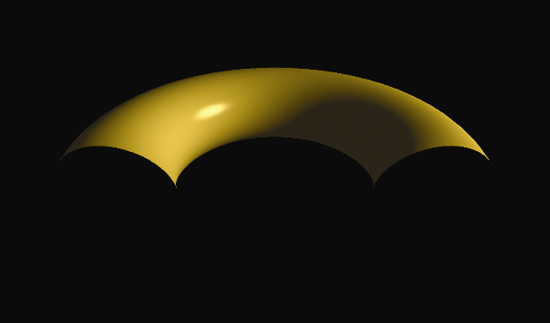
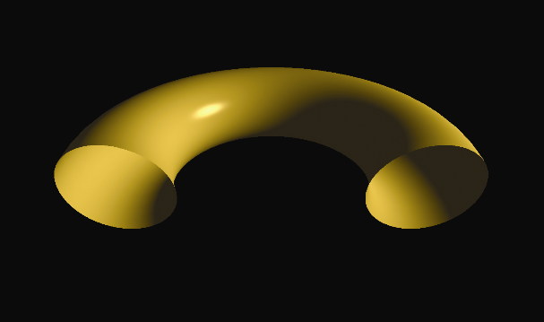

### 14.3　用户定义剪裁平面

OpenGL 不仅可以应用于视锥体，还包括了指定剪裁平面的功能。用户定义的剪裁平面的一个用途是对模型切片。这样就可以通过从简单的模型开始并从中切片来创建复杂的形状。

剪裁平面使用平面的标准数学定义来定义：

ax + by + cz + d = 0

其中a、b、c和d是用来定义有X、Y和Z轴的3D空间中特定平面的参数。参数表示垂直于平面的向量(a,b,c)，以及从原点到平面的距离d。可以使用vec4在顶点着色器中指定这样的平面，如下所示：

```c
vec4 clip_plane = vec4（0.0,0.0，−1.0,0.2）;
```

这对应于平面：

(0.0) x + (0.0) y + (−1.0) z + 0.2 = 0

然后，通过使用内置的GLSL变量gl_ClipDistance[ ]，可以在顶点着色器中实现裁剪，如下例所示：

gl_ClipDistance [0] = dot(clip_plane.xyz, vertPos) + clip_plane.w;

在此示例中，vertPos指的是在顶点属性（例如来自VBO）中进入顶点着色器的顶点位置，clip_plane定义如上。然后我们计算从裁剪平面到传入顶点的带符号距离（如第3章所示），如果顶点在平面上，则为0，或者取决于顶点在平面的哪一侧而为负或正。gl_ClipDistance数组的下标允许定义多个裁剪距离（即多个平面）。可以定义的最大用户裁剪平面数量取决于图形卡的OpenGL实现。

然后必须在C++/OpenGL应用程序中启用用户定义的裁剪。内置OpenGL标识符GL_CLIP_DISTANCE0、GL_CLIP_DISTANCE1等，对应于每个gl_ClipDistance[ ]数组元素。例如，启用第0个用户定义剪裁平面，如下所示。

```c
glEnable(GL_CLIP_DISTANCE0);
```

将前面的步骤应用到我们的发光环面会产生如图14.6所示的输出，其中环面的前半部分已经被剪裁了（还应用了旋转以提供更清晰的视图）。

可能看起来好像环面的底部也被修剪了，但这是因为环面的内表面没有被渲染。当裁剪会显示形状的内部表面时，也就需要渲染它们，否则模型将显示得不完整（如图14.6所示）。


<center class="my_markdown"><b class="my_markdown">图14.6　剪裁一个环面</b></center>

渲染内表面需要再次调用gl_DrawArrays()，并颠倒缠绕顺序。此外，在渲染背向三角形时，必须反转曲面法向量（如上一节所述）。C++应用程序和顶点着色器的相关修改如程序14.3所示，输出如图14.7所示。


<center class="my_markdown"><b class="my_markdown">图14.7　带背面的剪裁</b></center>

程序14.3　带背面的剪裁

```c
C++ / OpenGL应用程序：
void display(GLFWwindow* window, double currentTime) {
  . . .
  flipLoc = glGetUniformLocation(renderingProgram, "flipNormal");   . . .
  glEnable(GL_CLIP_DISTANCE0);
  // 正常绘制外表面
  glUniform1i(flipLoc, 0);   glFrontFace(GL_CCW);   glDrawElements(GL_TRIANGLES, numTorusIndices, GL_UNSIGNED_INT, 0);
  // 渲染背面，法向量反转
  glUniform1i(flipLoc, 1);   glFrontFace(GL_CW);   glDrawElements(GL_TRIANGLES, numTorusIndices, GL_UNSIGNED_INT, 0); }
顶点着色器：
. . .
vec4 clip_plane = vec4(0.0, 0.0, -1.0, 0.5); uniform int flipNormal;         // 反转法向量的标志
. . .
void main(void)
{ . . .
  if (flipNormal==1) varyingNormal = -varyingNormal;   . . .
  gl_ClipDistance[0] = dot(clip_plane.xyz, vertPos) - clip_plane.w;   . . .
}

```

