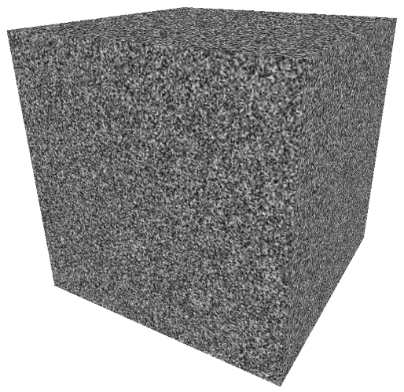
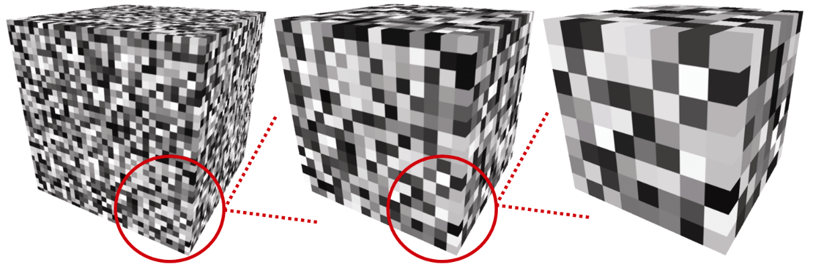
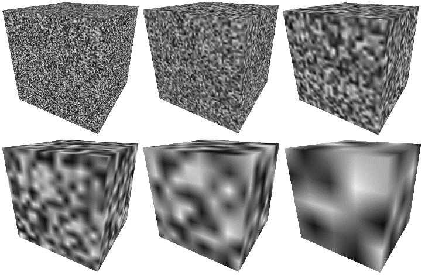
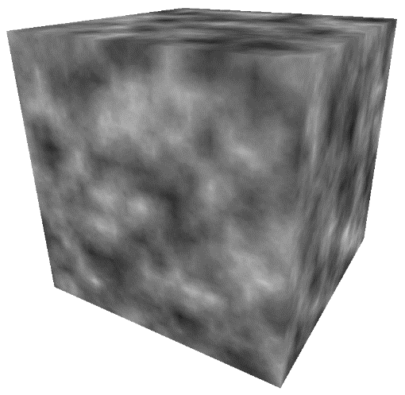

### 14.5　噪声

可以使用随机性或噪声来模拟许多自然现象。一种常见的技术是Perlin噪声<sup class="my_markdown">[PE85]</sup>，它以Ken Perlin命名。Ken Perlin在1997年因开发生成和使用2D和3D噪声的实用方法而获得奥斯卡奖。<sup>[1]</sup>这里描述的程序基于Perlin的方法。

图形场景中存在许多噪声应用。一些常见的例子是云、地形、木纹、矿产（如大理石中的矿脉）、烟雾、燃烧、火焰、行星表面和随机运动。在本节中，我们将重点关注生成包含噪声的3D纹理，然后使用噪声数据生成复杂材质（如大理石和木材），并模拟动画云纹理以用于立方体贴图或天幕。包含噪声的空间数据（例如2D或3D）的集合有时被称为噪声图。

我们首先从随机数据中构建3D纹理贴图。这可以使用上一节中显示的函数完成，只需进行一些修改。首先，我们使用以下更简单的generateNoise()函数替换程序14.4中的generate3Dpattern()函数：

```c
#include <random>; . . .
double noise[noiseWidth][noiseHeight][noiseDepth]; . . .
void generateNoise() {
   for (int x=0; x<noiseWidth; x++) {
       for (int y=0; y<noiseHeight; y++) {
            for (int z=0; z<noiseDepth; z++) {
                noise[x][y][z] = (double) rand() / (RAND_MAX + 1.0);        // 计算出[0...1]范围内的
                                                                            // 一个double类型数值
} } } }

```

接下来，修改程序14.4中的fillDataArray()函数，以便将噪声数据复制到字节数组中，以便加载到纹理对象中，如下所示。

```c
void fillDataArray(GLubyte data[ ]) {
   for (int i=0; i<noiseWidth; i++) {
        for (int j=0; j<noiseHeight; j++) {
             for (int k=0; k<noiseDepth; k++) {
                  data[i*(noiseWidth*noiseHeight*4)+j*(noiseHeight*4)+k*4+0] =
                        (GLubyte) (noise[i][j][k] * 255);
                  data[i*(noiseWidth*noiseHeight*4)+j*(noiseHeight*4)+k*4+1] =
                        (GLubyte) (noise[i][j][k] * 255);
                  data[i*(noiseWidth*noiseHeight*4)+j*(noiseHeight*4)+k*4+2] =
                        (GLubyte) (noise[i][j][k] * 255);
                  data[i*(noiseWidth*noiseHeight*4)+j*(noiseHeight*4)+k*4+3] =
                        (GLubyte) 255;
} } } }

```

程序14.4的其余部分，用于将数据加载到纹理对象并将其应用于模型，依然保持不变。我们可以通过将它应用于我们的简单立方体模型来查看这个3D噪声图，如图14.12所示。在此示例中，noiseHeight = noiseWidth = noiseDepth = 256。


<center class="my_markdown"><b class="my_markdown">图14.12　3D噪声数据纹理的立方体</b></center>

这是一个3D噪声图，虽然它不是非常有用（因为它太嘈杂了，很难有很多实际应用）。为了制作更实用、更可调的噪声模式，我们将使用不同的噪声生成过程替换fillDataArray()函数。

假设我们使用整数除法作为索引，通过“放大”，填充数据数组到图14.12所示的噪声图的一小部分。对fillDataArray()函数的修改如下所示。根据用于除法索引的“缩放”因子，可以使得到的3D纹理更多或少地呈现“块状”。在图14.13中，纹理显示了放大的结果，将索引分别除以缩放因子8、16和32（从左到右）。


<center class="my_markdown"><b class="my_markdown">图14.13　不同“缩放”因子的“块状”3D噪声图</b></center>

```c
void fillDataArray(GLubyte data[ ]) {
   int zoom = 8;      // 缩放因子
   for (int i=0; i<noiseWidth; i++) {
       for (int j=0; j<noiseHeight; j++) {
            for (int k=0; k<noiseDepth; k++) {
                 data[i*(noiseWidth*noiseHeight*4)+j*(noiseHeight*4)+k*4+0] =
                        (GLubyte) (noise [i/zoom] [j/zoom] [k/zoom] * 255);
                 data[i*(noiseWidth*noiseHeight*4)+j*(noiseHeight*4)+k*4+1] =
                        (GLubyte) (noise [i/zoom] [j/zoom] [k/zoom] * 255);
                 data[i*(noiseWidth*noiseHeight*4)+j*(noiseHeight*4)+k*4+2] =
                        (GLubyte) (noise [i/zoom] [j/zoom] [k/zoom] * 255);
                 data[i*(noiseWidth*noiseHeight*4)+j*(noiseHeight*4)+k*4+3] = (GLubyte) 255;
} } } }

```

通过从每个离散灰度颜色值插值到下一个灰度颜色值，我们可以平滑特定的噪声图内的“块效应”。也就是说，对于给定3D纹理内的每个小“块”，我们通过从其颜色到其相邻块的颜色进行插值来设置块内的每个纹素的颜色。插值代码在下面所示的函数smoothNoise()中，还有修改后的fillDataArray()函数。图14.14所示的是得到的“平滑”纹理（分别是缩放因子2、4、8、16、32和64——从左到右，从上到下）。请注意，缩放因子现在是一个double类型量，因为我们需要小数分量来确定每个纹素的插值灰度值。

```c
void fillDataArray(GLubyte data[ ]) {
   double zoom = 32.0;
   for (int i=0; i<noiseWidth; i++) {
       for (int j=0; j<noiseHeight; j++) {
            for (int k=0; k<noiseDepth; k++) {
                 data[i*(noiseWidth*noiseHeight*4) + j*(noiseHeight*4) + k*4 +0] =
                        (GLubyte) (smoothNoise(i/zoom, j/zoom, k/zoom) * 255);
                 data[i*(noiseWidth*noiseHeight*4) + j*(noiseHeight*4) + k*4 +1] =
                        (GLubyte) (smoothNoise(i/zoom, j/zoom, k/zoom) * 255);
                 data[i*(noiseWidth*noiseHeight*4) + j*(noiseHeight*4) + k*4 +2] =
                        (GLubyte) (smoothNoise(i/zoom, j/zoom, k/zoom) * 255);
                 data[i*(noiseWidth*noiseHeight*4) + j*(noiseHeight*4) + k*4 +3] = (GLubyte) 255;
} } } }
double smoothNoise(double x1, double y1, double z1) {
   // x1、y1和z1的小数部分（对于当前纹素，从当前块到下一个块的百分比）
   double fractX = x1 - (int) x1;
   double fractY = y1 - (int) y1;
   double fractZ = z1 - (int) z1;
   // 在X、Y和Z方向上的相邻像素的索引
   int x2 = ((int)x1 + noiseWidth + 1) % noiseWidth;
   int y2 = ((int)y1 + noiseHeight + 1) % noiseHeight;
   int z2 = ((int)z1 + noiseDepth + 1) % noiseDepth;
   // 通过按照3个轴方向插值灰度，平滑噪声
   double value = 0.0;
   value += (1-fractX)  * (1-fractY)   * (1-fractZ) * noise[(int)x1][(int)y1][(int)z1];
   value += (1-fractX)  * fractY       * (1-fractZ) * noise[(int)x1][(int)y2][(int)z1];
   value += fractX      * (1-fractY)   * (1-fractZ) * noise[(int)x2][(int)y1][(int)z1];
   value += fractX      * fractY       * (1-fractZ) * noise[(int)x2][(int)y2][(int)z1];
   value += (1-fractX)  * (1-fractY)   * fractZ     * noise[(int)x1][(int)y1][(int)z2];
   value += (1-fractX)  * fractY       * fractZ     * noise[(int)x1][(int)y2][(int)z2];
   value += fractX      * (1-fractY)   * fractZ     * noise[(int)x2][(int)y1][(int)z2];
   value += fractX      * fractY       * fractZ     * noise[(int)x2][(int)y2][(int)z2];
   return value;
}

```


<center class="my_markdown"><b class="my_markdown">图14.14　在各种缩放级别平滑3D纹理</b></center>

smoothNoise()函数通过计算相应原始“块状”噪声图中纹素周围的8个灰度值的加权平均值来计算给定噪声图的平滑版本中的每个纹素的灰度值。也就是说，它平均纹素所在的小“块”的8个顶点处的颜色值。这些“邻居”颜色中的每一个的权重基于纹素与其每个邻居的距离，并归一化到范围[0…1]。

接下来，组合各种缩放因子的平滑噪声图。创建一个新的噪声图，其中每个纹素由另一个加权平均值形成，这次基于每个“平滑”噪声图中相同位置的纹素的总和，其中缩放因子用作权重。这种效应被Perlin <sup class="my_markdown">[PE85]</sup>称为“湍流”，尽管它与通过求和各种波形产生的谐波实际上更为密切相关。新的turbulence()函数和fillDataArray()的修改版本指定了一个噪声图，该图对缩放级别1～32（2的各次幂）进行求和，如下所示。其中还显示了以此产生的噪声图在立方体上贴图的结果。

```c
double turbulence(double x, double y, double z, double maxZoom) {
   double sum = 0.0, zoom = maxZoom;
   while (zoom >= 1.0) {                  // 最后一遍是当zoom = 1时
      // 计算平滑后的噪声图的加权和
      sum = sum + smoothNoise(x / zoom, y / zoom, z / zoom) * zoom;
      zoom = zoom / 2.0;                  // 对每个2的幂的缩放因子
   }
   sum = 128.0 * sum / maxZoom;           // 对不大于64的maxZoom值，保证RGB < 256
   return sum;
}
void fillDataArray(GLubyte data[ ] ) {
   double maxZoom = 32.0;
   for (int i=0; i<noiseWidth; i++) {
       for (int j=0; j<noiseHeight; j++) {
           for (int k=0; k<noiseDepth; k++) {
               data[i*(noiseWidth*noiseHeight*4)+j*(noiseHeight*4)+k*4+0] =
                      (GLubyte) turbulence(i, j, k, maxZoom);
               data[i*(noiseWidth*noiseHeight*4)+j*(noiseHeight*4)+k*4+1] =
                      (GLubyte) turbulence(i, j, k, maxZoom);
               data[i*(noiseWidth*noiseHeight*4)+j*(noiseHeight*4)+k*4+2] =
                      (GLubyte) turbulence(i, j, k, maxZoom);
               data[i*(noiseWidth*noiseHeight*4)+j*(noiseHeight*4)+k*4+3] =
                      (GLubyte) 255;
} } } }
```

3D噪声图（如图14.15所示）可用于各种富有想象力的应用。在接下来的部分中，我们将使用它们来生成大理石、木材和云。可以通过放大级别的不同组合来调整噪声的分布。


<center class="my_markdown"><b class="my_markdown">图14.15　“湍流”噪声的3D纹理贴图</b></center>

