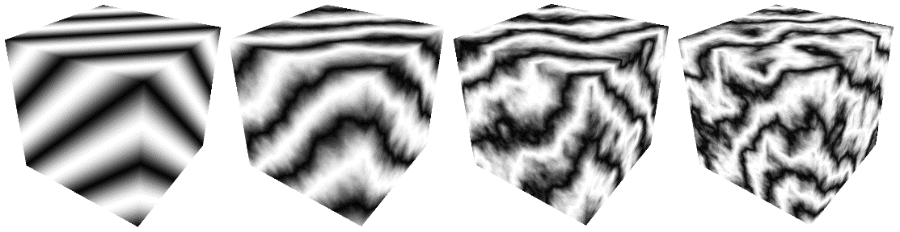
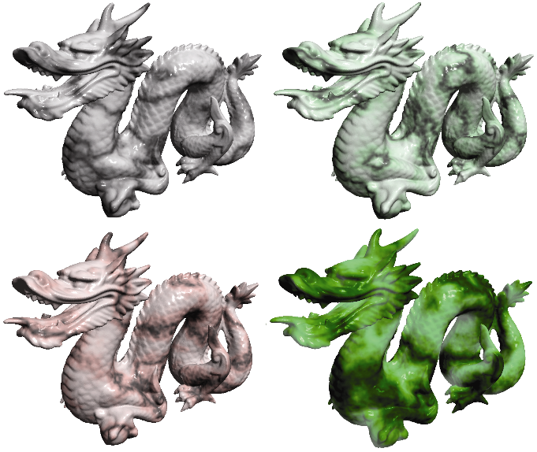

### 14.6　噪声应用——大理石

通过修改噪声图并使用适当的ADS材料添加Phong照明，我们可以使龙模型看起来像一块大理石般的石头，如图7.3所示。

我们首先生成一个条纹图案，有点类似于本章前面的“条纹”示例——新条纹与之前的条纹不同，首先是因为它们是对角线，还因为它们是由正弦波产生的，因此边缘是模糊的。然后，我们使用噪声图来扰动这些线，将它们存储为灰度值。fillDataArray()函数的更改如下：

```c
void fillDataArray(GLubyte data[ ]) {
   double veinFrequency = 2.0;    double turbPower = 1.5;    double maxZoom = 64.0;    for (int i=0; i<noiseWidth; i++) {
       for (int j=0; j<noiseHeight; j++) {
           for (int k=0; k<noiseDepth; k++) {
               double xyzValue = (float)i / noiseWidth + (float)j / noiseHeight + (float)k /                                  noiseDepth + turbPower * turbulence(i,j,k,maxZoom) / 256.0;                double sineValue = abs(sin(xyzValue * 3.14159 * veinFrequency));
               float redPortion = 255.0f * (float)sineValue;                float greenPortion = 255.0f * (float)sineValue;                float bluePortion = 255.0f * (float)sineValue;
               data[i*(noiseWidth*noiseHeight*4)+j*(noiseHeight*4)+k*4+0] = (GLubyte) redPortion;
               data[i*(noiseWidth*noiseHeight*4)+j*(noiseHeight*4)+k*4+1] = (GLubyte) greenPortion;
               data[i*(noiseWidth*noiseHeight*4)+j*(noiseHeight*4)+k*4+2] = (GLubyte) bluePortion;
               data[i*(noiseWidth*noiseHeight*4)+j*(noiseHeight*4)+k*4+3] = (GLubyte) 255;
} } } }

```

变量veinFrequency用于调整条纹数量，turbSize调整生成湍流时使用的缩放系数，turbPower调整条纹中的扰动量（将其设置为0，使条纹不受干扰）。由于相同的正弦波值用于所有3个（RGB）颜色分量，所以存储在图像数据阵列中的最终颜色是灰度级的。图14.16显示了各种turbPower值（0.0、5.5、1.0和1.5，从左到右）的结果纹理贴图。


<center class="my_markdown"><b class="my_markdown">图14.16　构建3D“大理石”噪声图</b></center>

由于我们希望大理石具有闪亮的外观，我们采用Phong着色使得“大理石”纹理物体看起来令人信服。程序14.5总结了生成大理石龙的代码。除了我们还传递了原始顶点坐标以用作3D纹理坐标（如前所述），顶点和片段着色器与用于Phong着色的相同。片段着色器使用前面7.6节中描述的技术将噪声结果与光照结果结合。

程序14.5　构建大理石龙

```c
C++ / OpenGL应用程序：
. . .
// 用于Phong着色的白光ADS设置
float globalAmbient[4] = {0.5f, 0.5f, 0.5f, 1.0f};
float lightAmbient[4] = {0.0f, 0.0f, 0.0f, 1.0f};
float lightDiffuse[4] = {1.0f, 1.0f, 1.0f, 1.0f};
float lightSpecular[4] = {1.0f, 1.0f, 1.0f, 1.0f};
float matShi = 75.0f;
void init(GLFWwindow* window) {
   . . .
   generateNoise();
   noiseTexture = load3DTexture();          // 和程序14.4一样，负责调用fillDataArray()
}
void fillDataArray(GLubyte data[ ]) {
   double veinFrequency = 1.75;    double turbPower = 3.0;    double turbSize = 32.0;    // 剩下部分构建大理石噪声图的和之前的一样
   . . .
}
顶点着色器
// 和程序14.4一样
片段着色器
. . .
void main(void)
{ . . .
   // 模型顶点取值[-1.5, +1.5]，纹理坐标取值[0, 1]
   vec4 texColor = texture(s, originalPosition / 3.0 + 0.5);
   fragColor =
      0.7 * texColor * (globalAmbient + light.ambient + light.diffuse * max(cosTheta,0.0))
      + 0.5 * light.specular * pow(max(cosPhi, 0.0), material.shininess);
}

```

有多种方法可以模拟不同颜色的大理石（或其他石材）。改变大理石中“矿脉”颜色的一种方法是修改fillDataArray()函数中Color变量的定义，例如，通过增加绿色成分：

```c
float redPortion = 255.0f * (float)sineValue;
float greenPortion = 255.0f * (float)min(sineValue*1.5 - 0.25, 1.0);
float bluePortion = 255.0f * (float)sineValue;
```

我们还可以引入ADS材料值［即在init()中指定］来模拟完全不同类型的石头，例如“玉石”。

图14.17（见彩插）显示了4个示例，前3个使用程序14.5所示的设置，第四个示例包含前面图7.3所示的“jade”ADS材料值。


<center class="my_markdown"><b class="my_markdown">图14.17　3D噪声图纹理的龙——3个大理石和1个玉质</b></center>

