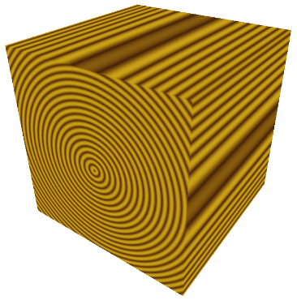
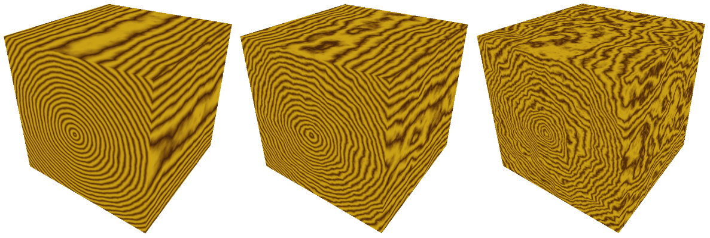
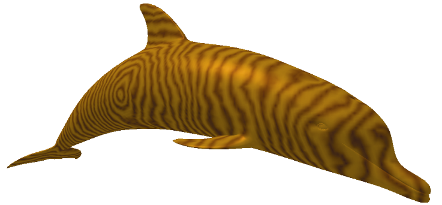

### 14.7　噪声应用——木材

创建“木材”纹理可以采用与之前“大理石”示例中类似的方式。树木按照年轮生长，正是这些年轮成了我们在用木头制成的物体中看到的“木纹”。随着树木的生长，环境压力会在年轮中产生变化，我们也会在木纹中看到这种变化。

我们首先构建一个程序性的“年轮”3D纹理贴图，类似于本章前面的“棋盘格”。然后，我们使用噪声图来扰动这些年轮，将深色和浅棕色插入年轮纹理贴图中。通过调整年轮的数量以及扰动年轮的程度，我们可以用各种类型的木纹模拟木材。棕色的色调可以通过组合相似数量的红色和绿色、少量蓝色来制作。然后，我们应用具有低“光泽”的Phong着色。

我们可以通过修改fillDataArray()函数来生成环绕我们3D纹理贴图中Z轴的年轮，使用三角函数指定与Z轴等距的X和Y值。我们使用正弦波循环重复此过程，根据此正弦波均匀地升高和降低红色和绿色成分，以产生不同的棕色调。变量sineValue保持精确的色调，可以通过稍微偏移一个分量或另一个分量来调整（在这种情况下，将红色增加80，将绿色增加30）。我们可以通过调整xyPeriod的值来创建更多（或更少）的年轮。得到的纹理如图14.18所示（见彩插）。

```c
void fillDataArray(GLubyte data[ ]) {
   double xyPeriod = 40.0;    for (int i=0; i<noiseWidth; i++) {
       for (int j=0; j<noiseHeight; j++) {
           for (int k=0; k<noiseDepth; k++) {
               double xValue = (i - (double)noiseWidth/2.0) / (double)noiseWidth;                double yValue = (j - (double)noiseHeight/2.0) / (double)noiseHeight;                double distanceFromZ = sqrt(xValue * xValue + yValue * yValue)                double sineValue = 128.0 * abs(sin(2.0 * xyPeriod * distanceFromZ * 3.14159));
               float redPortion = (float)(80 + (int)sineValue);                float greenPortion = (float)(30 + (int)sineValue);                float bluePortion = 0.0f;
               data[i*(noiseWidth*noiseHeight*4)+j*(noiseHeight*4)+k*4+0] = (GLubyte) redPortion;
               data[i*(noiseWidth*noiseHeight*4)+j*(noiseHeight*4)+k*4+1] = (GLubyte) greenPortion;
               data[i*(noiseWidth*noiseHeight*4)+j*(noiseHeight*4)+k*4+2] = (GLubyte) bluePortion;
               data[i*(noiseWidth*noiseHeight*4)+j*(noiseHeight*4)+k*4+3] = (GLubyte) 255;
} } } }

```


<center class="my_markdown"><b class="my_markdown">图14.18　为3D木材纹理创建年轮</b></center>

图14.18中的木质年轮环是一个很好的开始，但它们看起来不太逼真——它们太完美了。为了改善这一点，我们使用噪声图（更具体地说，是湍流）来扰动distanceFromZ变量，使得环具有轻微的变化。计算修改如下：

```c
double distanceFromZ = sqrt(xValue * xValue + yValue * yValue)
                                    + turbPower * turbulence(i, j, k, maxZoom) / 256.0; 
```

同样，变量turbPower调整应用了多少湍流（将其设置为0.0，产生图14.18所示的未受干扰的版本），并且maxZoom指定缩放值（在此示例中为32）。图14.19显示了turbPower值0.05、1.0和2.0（从左到右）得到的木材纹理。


<center class="my_markdown"><b class="my_markdown">图14.19　“木材”3D纹理贴图与噪声地图扰动的年轮</b></center>

我们现在可以将3D木材纹理贴图应用于模型。通过对用于纹理坐标的originalPosition顶点位置应用旋转，可以进一步增强纹理的真实感，这是因为用木头雕刻的大多数物品与年轮的方向不完全对齐。为此，我们向着色器发送一个额外的旋转矩阵，以旋转纹理坐标。我们还添加了Phong着色，具有适当的木色ADS值和适度的光泽度。创建“木质海豚”的完整代码补充和更改见程序14.6。

程序14.6　构建木质海豚

```c
C++ / OpenGL应用程序：
glm::mat4 texRot;
// 木质材质（棕色）
float matAmbient[4] = {0.5f, 0.35f, 0.15f, 1.0f};
float matDiffuse[4] = {0.5f, 0.35f, 0.15f, 1.0f};
float matSpecular[4] = {0.5f, 0.35f, 0.15f, 1.0f};
float matShi = 15.0f;
void init(GLFWwindow* window) {
   . . .
   // 旋转应用于纹理坐标——增加额外的木纹变化
   texRot = glm::rotate(glm::mat4(1.0f), toRadians(20.0f), glm::vec3(0.0f, 1.0f, 0.0f)); }
void fillDataArray(GLubyte data[ ]) {
   double xyPeriod = 40.0;    double turbPower = 0.1;    double maxZoom = 32.0;    for (int i=0; i<noiseWidth; i++) {
       for (int j=0; j<noiseHeight; j++) {
           for (int k=0; k<noiseDepth; k++) {
               double xValue = (i - (double)noiseWidth/2.0) / (double)noiseWidth;
               double yValue = (j - (double)noiseHeight/2.0) / (double)noiseHeight;
               double distanceFromZ = sqrt(xValue * xValue + yValue * yValue)                                       + turbPower * turbulence(i, j, k, maxZoom) / 256.0;                double sineValue = 128.0 * abs(sin(2.0 * xyPeriod * distanceFromZ * Math.PI));
               float redPortion = (float)(80 + (int)sineValue);
               float greenPortion = (float)(30 + (int)sineValue);
               float bluePortion = 0.0f;
               data[i*(noiseWidth*noiseHeight*4)+j*(noiseHeight*4)+k*4+0] = (GLubyte) redPortion;
               data[i*(noiseWidth*noiseHeight*4)+j*(noiseHeight*4)+k*4+1] = (GLubyte) greenPortion;
               data[i*(noiseWidth*noiseHeight*4)+j*(noiseHeight*4)+k*4+2] = (GLubyte) bluePortion;
               data[i*(noiseWidth*noiseHeight*4)+j*(noiseHeight*4)+k*4+3] = (GLubyte) 255;
} } } }
void display(GLFWwindow* window, double currentTime) {
   . . .
   tLoc = glGetUniformLocation(renderingProgram, "texRot");    glUniformMatrix4fv(tLoc, 1, false, glm::value_ptr(texRot));    . . .
}
顶点着色器
. . .
uniform mat4 texRot;
void main(void)
{ . . .
   originalPosition = vec3(texRot * vec4(position,1.0)).xyz;
   . . . .
}
片段着色器
. . .
void main(void)
{ . . .
   uniform mat4 texRot; . . .
   // 将光照和 3D 纹理结合
   fragColor =
      0.5 * ( . . . )
         +
      0.5 * texture(s,originalPosition / 2.0 + 0.5);
}

```

3D材质的木质海豚如图14.20所示。


<center class="my_markdown"><b class="my_markdown">图14.20　“木材”3D噪声图纹理的海豚</b></center>

片段着色器中还有一个值得注意的细节。由于我们在3D纹理内旋转模型，所以有时可能会导致顶点位置因旋转而移动超出所需的[0…1]纹理坐标范围。如果发生这种情况，我们可以通过将原始顶点位置除以更大的数字（例如4.0而不是2.0）来调整这种可能性，然后添加稍大一些的数字（例如0.6）以使其在纹理空间中居中。

