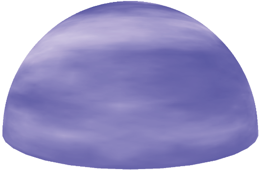
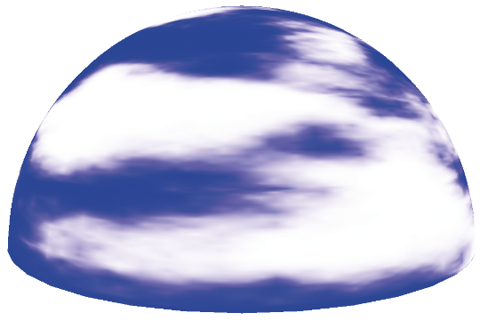
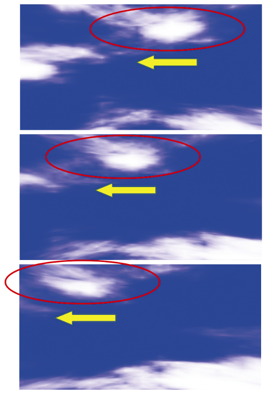

### 14.8　噪声应用——云

前面图14.15中构建的“湍流”噪声图看起来有点像云。当然，它不是正确的颜色，所以我们首先将它从灰度变为适当的浅蓝色和白色混合。一种直接的方法是为蓝色分量指定一个最大值为1.0的颜色，为红色和绿色分量指定0.0～1.0的变化（但相等的）值，具体取决于噪声图中的值。新的fillDataArray()函数如下：

```c
void fillDataArray(GLubyte data[ ]) {
   for (int i=0; i<noiseWidth; i++) {
       for (int j=0; j<noiseHeight; j++) {
           for (int k=0; k<noiseDepth; k++) {
               float brightness = 1.0f - (float) turbulence(i,j,k,32) / 256.0f;                float redPortion = brightness*255.0f;                float greenPortion = brightness*255.0f;                float bluePortion = 1.0f*255.0f;                data[i*(noiseWidth*noiseHeight*4)+j*(noiseHeight*4)+k*4+0] = (GLubyte) redPortion;
               data[i*(noiseWidth*noiseHeight*4)+j*(noiseHeight*4)+k*4+1] = (GLubyte) greenPortion;
               data[i*(noiseWidth*noiseHeight*4)+j*(noiseHeight*4)+k*4+2] = (GLubyte) bluePortion;
               data[i*(noiseWidth*noiseHeight*4)+j*(noiseHeight*4)+k*4+3] = (GLubyte) 255;
} } } }

```

生成的蓝色版本的噪声图现在可用于纹理化天幕。回想一下，天幕是一个球体或半球体，在禁用深度测试的情况下被纹理化和渲染，并放置使其围绕相机（类似于天空盒）。

构建天幕的一种方法是使用顶点坐标作为纹理坐标，以与我们对其他3D纹理相同的方式对其进行纹理化。然而，在这种情况下，事实证明使用天幕的2D纹理坐标会产生看起来更像云的图案，因为球面扭曲会略微拉伸纹理贴图。我们可以通过将GLSL的texture()调用中的第三维设置为常量值来从噪声图中获取2D切片。假设天幕的纹理坐标已经以标准方式发送到顶点属性中的OpenGL管线，下面的片段着色器使用噪声图的2D切片对其进行纹理化：

```c
#version 430
in vec2 tc;
out vec4 fragColor;
uniform mat4 mv_matrix;
uniform mat4 proj_matrix;
layout (binding=0) uniform sampler3D s;
void main(void)
{ fragColor = texture(s,vec3(tc.x, tc.y, 0.5));         // 常量替代了tc.z
}

```

得到的纹理化天幕如图14.21所示（见彩插）。虽然相机通常被放置在天幕内，但我们在外面使用相机进行渲染，因此可以看到圆顶本身的效果。当前的噪声图导致云“看起来模糊不清”。


<center class="my_markdown"><b class="my_markdown">图14.21　云雾缭绕纹理的天幕</b></center>

虽然我们的朦胧云看起来不错，但我们希望能够塑造它们——也就是说，让它们更多或更少朦胧。一种方法是修改turbulence()函数，使其使用指数（如logistic函数），<sup class="my_markdown">[2]</sup>让云看起来更“明显”。修改后的turbulence()函数以及相关的logistic()函数如程序14.7所示。完整的程序14.7还包含前面描述的smooth()、fillDataArray()和generateNoise()函数。

程序14.7　云纹理生成

```c
C++ / OpenGL应用程序：
double turbulence(double x, double y, double z, double size) {
   double value = 0.0, initialSize = size, cloudQuant;
   while(size >= 0.9) {
      value = value + smoothNoise(x/size, y/size, z/size) * size;
      size = size / 2.0;
   }
   cloudQuant = 110.0;          // 可微调的云质量
   value = value / initialSize;    value = 256.0 * logistic(value * 128.0 - cloudQuant);    return value;
}
double logistic(double x) {    double k = 0.2;     // 可微调的云朦胧程度，产生更多或更少的分明的云边界
   return (1.0 / (1.0 + pow(2.718, -k*x))); }

```

Logistic函数使颜色更倾向于白色或蓝色，而不是介于两者之间的值，从而产生具有更多不同云边界的视觉效果。变量cloudQuant调整噪声图中白色（相对于蓝色）的相对量，这反过来导致当应用logistic函数时产生更多（或更少）的白色区域（即不同的云）。由此产生的天幕现在具有更明显的云层，如图14.22所示（见彩插）。


<center class="my_markdown"><b class="my_markdown">图14.22　指数云纹理的天幕</b></center>

最后，真正的云不是静态的。为了增强云的真实感，我们应该通过以下方式使它们变得生动：（a）使它们随着时间的推移而移动或“漂移”；（b）随着它们漂移逐渐改变它们的形状。

使云“漂移”的一种简单方法是缓慢旋转天幕。这不是一个完美的解决方案，因为真实的云往往会沿着直线方向漂移，而不是围绕观察者旋转。但是，如果旋转缓慢且云只是用于装饰场景，则效果可能是足够的。

随着云的漂移，云逐渐变化，起初可能看起来很棘手。然而，考虑到我们用于纹理云的3D噪声图，实际上有一种非常简单而聪明的方法来实现这种效果。回想一下，虽然我们为云构建了一个3D纹理噪声图，但到目前为止我们只使用了它的一个“切片”，跟天幕的2D纹理坐标相交（我们将纹理查找的Z坐标设置为一个常量值）。到目前为止，3D纹理的其余部分尚未使用。

我们的技巧是将纹理查找的常量Z坐标替换为随时间逐渐变化的变量。也就是说，当我们旋转天幕时，我们逐渐增加深度变量，导致纹理查找使用不同的切片。回想一下，当我们构建3D纹理贴图时，我们将平滑应用于沿3个轴的颜色变化。因此，纹理贴图中的相邻切片非常相似，但略有不同。因此，通过逐渐改变texture()调用中的Z值，云的外观将逐渐改变。

代码更改导致云缓慢移动并随时间变化，如程序14.8所示。

程序14.8　动画云纹理

```c
C++ / OpenGL应用程序：
double rotAmt = 0.0;         // 用来让云看起来漂移的Y轴旋转量
float depth = 0.01f;         // 3D噪声图的深度查找，用来使云逐渐变化
. . .
void display(GLFWwindow* window, double currentTime) {
   . . .
   // 逐渐旋转天幕
   mMat = glm::translate(glm::mat4(1.0f), glm::vec3(domeLocX, domeLocY, domeLocZ);
   rotAmt += 0.02;    mMat = glm::rotate(mMat, rotAmt, glm::vec3(0.0f, 1.0f, 0.0f));
   // 逐渐修改第三个纹理坐标，以使云变化
   dLoc = glGetUniformLocation(program, "d");    depth += 0.00005f;    if (depth >= 0.99f) depth = 0.01f;           // 当我们到达纹理贴图的终点时返回开头
   glUniform1f(dLoc, depth);    . . .
}
片段着色器
#version 430
in vec2 tc;
out vec4 fragColor;
uniform mat4 mv_matrix;
uniform mat4 proj_matrix;
uniform float d;
layout (binding=0) uniform sampler3D s;
void main(void)
{ fragColor = texture(s, vec3(tc.x, tc.y, d));             // 逐渐改变的"d"替换前面的常量
}

```

虽然我们无法在单个静止图像中显示逐渐改变漂移和动画的云的效果，但图14.23显示了3D生成云的一系列快照中的这些变化，因为它们从右到左漂移在天幕上，并在漂移时缓慢改变形状。


<center class="my_markdown"><b class="my_markdown">图14.23　3D云在漂移时改变</b></center>

