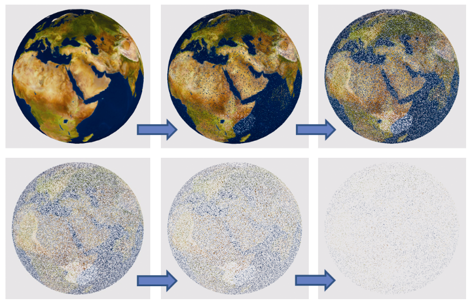

### 14.9　噪声应用——特殊效果

噪声纹理可用于各种特殊效果。事实上，有许多可能的用途，其适用性仅受到想象力的限制。

我们将在此展示的一个非常简单的特殊效应是溶解效应。我们使物体看起来逐渐溶解成小颗粒，直到它最终消失。给定3D噪声纹理，可以使用非常少的附加代码实现此效果。

为了促进溶解效果，我们引入了GLSL的discard命令。此命令仅在片段着色器中是合法的，并且在执行时，它会导致片段着色器丢弃当前片段（意味着不渲染它）。

我们的策略很简单。在C++/OpenGL应用程序中，我们创建了一个与图14.12所示相同的细粒度噪声纹理贴图，以及随时间逐渐增加的浮点变量计数器。然后，此变量在着色器管线中以统一变量发送，并且噪声图也放置在具有关联采样器的纹理贴图中。然后片段着色器使用采样器访问噪声纹理——在这种情况下，我们使用返回的噪声值来确定是否丢弃该片段。我们通过将灰度噪声值与计数器进行比较来实现这一点，计数器用作一种“阈值”值。因为阈值随着时间的推移逐渐变化，我们可以将其设置为逐渐丢弃越来越多的片段。结果是物体似乎逐渐溶解。程序14.9显示了相关的代码部分，它们被添加到程序6.1中的地球渲染球体中。生成的输出如图14.24所示。

程序14.9　使用discard命令的溶解效果

```c
C++ / OpenGL应用程序：
float threshold = 0.0f;            // 用于保留、丢弃片段的逐渐增长的阈值
. . .
在 display() 中
. . .
tLoc = glGetUniformLocation(renderingProgram, "t"); threshold += .002f; glUniform1f(tLoc, threshold); . . .
glActiveTexture(GL_TEXTURE0);
glBindTexture(GL_TEXTURE_3D, noiseTexture);
glActiveTexture(GL_TEXTURE1);
glBindTexture(GL_TEXTURE_2D, earthTexture);
. . .
glDrawArrays(GL_TRIANGLES, 0, numSphereVertices);
片段着色器
#version 430
in vec2 tc;              // 当前片段的纹理坐标
in vec3 origPos;         // 模型中的原始顶点位置，用于访问3D纹理
. . .
layout (binding=0) uniform sampler3D n;        // 用于噪声纹理的采样器
layout (binding=1) uniform sampler2D e;        // 用于地球纹理的采样器
. . .
uniform float t;            // 用于保留或丢弃片段的阈值
void main(void)
{ float noise = texture(n, origPos).x;          // 从片段中取得噪声值
  if (noise > t)                                // 如果噪声值大于当前阈值
  { fragColor = texture(e, tc);                 // 则使用地球纹理渲染片段
  }   else   { discard;                                    // 否则，丢弃片段（不要渲染）
  } }

```


<center class="my_markdown"><b class="my_markdown">图14.24　使用discard着色器的溶解效果</b></center>

如果可能，丢弃命令应该谨慎使用，因为它可能会导致性能损失。这是因为它的存在使OpenGL更难以优化Z缓冲深度测试。

