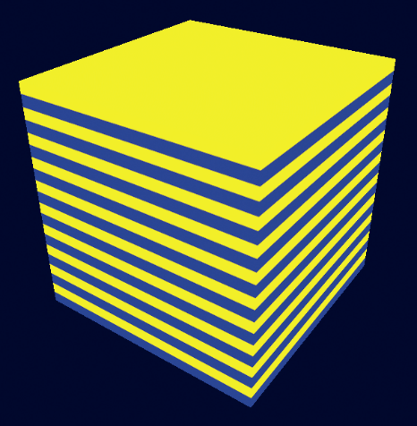
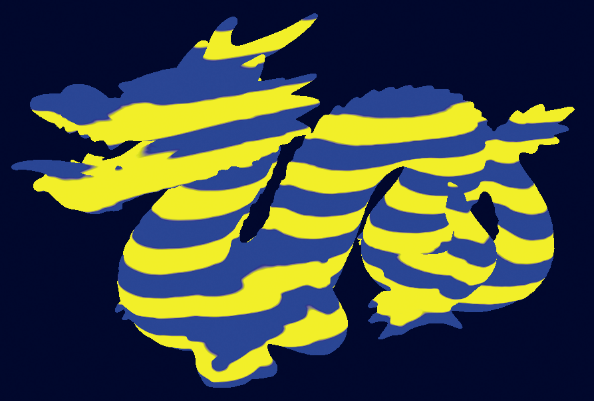
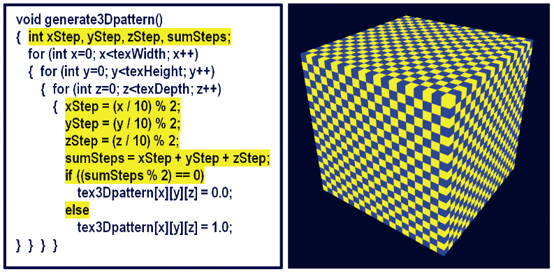
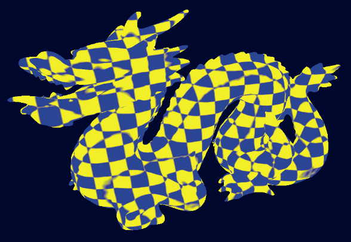

### 14.4　3D纹理

2D纹理包含由两个变量索引的图像数据，而3D纹理包含相同类型的图像数据，但是处在由3个变量索引的3D结构中。前两个维度仍然代表纹理贴图中的宽度和高度，第三个维度代表深度。

因为3D纹理中的数据以与2D纹理类似的方式存储，所以很容易将3D纹理视为一种3D“图像”。但是，我们通常不将3D纹理源数据称为3D图像，因为对于这种结构没有常用的图像文件格式（即没有类似的3D版JPEG，至少没有真正三维的图像）。相反，我们建议将3D纹理视为一种物质，我们将其浸没（或“浸入”）被纹理化的对象，从而使对象的表面点从纹理中的相应位置获得颜色。或者可以想象这个物体被从3D纹理“立方体”中“雕刻”出来，就像雕塑家用一块坚固的大理石雕刻出一个人物一样。

OpenGL支持3D纹理对象。为了使用它们，我们需要学习如何构建3D纹理以及如何使用它来纹理化对象。

与可以从标准图像文件构建的2D纹理不同，3D纹理通常是在程序上生成的。正如之前对2D纹理所做的那样，我们决定分辨率，即每个维度中的纹素数量。根据纹理中的颜色，我们可以构建包含这些颜色的三维数组。如果纹理包含可以与各种颜色一起使用的“图案”，我们可能会建立一个保存图案的数组，例如0和1。

例如，我们可以通过填充对应于所需条纹图案的0和1的数组来构建表示水平条纹的3D纹理。假设纹理的所需分辨率是200×200×200纹素，并且纹理由交替的条纹组成，每个条纹高10纹素。通过在嵌套循环中使用适当的0和1填充数组来构建此类结构的简单函数（假设在这种情况下，宽度、高度和深度变量均设置为200）将如下所示。

```c
void generate3Dpattern() {
  for (int x=0; x<texWidth; x++) {
    for (int y=0; y<texHeight; y++) {
      for (int z=0; z<texDepth; z++) {
        if ((y/10) % 2 == 0)
          tex3Dpattern[x][y][z] = 0.0;
        else
          tex3Dpattern[x][y][z] = 1.0;
      }
    }
  }
}
```

存储在tex3Dpattern数组中的图案如图14.8所示（见彩插），0呈蓝色，1呈黄色。


<center class="my_markdown"><b class="my_markdown">图14.8　条纹3D纹理图案</b></center>

使用条纹图案对对象进行纹理处理，如图14.8所示，需要执行以下步骤。

（1）生成如上所示的图案。

（2）使用图案填充所需颜色的字节数组。

（3）将字节数组加载到纹理对象中。

（4）确定对象顶点的适当3D纹理坐标。

（5）在片段着色器中使用适当的采样器来纹理化对象。

3D纹理的纹理坐标范围为［0…1］，与2D纹理的方式相同。

有趣的是，步骤（4）（确定3D纹理坐标）通常比最初怀疑的要简单得多。事实上，它通常比2D纹理更简单！这是因为（在2D纹理的情况下）3D对象被2D图像纹理化，我们需要决定如何“展平”3D对象的顶点（例如通过UV映射）来创建纹理坐标。但是当3D纹理化时，对象和纹理都具有相同的维度。在大多数情况下，我们希望对象反映纹理图案，就像它被“雕刻”出来一样（或浸入其中）。所以顶点位置本身就是纹理坐标！通常所需的只是应用一些简单的缩放以确保对象的顶点的位置坐标映射到3D纹理坐标的范围[0, 1]。

由于我们通过程序来生成3D纹理，所以我们需要一种从生成的数据中构造OpenGL纹理贴图的方法。将数据加载到纹理中的过程与我们之前在第5.12节中看到的类似。在这种情况下，我们用颜色值填充3D数组，然后将它们复制到纹理对象中。

程序14.4展示出了用于实现所有先前步骤的各种组件，以便使用程序构建的3D纹理来纹理化具有蓝色和黄色水平条纹的对象。所需的图案在generate3Dpattern()函数中构建，该函数将图案存储在名为“tex3Dpattern”的数组中。然后在函数fillDataArray()中构建“图像”数据，按照图案，该函数使用与RGB颜色R、G、B和A相对应的字节数据填充3D数组，每个数据在[0, 255]范围内。然后将这些值复制到load3DTexture()函数中的纹理对象中。

程序14.4　3D纹理：条纹图案

```c
C++ / OpenGL应用程序：
. . .
const int texHeight= 200;
const int texWidth = 200;
const int texDepth = 200;
double tex3Dpattern[texWidth][texHeight][texDepth];
. . .
// 按照由generate3Dpattern()构建的图案，用蓝色、黄色的RGB值来填充字节数组
void fillDataArray(GLubyte data[ ]) {
  for (int i=0; i<texWidth; i++) {
    for (int j=0; j<texHeight; j++) {
      for (int k=0; k<texDepth; k++) {
        if (tex3Dpattern[i][j][k] == 1.0) {
          // 黄色
          data[i*(texWidth*texHeight*4) + j*(texHeight*4)+ k*4+0] = (GLubyte) 255; // red
          data[i*(texWidth*texHeight*4) + j*(texHeight*4)+ k*4+1] = (GLubyte) 255; // green
          data[i*(texWidth*texHeight*4) + j*(texHeight*4)+ k*4+2] = (GLubyte) 0;   // blue
          data[i*(texWidth*texHeight*4) + j*(texHeight*4)+ k*4+3] = (GLubyte) 255; // alpha
        }
        else {
          // 蓝色
          data[i*(texWidth*texHeight*4) + j*(texHeight*4)+ k*4+0] = (GLubyte) 0;   // red
          data[i*(texWidth*texHeight*4) + j*(texHeight*4)+ k*4+1] = (GLubyte) 0;   // green
          data[i*(texWidth*texHeight*4) + j*(texHeight*4)+ k*4+2] = (GLubyte) 255; // blue
          data[i*(texWidth*texHeight*4) + j*(texHeight*4)+ k*4+3] = (GLubyte) 255; // alpha
} } } } }
// 构建条纹的3D图案
void generate3Dpattern() {
  for (int x=0; x<texWidth; x++) {
    for (int y=0; y<texHeight; y++) {
      for (int z=0; z<texDepth; z++) {
        if ((y/10)%2 == 0)
          tex3Dpattern[x][y][z] = 0.0;
        else
          tex3Dpattern[x][y][z] = 1.0;
} } } }
// 将顺序字节数据数组加载进纹理对象
int load3DTexture() {
  GLuint textureID;
  GLubyte* data = new GLubyte[texWidth*texHeight*texDepth*4];
  fillDataArray(data);
  glGenTextures(1, &textureID);
  glBindTexture(GL_TEXTURE_3D, textureID);
  glTexParameteri(GL_TEXTURE_3D, GL_TEXTURE_MIN_FILTER, GL_LINEAR);
  glTexStorage3D(GL_TEXTURE_3D, 1, GL_RGBA8, texWidth, texHeight, texDepth);
  glTexSubImage3D(GL_TEXTURE_3D, 0, 0, 0, 0, texWidth, texHeight, texDepth,
                  GL_RGBA, GL_UNSIGNED_INT_8_8_8_8_REV, data);
  return textureID;
}
void init(GLFWwindow* window) {
  . . .
  generate3Dpattern();                   // 3D图案和纹理只加载一次，所以在init()里作
  stripeTexture = load3DTexture();       // 为3D纹理保存整型图案ID
}
void display(GLFWwindow* window, double currentTime) {
  . . .
  glActiveTexture(GL_TEXTURE0);
  glBindTexture(GL_TEXTURE_3D, stripeTexture);
  glDrawArrays(GL_TRIANGLES, 0, numObjVertices);
}
顶点着色器
. . .
out vec3 originalPosition;               // 原始模型顶点将被用于纹理坐标
. . .
layout (binding=0) uniform sampler3D s;
void main(void)
{ originalPosition = position;          // 将原始模型坐标传递，用作3D纹理坐标
  gl_Position = proj_matrix * mv_matrix * vec4(position,1.0);
}
片段着色器
. . .
in vec3 originalPosition;         // 接受原始模型坐标，用作3D纹理坐标
out vec4 fragColor;
. . .
layout (binding=0) uniform sampler3D s;
void main(void)
{
  fragColor = texture(s, originalPosition/2.0 + 0.5); // 顶点范围为[−1,+1]，纹理坐标范围为[0,1]
}

```

在C++/OpenGL应用程序中，load3Dtexture()函数将生成的数据加载到3D纹理中。它不使用SOIL2来加载纹理，而是直接进行相关的OpenGL调用，其方式类似于前面5.12节中所述的方式。图像数据应该被格式化为对应于RGBA颜色分量的字节序列。函数fillDataArray()执行此操作，应用黄色和蓝色的RGB值，依据由generate3Dpattern()函数构建并保存在tex3Dpattern数组中的条带图案。另请注意display()函数中指定了纹理类型GL_TEXTURE_3D。

由于我们希望将对象的顶点位置用作纹理坐标，我们将它们从顶点着色器传递到片段着色器。片段着色器缩放它们，以便它们按照纹理坐标的标准，被映射到范围[0, 1]。最后，通过sampler3D统一变量访问3D纹理，该统一变量采用3个参数而不是两个参数。我们使用顶点的原始X、Y和Z坐标，缩放到正确的范围，以访问纹理。结果如图14.9所示（见彩插）。


<center class="my_markdown"><b class="my_markdown">图14.9　3D条纹纹理的龙对象</b></center>

通过修改generate3Dpattern()可以生成更复杂的图案。图14.10显示了将条带图案转换为3D棋盘的简单更改，产生的效果如图14.11所示。值得注意的是，如果龙的表面采用2D棋盘纹理图案进行纹理处理，效果与情况则大不相同。（见习题14.3。）


<center class="my_markdown"><b class="my_markdown">图14.10　生成棋盘3D纹理图案</b></center>


<center class="my_markdown"><b class="my_markdown">图14.11　3D棋盘纹理的龙</b></center>

