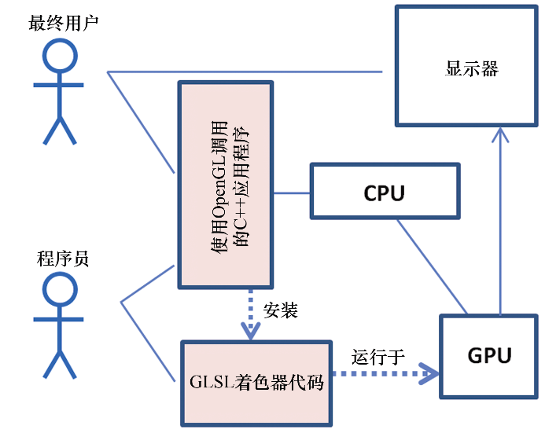

### 第2章　OpenGL图像管线

OpenGL是整合软硬件的多平台2D和3D图形API。使用OpenGL需要显卡（GPU）支持足够新版的OpenGL（如第1章所述）。

在硬件方面，OpenGL提供了一个多级图形管线，可以使用一种名为GLSL的语言进行部分编程。

软件方面，OpenGL的API是用C语言编写的，因此API调用直接兼容C和C++。对于十几种其他的流行语言（Java、Perl、Python、Visual Basic、Delphi、Haskell、Lisp、Ruby等），OpenGL也有着稳定的库（或“包装器”），具有与C语言库几乎相同的性能。本书使用的C++，应该是目前流行的OpenGL语言。使用C++时，程序员编写在CPU上运行的（编译后的）代码并包含OpenGL调用。当一个C++程序包含OpenGL调用时，我们将其称为C++/OpenGL应用程序。C++/OpenGL应用程序的一个重要任务是将程序员的GLSL代码安装到GPU上。

基于C++的图形应用大致如图2.1所示，其中软件部分以底色突出显示。

<b class="my_markdown">图2.1　基于C++的图形应用概览</b>

在我们后面的代码中，一部分用C++编码，进行OpenGL调用；另一部分是GLSL。C++/OpenGL应用程序、GLSL模块和硬件一起用来生成3D图形输出。当应用完成之后，最终用户直接与C++应用程序进行交互。

GLSL是一种着色器语言。着色器语言主要运行于GPU上，在图形管线上下文中。还有一些其他的着色器语言，如HLSL，用于微软的3D框架DirectX。GLSL是与OpenGL兼容的专用着色器语言，因此我们在C++/OpenGL应用代码之外，需要用GLSL写着色器代码。

本章其余内容将简单地浏览OpenGL管线的内容。读者不用期望详细理解所有细节，这里只要对各阶段如何工作有大致感觉即可。

