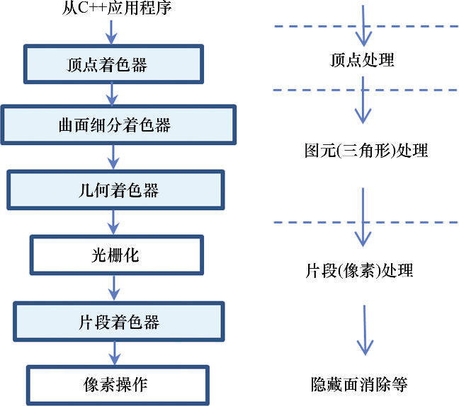

### 2.1　OpenGL管线

现代3D图形编程会使用管线的概念，在管线中。将3D场景转换成2D图形的过程被分割成许多步骤。OpenGL和DirectX使用了相似的管线概念。

图2.2展示了OpenGL图形管线简化后的概览（并未展示所有阶段，仅包含我们要学习的主要阶段）。C++/OpenGL应用发送图形数据到顶点着色器，随着管线处理，最终生成在显示器上显示的像素点。

<b class="my_markdown">图2.2　OpenGL管线概览</b>

用灰色阴影表示的阶段（顶点着色器、曲面细分着色器、几何着色器、片段着色器）可以用GLSL进行编程。将GLSL程序载入这些着色器阶段也是C++/OpenGL程序的责任之一，其过程如下。

（1）首先使用C++获取GLSL着色器代码，既可以从文件中读取，也可以硬编码在字符串中。

（2）接下来创建OpenGL着色器对象并将GLSL着色器代码加载进着色器对象。

（3）最后，用OpenGL命令编译并连接着色器对象，并将它们安装进GPU。

在实践中，一般至少要提供顶点着色器和片段着色器阶段的GLSL代码，而曲面细分着色器和几何着色器阶段是可选的。接下来我们将简单地过一下整个过程，并看看每步发生了什么。

