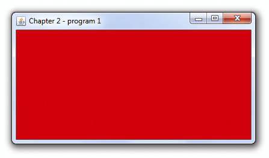

### 2.1.1　C++/OpenGL应用程序

我们的图形应用程序中大部分是使用C++进行编写的。根据程序目的的不同，它可能需要用标准C++库与最终用户交互，用OpenGL调用实现与3D渲染相关的任务。正如前面章节所述，我们将会使用一些扩展库：GLEW（OpenGL Extension Wrangler）、GLM（OpenGL Mathmatics）、SOIL2（Simple OpenGL Image Loader）以及GLFW（Graphics Library Framework）。

GLFW库包含了GLFWwindow类，我们可以在其上进行3D场景绘制。如前所述，OpenGL也向我们提供了用于将GLSL程序安装到可编程着色器阶段并编译的命令。最后，OpenGL使用缓冲区将3D模型和其他相关图形数据发送到管线中。

在我们尝试编写着色器之前，先写一个简单的C++/OpenGL程序，创建一个GLFWwindow实例并为其设置背景色。这个过程根本用不到着色器！其代码如程序2.1所示。程序2.1中的main()函数与本书中所有将会用到的main()函数一样。其中重要的操作有：（a）初始化GLFW库；（b）实例化GLFWwindow；（c）初始化GLEW库；（d）调用一次init()函数；（e）重复调用display()函数。

我们将每个应用程序的初始化任务都放在init()函数中，用于绘制GLFWwindow的代码都将放在display()函数中。

在本例中，glClearColor()命令指定了清除背景时用的颜色值——这里(1,0,0,1)代表RGB值中的红色（末尾的1表示不透明度）。接下来使用OpenGL调用glClear(GL_COLOR_BUFFER_BIT)，实际使用红色对颜色缓冲区进行填充。

程序2.1　第一个C++/OpenGL应用程序

```c
#include <GL\glew.h>
#include <GLFW\glfw3.h>
#include <iostream>
using namespace std;
void init(GLFWwindow* window) { }
void display(GLFWwindow* window, double currentTime) { 
   glClearColor(1.0, 0.0, 0.0, 1.0); 
   glClear(GL_COLOR_BUFFER_BIT);
}
int main(void) { 
    if (!glfwInit()) { exit(EXIT_FAILURE); } 
    glfwWindowHint(GLFW_CONTEXT_VERSION_MAJOR, 4); 
    glfwWindowHint(GLFW_CONTEXT_VERSION_MINOR, 3); 
    GLFWwindow* window = glfwCreateWindow(600, 600, "Chapter2 - program1", NULL, NULL); 
    glfwMakeContextCurrent(window); 
    if (glewInit() != GLEW_OK) { exit(EXIT_FAILURE); } 
    glfwSwapInterval(1); 
    init(window); 
    while (!glfwWindowShouldClose(window)) { 
        display(window, glfwGetTime()); 
        glfwSwapBuffers(window); 
        glfwPollEvents(); 
    } 
    glfwDestroyWindow(window); 
    glfwTerminate(); 
    exit(EXIT_SUCCESS);
}
```

图2.3展示了程序2.1的输出。


<center class="my_markdown"><b class="my_markdown">图2.3　程序2.1的输出</b></center>

这些函数部署的机制如下：GLFW和GLEW库先分别使用glfwInit()和glewInit()初始化。glfwCreateWindow()命令负责创建GLFW窗口，同时其相关的OpenGL上下文<sup class="my_markdown">[1]</sup>由glfwCreateWindow()命令创建，其可选项由前面的WindowHints设置。WindowHints指定了机器必须与OpenGL版本4.3兼容（“主版本号”=4，“次版本号”=3）。glfwCreateWindow命令的参数指定了窗口的宽、高（以像素为单位）以及窗口顶部的标题。（这里没有用到的另外两个参数设为NULL，分别用来允许全屏显示以及资源共享。）glfwSwapInterval()命令和glfwSwapBuffers命令用来开启垂直同步（Vsync）——GLFW窗口默认是双缓冲的。<sup>[2]</sup>这里需要注意，创建GLFW窗口并不会自动将它与当前OpenGL上下文关联起来——因此我们需要调用glfwMakeContextCurrent()。

main()函数包括了一个简单的渲染循环，用来反复调用display()方法。同时它也调用了glfwSwapBuffers()以绘制屏幕，以及glfwPollEvents()以处理窗口相关事件（如按键事件）。当GLFW探测到应该关闭窗口的事件（如用户单击了右上角的×）时，循环就会终止。这里需要注意，我们将一份GLFW窗口对象的引用传入了init()和display()调用。这些函数在特定环境下需要访问GLFW窗口对象。同时我们也将当前时间传入了display()调用，这样方便保证动画在不同计算机上以相同速度播放。在这里，我们用了glfwGetTime()，它会返回GLFW初始化之后经过的时间。

现在是时候详细看看程序2.1中的OpenGL调用了。首先关注一下这个调用：

```c
glClear(GL_COLOR_BUFFER_BIT);
```

在这里，调用的OpenGL参考文档中的描述是：

```c
void glClear(GLbitfield mask);
```

参数中引用了类型为GLbitfield的“GL_COLOR_BUFFER_BIT”。OpenGL有很多预定义的常量（其中很多是枚举量）。GL_COLOR_BUFFER_BIT引用了包含渲染后像素的颜色缓冲区。OpenGL有多个颜色缓冲区，这个命令会将它们全部清除——用一种被称为“清除色（clear color）”的预定义颜色填充所有缓冲区。注意，这里的“清除（clear）”表示的不是“颜色清晰”，而是用来重置缓冲区时填充的颜色（清除）。

在调用glClear()后紧接着是glClearColor()的调用。glClearColor()让我们能够指定颜色缓冲区清除后填充的值。这里我们指定了(1,0,0,1)，即RGBA颜色中的红色。

最后，当用户尝试关闭GLFW窗口时，程序将退出渲染循环。这时，main()会通过分别调用glfwDestroyWindow()和glfwTerminate()通知GLFW销毁窗口以及终止运行。

