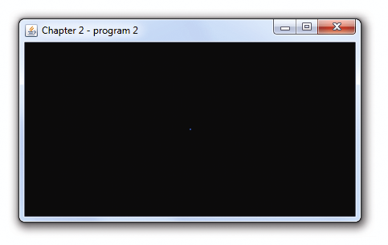
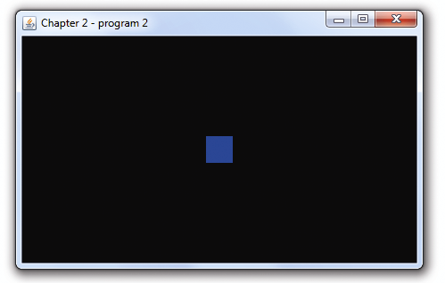

### 2.1.2　顶点着色器和片段着色器

在第一个OpenGL程序中，我们实际上并没有绘制任何东西——仅仅用一种颜色来填充了颜色缓冲区。要真的绘制点什么，我们需要加入顶点着色器和片段着色器。

你可能对于学习OpenGL只让你绘制少数几类非常简单的东西有点吃惊，如点、线、三角形。这些简单的东西叫作图元，多数3D模型通常是由许多三角形的图元构成。图元由顶点组成——例如三角形有3个顶点。顶点可以由很多来源产生——从文件读取并由C++/ OpenGL应用载入缓冲区、直接在C++文件中硬编码或者直接在GLSL代码中。

在加载顶点之前，C++/OpenGL应用必须编译并链接合适的GLSL顶点着色器和片段着色器程序，之后将它们载入管线。我们稍后将会看到这些命令。

C++/OpenGL应用同时也负责通知OpenGL构建三角形，通过使用如下OpenGL函数完成：

```c
glDrawArrays(GLenum mode, Glint first, GLsizei count);
```

mode参数是图元的类型——对于三角形我们用GL_TRIANGLES。first参数表示从哪个顶点开始绘制（通常是顶点0，即第一个顶点），count表示总共要绘制的顶点数。

当调用glDrawArrays()时，管线中的GLSL代码开始执行。现在可以向管线加一些GLSL代码了。

不管它们从何处读入，所有的顶点都会被传入顶点着色器。顶点们会被一个一个地处理，即着色器会对每个顶点执行一次。对拥有很多顶点的大型复杂模型而言，顶点着色器会执行成百上千甚至百万次，这些执行过程通常是并行的。

现在，我们来写一个简单的程序，它仅包含一个顶点，硬编码于顶点着色器中。虽然这不足以让我们画三角形，但是足够画出一个点。为了显示这个点，我们还需要提供片段着色器。为简单起见，我们将这两个着色器程序声明为字符串数组。

程序2.2　着色器，画一个点

```c
(#include列表与之前相同)
#define numVAOs 1     ⇽---　新的定义
GLuint renderingProgram;      
GLuint vao[numVAOs];
GLuint createShaderProgram() { 
  const char *vshaderSource = 
    "#version 430 \n" 
    "void main(void) \n" 
    "{ gl_Position = vec4(0.0, 0.0, 0.0, 1.0); }"; 
  const char *fshaderSource = 
    "#version 430 \n" 
    "out vec4 color; \n"
    "void main(void) \n" 
    "{ color = vec4(0.0, 0.0, 1.0, 1.0); }"; 
  GLuint vShader = glCreateShader(GL_VERTEX_SHADER); 
  GLuint fShader = glCreateShader(GL_FRAGMENT_SHADER); 
  glShaderSource(vShader, 1, &vshaderSource, NULL); 
  glShaderSource(fShader, 1, &fshaderSource, NULL); 
  glCompileShader(vShader); 
  glCompileShader(fShader); 
  GLuint vfProgram = glCreateProgram(); 
  glAttachShader(vfProgram, vShader); 
  glAttachShader(vfProgram, fShader); 
  glLinkProgram(vfProgram); 
  return vfProgram;
}
void init(GLFWwindow* window) { 
  renderingProgram = createShaderProgram(); 
  glGenVertexArrays(numVAOs, vao); 
  glBindVertexArray(vao[0]);
}
void display(GLFWwindow* window, double currentTime) { 
  glUseProgram(renderingProgram); 
  glDrawArrays(GL_POINTS, 0, 1);
}
...main()函数与之前相同
```

程序看起来只显示了一个空的窗口（见图2.4）。但仔细观察一下，会发现窗口中央有一个蓝色的点（假设本页印刷精度足够）。OpenGL中点的默认大小为1像素。


<center class="my_markdown"><b class="my_markdown">图2.4　程序2.2的输出效果</b></center>

程序2.2中有很多值得讨论的重要细节（为方便起见已用颜色标出）。首先，注意其中多次用到的“Gluint”——这是由OpenGL提供的“unsigned int”的平台无关简写（许多OpenGL结构体都是整数类型引用）。接下来，init()不再是空函数了——现在它会调用另一个叫作“createShaderProgram”的函数（我们写的）。“createShaderProgram”函数先定义了两个字符串vshaderSource和fshaderSource。之后调用了两次glCreateShader()函数，创建了类型为GL_VERTEX_SHADER和GL_FRAGMENT_SHADER的两个着色器。OpenGL创建每个着色器对象（初始值为空）的时候，会返回一个整数ID作为后面引用它的序号——我们的代码将这个ID存入了vShader和fShader变量中。之后，createShaderProgram()调用了glShaderSource()，这个函数用于将GLSL代码从字符串载入空着色器对象中。之后，用glCompileShader()编译各着色器。glShaderSource()有4个参数：（a）用来存放着色器的着色器对象，（b）着色器源代码中的字符串数量，（c）包含源代码的字符串指针，（d）最后一个没用到的参数（我们稍后会在补充章节说明中解释这个参数）。注意，这两次调用glCompileShader()时都指明了着色器的源代码字符串数量为“1”——这个参数也会在补充说明中解释。

之后应用程序创建了一个叫作vfProgram的程序对象，并储存指向它的整数ID。OpenGL“程序”对象包含一系列编译过的着色器，这里可以看到使用glCreateProgram()创建程序对象，使用glAttachShader()将着色器加入程序对象，之后使用glLinkProgram()来请求GLSL编译器确保它们的兼容性。

如前所见，在init()结束后程序调用了display()。display()函数所做的事情中包含调glUseProgram()，它将含有两个已编译着色器的程序载入OpenGL管线阶段（在GPU上！）。注意glUseProgram()并没有运行着色器，它只是将着色器加载进硬件。

我们稍后在第4章会看到，一般情况下，这里C++/OpenGL将会准备要发送给管线绘制的模型的顶点集。但是本例中，由于是第一个着色器程序，我们仅仅在顶点着色器中硬编码了一个顶点。因此，本例中的display()函数接着调用了glDrawArrays()用来启动管线处理过程。原始类型是GL_POINTS，仅用来显示一个点。

现在我们来看一下着色器，在之前用绿色展示（并在之后的解释中又重复了一遍）。正如我们所看到的，在C++/OpenGL程序中，它们声明为字符串数组。这是一种笨拙的编程方式，不过在这个超简单的例子中足够了。这个顶点着色器是：

```c
#version 430
void main(void)
{   gl_Position = vec4(0.0, 0.0, 0.0, 1.0); }
```

第一行指明了OpenGL版本，这里是4.3。接下来是一个“main”函数（我们后面将会看到，GLSL句法上与C++类似）。所有顶点着色器的主要目标都是将顶点发送给管线（正如之前所说的，它会对每个顶点进行处理）。内置变量gl_Position用来设置顶点在3D空间的坐标位置，并发送至下一个管线阶段。GLSL数据类型vec4用来存储4元组，适合用来存储坐标，4元组的前3个值分别表示X、Y、Z，第4个值在这里设为1.0（第3章将会学习第4个值的用途）。本例中，顶点坐标硬编码于原点(0,0,0)。

顶点接下来将沿着管线移动到光栅着色器，它们会在这里被转换成像素位置（更精确地说是片段——后面会解释）。最终这些像素（片段）到达片段着色器：

```c
#version 430
out vec4 color;
void main(void)
{   color = vec4(0.0, 0.0, 1.0, 1.0); }
```

所有片段着色器的目的都是给将要展示的像素赋予RGB颜色。在本例中所指定的输出颜色值(0,0,1)是蓝色（第4个值1.0是不透明度）。注意这里的“out”标签表明color变量是输出变量。（在顶点着色器中并不是必须给gl_Position指定“out”标签，因为gl_Position是预定义的输出变量。）

代码中还有一处我们没有讨论的细节，即init()函数中的最后两行（以红色显示）。它们看起来可能有些神秘。我们在第4章中将会看到，当准备将数据集发送给管线时是以缓冲区形式发送的。这些缓冲区最后都会被存入顶点数组对象（Vertex Array Object，VAO）中。在本例中，我们向顶点着色器中硬编码了一个点，因此我们不需要任何缓冲区。但是，即使应用程序完全没有用到任何缓冲区，OpenGL仍然需要在使用着色器的时候至少有一个创建好的VAO，所以这两行用来创建OpenGL要求的VAO。

最后的问题就是从顶点着色器出来的顶点是如何变成片段着色器中的像素的。回忆一下图2.2中，在顶点处理和像素处理中间存在着光栅化阶段。正是在这个阶段中图元（如点或三角形）转换成了像素集合。OpenGL中默认点的大小为1像素，这就是为什么我们的单点最终渲染成了单个像素。

让我们将下面的命令加入display()函数中，就放在调用glDrawArrays()之前：

```c
glPointSize(30.0f);
```

现在，当光栅化阶段从顶点着色器收到顶点时，它会为一个大小是30像素的点设置像素颜色值。输出的结果展示在图2.5中（见彩插）。


<center class="my_markdown"><b class="my_markdown">图2.5　改变glPointSize</b></center>

让我们继续观察剩下的OpenGL管线。

