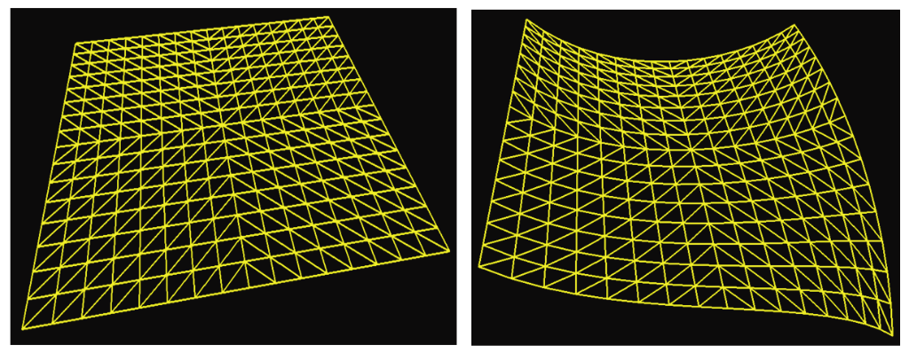

### 2.1.3　曲面细分着色器

我们在第12章中介绍曲面细分。可编程曲面细分阶段是最近加入OpenGL（在4.0版中）的功能。它提供了一个曲面细分着色器用以生成大量三角形，通常是网格形式。同时也提供一些可以以各种方式操作这些三角形的工具。例如，程序员可能需要以图2.6展示的方式操作一个曲面细分过的三角形网格。

<b class="my_markdown">图2.6　曲面细分着色器生成的网格</b>

当在简单形状上需要很多顶点时，曲面细分着色器就能发挥作用了，如在方形区域或曲面上。稍后我们会看到，它在生成复杂地形时也很有用。对于这种情况，有时用GPU中的曲面细分着色器在硬件里生成三角形网格比在C++中生成要高效得多。

