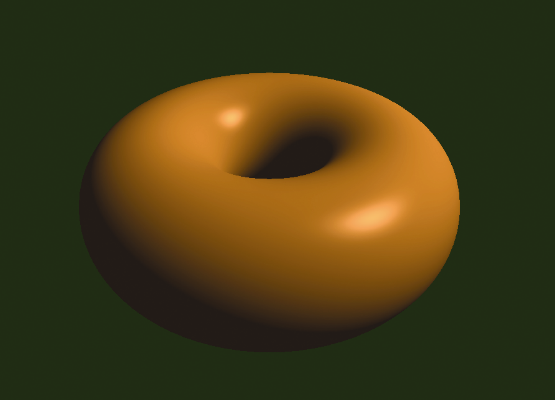
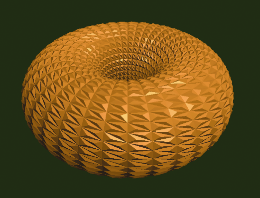

### 2.1.4　几何着色器

我们在第13章中介绍了几何着色器阶段。顶点着色器赋予程序员一次操作一个顶点的能力（“按顶点”处理），片段着色器（稍后会看到）允许一次操作一个像素（“按片段”处理），几何着色器赋予了一次操作一个图元的能力（“按图元”处理）。

回顾前文提到最通用的图元是三角形。当我们到达几何着色器阶段时，管线肯定已经完成了将顶点组合为三角形的过程（这个过程叫作图元组装）。接下来几何着色器会让程序员可以同时访问每个三角形的所有顶点。

按图元处理有很多用途，既可以让图元变形，比如拉伸或者缩小，还可以删除一些图元，从而在渲染的物体上产生“洞”——这是一种将简单模型转化为复杂模型的方法。

几何着色器也提供了生成额外图元的方法。这些方法也打开了通过转换简单模型而得到复杂模型的大门。几何着色器有一种有趣的用法，就是在物体上增加表面纹理，如凸起、鳞甚至“毛发”。考虑图2.7所示的简单环面（本书后面会介绍如何生成它）。环面的表面由上百个三角形构成。如果我们用几何着色器对每个三角形外面增加一个额外的三角形，就会得到如图2.8所示的结果。这个“鳞环面”如果是从C++/OpenGL应用程序那边从零建模生成，代价就大了。

<b class="my_markdown">图2.7　环面模型</b>

<b class="my_markdown">图2.8　几何着色器修改后的环面</b>

在曲面细分阶段已经给程序员同时访问模型中所有顶点的能力后，再提供一个按图元运算的着色器阶段可能看起来有点多余。它们的区别是，曲面细分只在非常少数情况下提供了这个能力——尤其在模型是由曲面细分器生成的三角形网格时。它并没有提供同时访问所有顶点，即任何从C++用缓冲区传来的顶点的能力。

