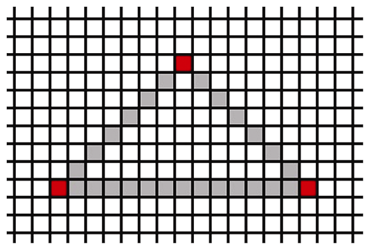
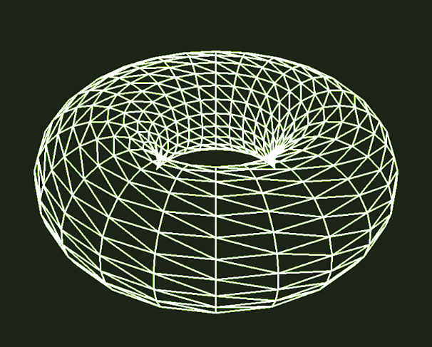
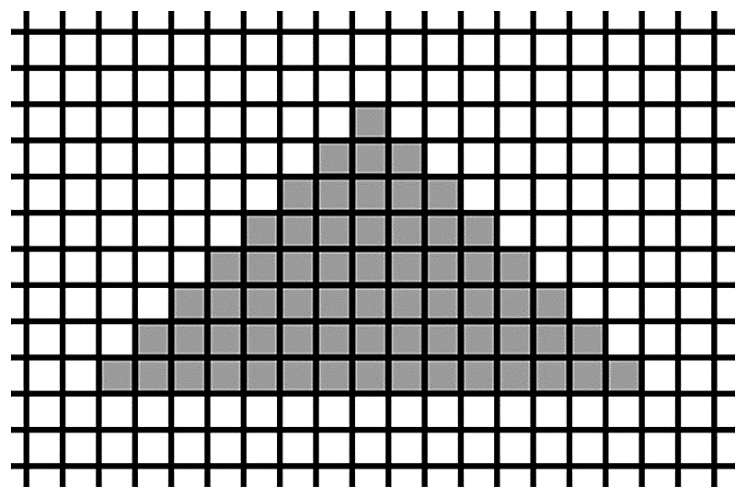
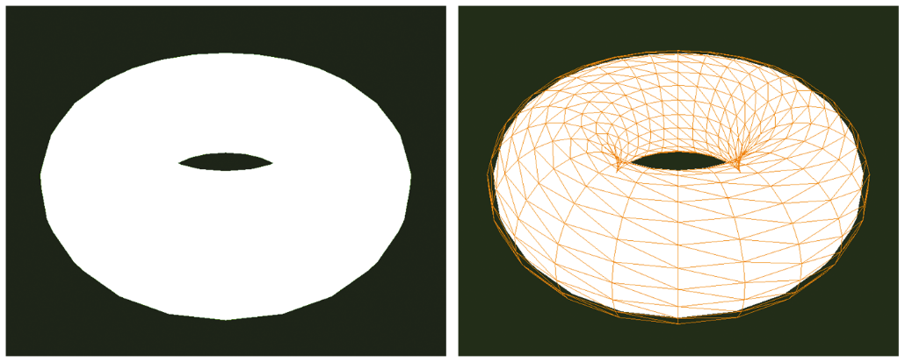

### 2.1.5　光栅化

最终，我们3D世界中的点、三角形、颜色等全都需要展现在一个2D显示器上。这个2D屏幕由光栅——矩形像素阵列组成。

当3D物体光栅化后，OpenGL将物体中的图元（通常是三角形）转化为片段。片段拥有关于像素的信息。光栅化过程确定了用以显示3个顶点所确定的三角形的所有像素需要绘制的位置。

光栅化过程开始时先对三角形的每对顶点进行插值。插值过程可以通过选项调节。就目前而言，使用图2.9所示的简单的线性插值就够了。原本的3个顶点标记为红色（见彩插）。


<center class="my_markdown"><b class="my_markdown">图2.9　光栅化（步骤1）</b></center>

如果光栅化过程到此为止，那么呈现出的图像将会是线框模型。呈现线框模型也是OpenGL中的一个选项。通过在display()函数中glDrawArrays()调用之前添加如下命令：

```c
glPolygonMode(GL_FRONT_AND_BACK, GL_LINE);

```

如果2.1.4小节中的环面使用了这行额外代码，它将会看起来如图2.10所示。


<center class="my_markdown"><b class="my_markdown">图2.10　使用线框模型渲染的环面</b></center>

如果我们不加入之前的那一行代码（或者我们在其中使用GL_FILL而非GL_LINE），插值过程将会继续沿着光栅线填充三角形的内部，如图2.11所示。当应用于环面时会产生一个完全光栅化的“实心”环面，如图2.12（左）所示。请注意，在这种情况下，环面的整体形状和曲率不明显——这是因为我们没有包括任何纹理或照明技术，因此它看起来是“平”的。图2.12（右）是同样的“平”环面叠加了线框模型。前面图2.7所示的环面包括了照明效果，因此更清晰地显示了环面的形状。我们将在第7章学习照明。


<center class="my_markdown"><b class="my_markdown">图2.11　完全光栅化的三角形</b></center>


<center class="my_markdown"><b class="my_markdown">图2.12　环面的完全光栅化图元渲染（左）和使用线框叠加（右）</b></center>

在本章后面我们将看到，光栅化不仅可以对像素插值。任何顶点着色器输出的变量和片段着色器的输入变量都可以基于对应的像素进行插值。我们将会使用该功能生成平滑的颜色渐变，实现真实光照以及许多其他效果。

