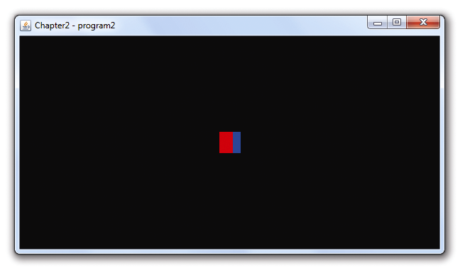

### 2.1.6　片段着色器

如前所述，片段着色器用于为光栅化的像素指定颜色。我们已经在程序2.2中看到了片段着色器示例。在程序2.2中，片段着色器仅将输出硬编码为特定值，从而为每个输出的像素赋予相同的颜色。不过GLSL为我们提供了其他计算颜色的方式，用以表现无穷的创造力。

一个简单的例子就是基于像素位置决定输出颜色。回忆我们在顶点着色器中，顶点的输出坐标使用了预定义变量gl_Position。在片段着色器中，同样有一个变量让程序员可以访问输入片段的坐标，叫作gl_FragCoord。我们可以通过修改程序2.2中的片段着色器，让它使用gl_FragCoord（在本例中通过GLSL属性选择语法引用它的X坐标）基于位置设置每个像素的颜色，如：

```c
#version 430
out vec4 color;
void main(void)
{ if (gl_FragCoord.x < 200) color = vec4(1.0, 0.0, 0.0, 1.0); else color = vec4(0.0, 0.0, 1.0, 1.0);
}
```

如果我们像在2.1.2小节末尾那样增大GL_PointSize，渲染的点的像素颜色将会以坐标变化——X坐标小于200时是红色，否则就是蓝色，如图2.13所示（见彩插）。


<center class="my_markdown"><b class="my_markdown">图2.13　片段着色器颜色变化</b></center>

