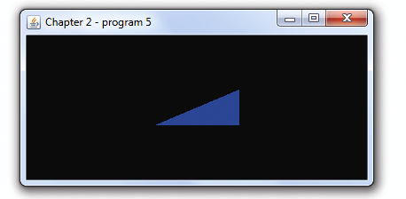

### 2.4　从顶点构建对象

最终我们想要绘制的不止是一个单独的点，而是想要绘制由很多顶点组成的对象。本书的大部分章节将会致力于这一主题。现在我们从一个简单的例子开始——我们将会定义3个顶点，并用它们绘制一个三角形，如图2.15所示。


<center class="my_markdown"><b class="my_markdown">图2.15　绘制简单三角形</b></center>

我们可以通过对程序2.2（事实上是从文件读入着色器的程序2.4）进行两个小改动来实现绘制三角形：（a）修改顶点着色器，以便将3个不同的点输出到后续的管线阶段；（b）修改glDrawArrays()调用，指定3个顶点。

在C++/OpenGL应用程序中［特别是在glDrawArrays()调用中］我们指定了GL_TRIANGLES（而非GL_POINTS），同时也指定了管线中有3个顶点。这样顶点着色器会在每个迭代运行3遍，内置变量gl_VertexID会自增（初始值为0）。通过检测gl_VertexID的值，着色器设计为可以在每次运行时输出不同的点。前面说到这3个点之后会经过光栅化阶段，生成一个填充过的三角形。程序的改动显示在程序2.5中（余下的代码与之前在程序2.4中的相同）。

程序2.5　绘制三角形

```c
顶点着色器
#version 430
void main(void)
{ if (gl_VertexID == 0) gl_Position = vec4( 0.25, -0.25, 0.0, 1.0); 
  else if (gl_VertexID == 1) gl_Position = vec4(-0.25, -0.25, 0.0, 1.0);   else gl_Position = vec4( 0.25, 0.25, 0.0, 1.0); }
C++/OpenGL 应用程序——在display()函数中
. . .
glDrawArrays(GL_TRIANGLES, 0, 3);

```

