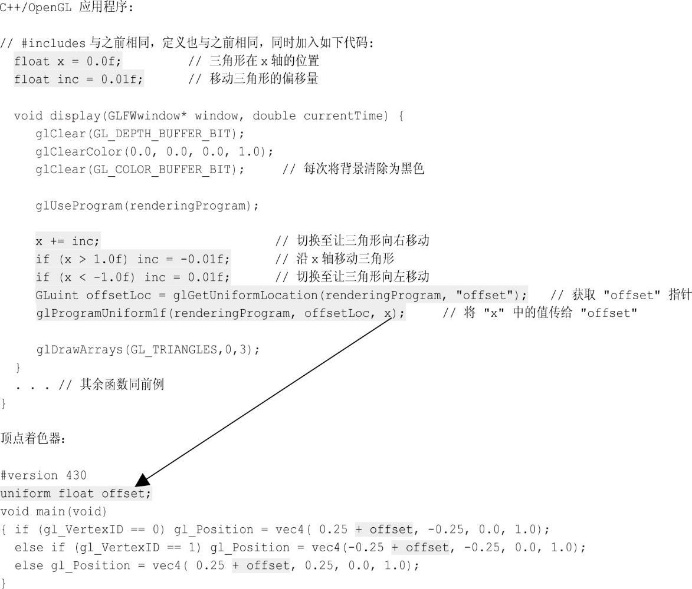
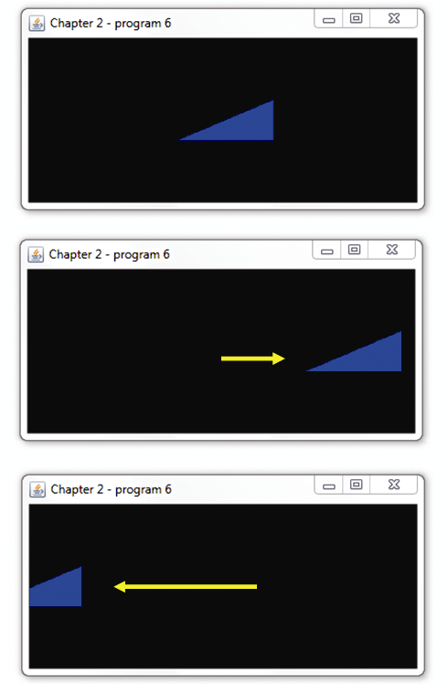

### 2.5　场景动画

本书中的很多技术可以用于动画。当场景中的物体移动或改变时，场景会被重复渲染以实时反映这些改动。

回顾2.1.1小节中，我们构建的main()函数只调用了init()一次，之后就重复调用display()。因此虽然前面所有的例子看起来都是静态绘制的场景，但实际上main()函数中的循环会让它们一次又一次地绘制。

因此，main()函数的结构已经可以支持动画了。我们只需要设计display()函数来随时间改变绘制的东西。场景的每一次绘制都叫作一帧，调用display()的频率叫作帧率。在程序逻辑中移动的速率可以通过自前一帧到目前经过的时间来控制（这就是为什么我们会将“currentTime”作为display()函数的参数）。

程序2.6中展示了动画示例。我们使用了程序2.5中的三角形，并给它加入了先向右，再向左，往复移动的动画。在本例中，我们不考虑经过的时间，因此三角形的移动或快或慢，基于运行计算机的处理速度。在未来的示例中，我们将会使用经过的时间来确保无论在什么配置的计算机上运行，动画都保持以同样的速度播放。

在程序2.6中，程序的display()方法维持一个变量“x”用于偏移三角形的X轴位置。每当display()调用时，它的值都会改变（因此每帧都不同）。同时每当它到达1.0或者−1.0时，都会改变方向。在x中的值会被复制到顶点着色器的“offset”变量中。执行这个复制的机制叫作Uniform变量（统一变量），稍后我们会在第4章中学习它。目前不必了解统一变量的细节。现在，只需要注意C++/OpenGL应用程序先调用glGetUniformLocation()获取指向“offset”变量的指针，之后调用glProgramUniform1f()将x的值复制给offset。之后顶点着色器会将offset加给所绘制三角形的X坐标。注意，每次调用display()时背景都会被清除，以避免三角形移动时留下一串轨迹。图2.16展示了3个时间点显示的图像（当然，书中的静态图是无法展示移动的）。

程序2.6　简单动画示例


注意，除了添加三角形动画代码之外，我们还在display()函数的开头添加了这行代码：

```c
glClear(GL_DEPTH_BUFFER_BIT);
```


<center class="my_markdown"><b class="my_markdown">图2.16　移动的三角形动画</b></center>

虽然在本例中并不是必需的，我们仍然把它加在这里，同时它会在之后的大多数应用程序中存在。回忆2.1.7小节中讨论的，隐藏面消除需要同时用到颜色缓冲区和深度缓冲区。当我们后面渐渐地开始绘制更复杂的3D场景时，每帧初始化（清除）深度缓冲区就是必要的，尤其是对于动画场景，要确保深度对比不会受旧的深度数据影响。从前面的例子中可以明显看出，清除深度缓冲区的命令与清除颜色缓冲区的命令基本相同。

