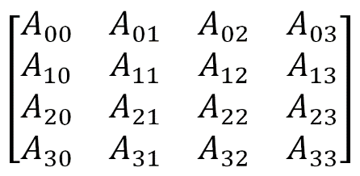
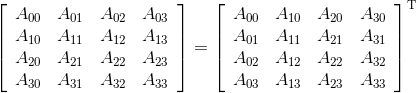
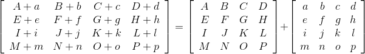
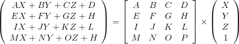
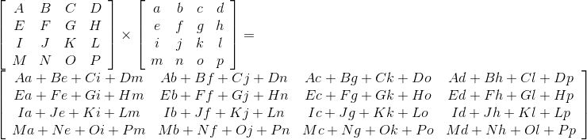
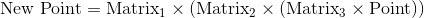
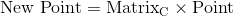

### 3.3　矩阵

矩阵是矩形的值阵列，它的元素通常使用下标访问。第一个下标表示行号，第二个下标表示列号，下标从0开始。我们在3D图形计算中要用到的矩阵大多数大小为4×4，如图3.2所示。

<b class="my_markdown">图3.2　4×4矩阵</b>

GLSL语言中的mat4数据类型用来存储4×4矩阵。同样，GLM中有mat4类用以实例化并存储4×4矩阵。

单位矩阵中一条对角线的值为1，其余值全为0：

任何值乘以单位矩阵都不会改变。在GLM中，调用构造函数glm::mat4 m(1.0f)以在变量m中生成单位矩阵。

矩阵转置的计算是通过交换矩阵的行和列完成的。例如：

GLM库和GLSL库都有转置函数，分别是glm::transpose(mat4)和transpose(mat4)。

矩阵加法简单明了：

在GLSL中，+运算符在mat4上进行了重载，以支持矩阵加法。

3D图形学中有很多有用的矩阵乘法操作。矩阵乘法一般可以从左向右或从右向左处理（注意，由于左乘和右乘是不同的，所以矩阵乘法不满足交换律）。

在3D图形学中，点与矩阵相乘通常从右向左，得到点，如：

注意，我们用齐次坐标将点(X, Y, Z)表示为列数为1的矩阵。

GLSL和GLM都支持点（确切地说是vec4）与矩阵使用*操作符相乘。

4×4矩阵与4×4矩阵相乘如下：

矩阵相乘也经常叫作合并，稍后我们会看到，它可以用于将一系列矩阵变换合并成一个矩阵。这种合并矩阵变换的能力来自矩阵乘法的结合律。

考虑如下运算序列：

我们将一个点与Matrix3相乘，之后将结果与Matrix2相乘，最后将结果与Matrix1相乘。其结果是一个新的点。结合律确保了之前的计算与如下计算相同：

我们先将3个矩阵相乘，建立Matrix1、Matrix2、Matrix3的连接。如果我们称其为MatrixC，我们就可以将之前的运算写作：

我们稍后在第4章会看到这么做的好处是，我们需要经常将相同的一系列矩阵变换应用到场景中的每个点上。通过预先一次计算好这些矩阵的合并，就可以成倍减少总的矩阵运算量。

GLSL和GLM都支持使用重载后的*运算符进行矩阵乘法。

一个4×4矩阵的逆矩阵是另一个4×4矩阵，用**M**−1表示，在矩阵乘法中有如下性质：

在此我们就不展示计算逆矩阵的细节了。但是，需要知道的是计算矩阵的逆矩阵的运算量很大。幸运的是我们只有很少情况下需要用到它。在这些极少的情况下，GLSL和GLM都提供了mat4.inverse()函数。

