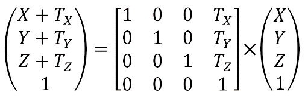

### 3.4.1　平移矩阵

平移矩阵用于将物体从一个位置移至另一位置。它包含一个单位矩阵，同时X、Y和Z的移动量在A03、A13、A23。图3.3展示了平移矩阵和它与齐次坐标点相乘的效果。其结果是一个以平移值“移动过”的点。

<b class="my_markdown">图3.3　平移矩阵变换</b>

注意，作为与平移矩阵相乘的结果，点(X, Y, Z)平移(或移动)到了位置(X+Tx, Y+Ty, Z+Tz)。同样需要注意的是这个乘法是从右向左相乘。

例如，当我们想要将一组点向上沿Y轴正方向移动5个单位，我们可以通过给一个单位矩阵的Ty位置放入5来构建平移矩阵。之后我们只需要将我们想要移动的点与矩阵相乘就可以了。

GLM中有一些函数是用于构建与点相乘的平移矩阵的。其中相关的操作有：

+ glm::translate(x, y, z)构建平移(x, y, z)的矩阵；
+ mat4 × vec4。

